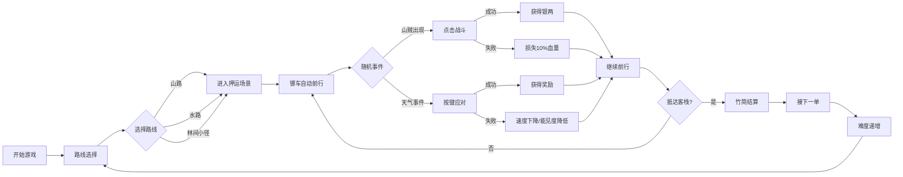

## 1. 产品概述

古代镖师押运模拟游戏，玩家扮演威远镖局镖头，在3D黄土官道上选择路线、应对山贼伏击与天气变化，最终安全抵达客栈结算镖银。

- 核心玩法：路线选择 + 即时战斗 + 天气事件应对 + 资源管理
- 目标用户：喜欢古风题材、轻度策略和即时反应类游戏的玩家
- 产品价值：沉浸式体验古代镖师职业，兼具策略性与操作乐趣

## 2. 核心功能

### 2.1 功能模块

1. **路线选择界面**：三条路线（山路、水路、林间小径）选择，令牌点击交互
2. **押运主场景**：3D官道场景，镖车自动前行，山贼随机出现
3. **战斗系统**：点击山贼触发战斗动画，未及时点击损失血量
4. **天气事件系统**：暴雨、沙暴、浓雾三种天气，各有独特交互机制
5. **结算界面**：竹简形式展示押运数据，镖银计算，难度递增机制
6. **音效与粒子反馈**：所有交互配有文字提示和粒子特效

### 2.2 页面详情

| 页面名称 | 模块名称 | 功能描述 |
|-----------|-------------|---------------------|
| 路线选择页 | 路线令牌 | 显示三条发光路径，点击令牌选择路线，卷轴展开过渡动画 |
| 押运场景页 | 3D官道 | 渲染黄土官道、镖车模型、路径动画、山贼和天气特效 |
| 押运场景页 | 战斗模块 | 山贼出现检测、点击判定、战斗动画、血量计算 |
| 押运场景页 | 天气模块 | 天气触发、粒子效果、按键交互、速度影响 |
| 结算页 | 竹简结算 | 显示路程、击败山贼数、天气应对次数、镖银总数，接下一单按钮 |

## 3. 核心流程

玩家进入游戏 → 选择路线（山路/水路/林间小径） → 镖车自动沿路前行 → 随机遭遇山贼（点击战斗/损失血量） → 每500单位触发天气事件（按键应对） → 抵达客栈 → 竹简结算镖银 → 点击"接下一单" → 难度递增 → 返回路线选择

## 4. 用户界面设计

### 4.1 设计风格

- **主色调**：背景色 #f5e6c8（米黄色宣纸质感），辅以墨黑 #2d2d2d、朱砂红 #c41e3a、金色 #ffd700
- **设计风格**：唐朝水墨风晕染，UI元素毛笔描边特效，麻布纹理按钮
- **字体**：Google Fonts - Ma Shan Zheng（马善政毛笔字体）
- **按钮风格**：麻布纹理背景，按压凹陷动画 0.1s，2px 毛笔描边
- **镖车与山贼**：手绘质感插画，带 2px 黑色描边
- **动效**：卷轴展开过渡、刀光闪过、金币飞溅粒子、雨丝粒子、雾效渐变

### 4.2 页面设计概述

| 页面名称 | 模块名称 | UI Elements |
|-----------|-------------|-------------|
| 路线选择页 | 路线令牌 | 3D视角黄土官道，左侧木质双轮镖车插"威远镖局"三角镖旗，前方三条发光路径，悬浮三色令牌 |
| 押运场景页 | 主场景 | 蜿蜒主路，镖车居中前行，两侧随机出现山贼（骑马持刀，红色感叹号预警） |
| 押运场景页 | HUD | 顶部血量条（红色）、路程进度条、银两计数（金色） |
| 押运场景页 | 天气层 | 雨丝粒子（500颗/帧，透明度0.4）、沙暴黄褐色覆盖、浓雾灰白渐变 |
| 结算页 | 竹简结算 | 中央竹简卷轴，手写体记录押运数据，左下角金色大字镖银数，右上角"接下一单"麻布按钮 |

### 4.3 响应式设计

- **设计策略**：Desktop-first，移动端自适应
- **桌面端**：横向布局，3D场景占主要区域，UI元素环绕四周
- **移动端**：纵向排列，镖车在顶部，下方显示交互按钮和状态条
- **触控优化**：按钮最小尺寸 48x48px，点击区域放大
- **断点**：768px 以下切换为移动端布局

### 4.4 3D场景指导

- **环境**：黄土官道，远山淡墨晕染，天空米黄色渐变
- **光照**：柔和方向光模拟日光，环境光 #f5e6c8，强度 0.6
- **相机**：第三人称视角，跟随镖车，距离 15 单位，高度 8 单位
- **构图**：镖车位于画面左侧 1/3 处，前方路径延伸至画面深处
- **动画**：镖车车轮滚动，路径蜿蜒延伸，天气粒子系统
- **后处理**：轻微晕染效果，边缘水墨虚化
- **性能**：requestAnimationFrame 循环，粒子数 ≤ 600，雾效使用线性插值

### 4.5 音效与反馈

- **山贼出现**：屏幕底部弹出"有山贼！"红色狂草字，持续1.5s淡出
- **击败山贼**：20颗金色（#ffd700）粒子飞溅，持续0.8s
- **天气触发**：对应文字提示（"暴雨来袭！"/"沙暴预警！"/"浓雾弥漫！"）
- **按键交互**：按键正确时绿色反馈，错误时红色震动
