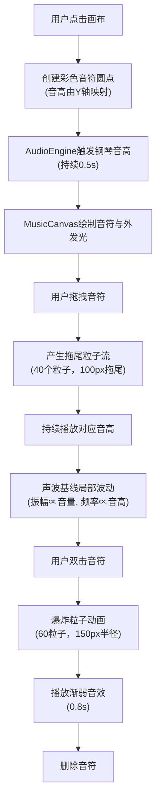
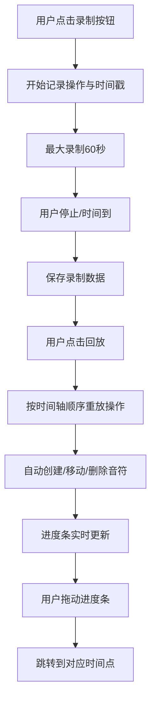

## 1. 产品概述

虚拟古典音乐厅音乐可视化应用，让用户以声音画家的身份在虚拟画布上通过鼠标交互创作音乐可视化作品。用户通过拖拽彩色音符产生流动的粒子轨迹和动态声波图案，同时触发实时钢琴音色，实现听觉与视觉的融合艺术体验。

**核心价值**：打破传统音乐欣赏的单一感官模式，让音乐可见、可画、可玩，为音乐爱好者和创意人士提供直观的音乐可视化创作工具。

**目标用户**：音乐爱好者、视觉艺术家、教育工作者、创意设计师。

---

## 2. 核心功能

### 2.1 用户角色

| 角色 | 注册方式 | 核心权限 |
|------|----------|----------|
| 普通用户 | 无需注册 | 创建音符、拖拽交互、录制回放、音色调整 |

### 2.2 功能模块

1. **主画布区域**：音符创建与交互、粒子流特效、动态声波可视化
2. **音频引擎**：Tone.js合成器、多音色支持、实时音频触发
3. **控制面板**：音量调节、音色选择、速度控制
4. **录制回放系统**：操作记录、时间轴回放、进度条控制

### 2.3 页面详情

| 页面名称 | 模块名称 | 功能描述 |
|----------|----------|----------|
| 主应用页面 | 画布区域 | 点击创建音符，拖拽移动产生粒子流，双击删除音符 |
| 主应用页面 | 声波基线 | 默认显示平缓波浪线，音符移动时产生局部波动 |
| 主应用页面 | 底部控制栏 | 录制按钮、回放按钮、进度条、控制面板入口 |
| 主应用页面 | SynthController | 音量滑块(0-100)、音色下拉(钢琴/电子琴/弦乐)、BPM旋钮(60-180) |

---

## 3. 核心流程

### 3.1 音符创建与交互流程

### 3.2 录制与回放流程

---

## 4. 用户界面设计

### 4.1 设计风格

- **设计基调**：深色音乐工作室风格，营造专业、沉浸的创作氛围
- **主色调**：#e94560（红色，代表热情与活力）
- **辅色调**：#0f3460（深蓝色，代表沉稳与深度）
- **背景色**：#1a1a2e（深紫蓝色，营造音乐厅氛围）
- **画布背景**：#2a2a3e，带有径向渐变（中心#3a3a5e向外）
- **字体**：Google Fonts Playfair Display（优雅的衬线字体，古典音乐厅风格）
- **视觉效果**：外发光、半透明混合、动态光点、脉冲动画

### 4.2 页面设计概述

| 页面名称 | 模块名称 | UI元素 |
|----------|----------|--------|
| 主应用 | 画布区域 | 居中80%宽、70%高，四周10%边距，径向渐变背景，外发光音符，半透明粒子 |
| 主应用 | 底部控制栏 | 左侧红色录制按钮（脉冲动画）、绿色回放按钮、中间进度条、右侧SynthController折叠面板 |
| 主应用 | SynthController | #0f3460背景，#e0e0e0字体，音量滑块、音色下拉、BPM旋钮 |
| 主应用 | 声波基线 | 柔和蓝色#4a4a8a，透明度0.5，振幅20px，波峰光点# aaddff |

### 4.3 响应式设计

**桌面端**：
- 画布宽度80%，高度70%，四周10%边距
- SynthController位于右侧折叠面板，宽度200px

**移动端**：
- 画布宽度调整为95%
- 控制栏高度自适应
- SynthController面板置底并水平排列
- 触摸事件优化，增大点击区域

### 4.4 动画与交互细节

1. **音符外发光**：glow shadow，颜色与音符相同，模糊半径4px
2. **粒子混合模式**：globalAlpha 0.3-0.6，半透明叠加
3. **波峰光点**：沿波峰移动，大小3px，颜色#aaddff
4. **录制按钮**：红色圆形，点击后脉冲动画
5. **拖尾粒子**：以音符速度的0.5倍向拖拽方向扩散，生命周期2s
6. **爆炸粒子**：60个粒子向四周扩散，半径150px，1.5s消散

---

## 5. 性能约束

- **画布渲染帧率**：≥50FPS
- **音频触发延迟**：≤50ms
- **回放时间误差**：≤±100ms
- **粒子数量上限**：同时存在≤500个粒子
- **内存管理**：粒子生命周期结束后及时清理
