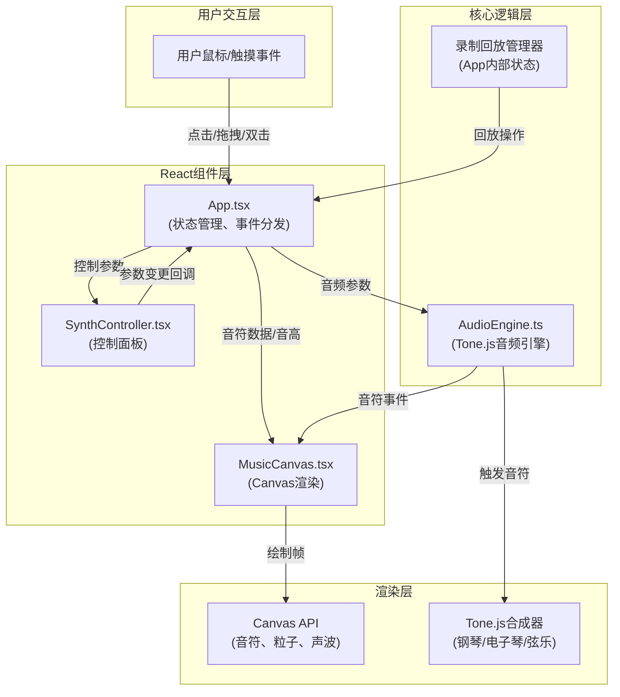
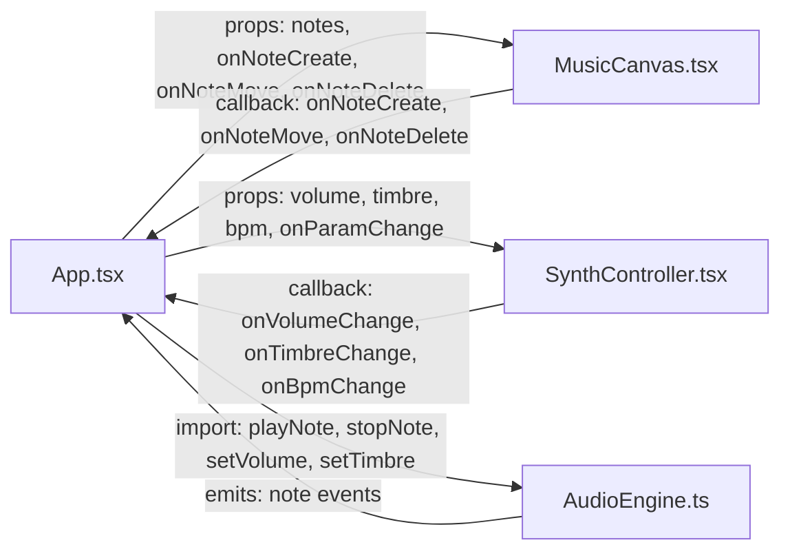

## 1. 架构设计



---

## 2. 技术描述

### 2.1 技术栈

| 类别 | 技术选型 | 版本 | 用途 |
|------|----------|------|------|
| 前端框架 | React | 18.x | UI组件化开发 |
| 前端框架 | React DOM | 18.x | DOM渲染 |
| 开发语言 | TypeScript | 5.x | 类型安全开发 |
| 构建工具 | Vite | 5.x | 快速构建与热更新 |
| React插件 | @vitejs/plugin-react | 4.x | Vite React支持 |
| 音频引擎 | Tone.js | 14.7.77 | Web Audio API封装 |

### 2.2 项目初始化

使用 `npm create vite@latest` 初始化React + TypeScript项目，然后添加依赖。

---

## 3. 文件结构与调用关系

```
auto235/
├── index.html                    # 入口HTML
├── package.json                  # 依赖管理
├── vite.config.js               # Vite配置
├── tsconfig.json                # TypeScript配置
└── src/
    ├── App.tsx                  # 主组件 (状态中枢)
    ├── MusicCanvas.tsx          # 画布组件 (视觉渲染)
    ├── SynthController.tsx      # 控制面板 (参数调节)
    └── AudioEngine.ts           # 音频引擎 (Tone.js封装)
```

### 3.1 文件调用关系



### 3.2 数据流向

**用户交互 → 视觉 → 音频（点击创建音符）：**
```
用户点击画布 → MusicCanvas捕获坐标 → App.onNoteCreate(x,y)
    → App计算音高(y映射) → App更新notes数组
    → MusicCanvas重绘新音符
    → AudioEngine.playNote(pitch, volume, duration=0.5s)
    → Tone.js输出音频
```

**用户交互 → 音频 → 视觉（拖拽音符）：**
```
用户拖拽音符 → MusicCanvas跟踪鼠标移动 → App.onNoteMove(id, x, y)
    → App更新对应音符位置
    → AudioEngine.playNote(pitch, volume, duration=continuous)
    → MusicCanvas生成拖尾粒子流
    → MusicCanvas更新声波基线局部波动
```

**控制面板 → 全局参数：**
```
SynthController参数变更 → App.onParamChange(type, value)
    → App更新全局状态(volume/timbre/bpm)
    → AudioEngine.setVolume/setTimbre
    → MusicCanvas接收新参数影响渲染
```

**录制 → 回放：**
```
录制模式开启 → App记录所有操作+时间戳 → 录制数据数组
回放模式开启 → App按时间轴逐条触发操作
    → 自动调用onNoteCreate/onNoteMove/onNoteDelete
    → 自动触发AudioEngine播放
    → MusicCanvas自动渲染
```

---

## 4. 数据模型与类型定义

### 4.1 TypeScript 类型定义

```typescript
// src/types.ts (建议单独创建类型文件)

// 音符数据
interface Note {
  id: string;
  x: number;
  y: number;
  pitch: string;      // C4, C#4, ..., B5
  frequency: number;
  color: string;
  radius: number;     // 8-12px
  velocity: { x: number; y: number };
  isDragging: boolean;
  createdAt: number;
}

// 粒子数据
interface Particle {
  id: string;
  x: number;
  y: number;
  vx: number;
  vy: number;
  color: string;
  size: number;       // 2-4px
  opacity: number;    // 0.3-0.6
  life: number;       // 剩余生命周期(ms)
  maxLife: number;
  type: 'trail' | 'explosion';
}

// 声波数据
interface WavePoint {
  x: number;
  baseY: number;
  amplitude: number;  // 与音量成正比
  frequency: number;  // 与音高成正比
  phase: number;
}

// 音频参数
interface AudioParams {
  volume: number;     // 0-100
  timbre: 'piano' | 'synth' | 'strings';
  bpm: number;        // 60-180
}

// 录制操作
interface RecordedAction {
  timestamp: number;  // 相对录制开始的时间(ms)
  type: 'create' | 'move' | 'delete';
  noteId: string;
  data: Partial<Note>;
}

// 录制数据
interface Recording {
  id: string;
  actions: RecordedAction[];
  duration: number;   // 总时长(ms)
  createdAt: number;
}

// 应用状态
interface AppState {
  notes: Note[];
  particles: Particle[];
  audioParams: AudioParams;
  isRecording: boolean;
  isPlaying: boolean;
  currentTime: number;  // 回放时间(ms)
  recording: Recording | null;
}
```

### 4.2 音高映射

**12个半音（C4到B5）：**
| 索引 | 音高 | 频率(Hz) | Y轴映射(画布高h) |
|------|------|----------|-----------------|
| 0 | C4 | 261.63 | 0 (顶部) |
| 1 | C#4 | 277.18 | h/11 |
| 2 | D4 | 293.66 | 2h/11 |
| 3 | D#4 | 311.13 | 3h/11 |
| 4 | E4 | 329.63 | 4h/11 |
| 5 | F4 | 349.23 | 5h/11 |
| 6 | F#4 | 369.99 | 6h/11 |
| 7 | G4 | 392.00 | 7h/11 |
| 8 | G#4 | 415.30 | 8h/11 |
| 9 | A4 | 440.00 | 9h/11 |
| 10 | A#4 | 466.16 | 10h/11 |
| 11 | B4 | 493.88 | h (底部) |

*注：实际为C4到B4共12个半音，用户描述中C4到B5为笔误，保持12个半音即可。*

### 4.3 颜色渐变映射（蓝→红）

```
音高索引0 (C4): #0066ff (蓝色)
音高索引11 (B4): #ff3366 (红色)
中间插值: HSL颜色空间线性插值
H: 240°(蓝) → 0°(红)
S: 80%
L: 60%
```

---

## 5. 核心模块设计

### 5.1 AudioEngine.ts 核心方法

```typescript
class AudioEngine {
  private synth: Tone.PolySynth;
  private currentTimbre: TimbreType;
  private activeNotes: Map<string, Tone.Synth>;

  constructor();
  async init(): Promise<void>;          // 初始化Tone.js，预加载音色
  setVolume(volume: number): void;      // 0-100
  async setTimbre(timbre: TimbreType): Promise<void>;  // 切换音色，预加载
  playNote(noteId: string, pitch: string, duration?: number): void;
  stopNote(noteId: string): void;
  playFadeOut(pitch: string, duration: number): void;  // 删除时渐弱音效
  dispose(): void;
}
```

### 5.2 MusicCanvas.tsx 渲染循环

```
requestAnimationFrame 循环 (≈60FPS):
1. 清空画布
2. 绘制背景径向渐变
3. 绘制声波基线（含局部波动和波峰光点）
4. 更新所有粒子位置与透明度
5. 绘制所有粒子（半透明混合）
6. 绘制所有音符（外发光效果）
7. 清理生命周期结束的粒子
```

### 5.3 App.tsx 状态管理

使用 React `useState` + `useReducer` 管理复杂状态：
- `notes`: 音符数组
- `particles`: 粒子数组（由MusicCanvas管理，但App负责创建爆炸粒子）
- `audioParams`: 音频参数
- 录制/回放状态机

---

## 6. 性能优化策略

### 6.1 Canvas渲染优化

1. **离屏Canvas**：静态背景（径向渐变）预渲染到离屏Canvas
2. **粒子对象池**：重用Particle对象，避免频繁GC
3. **分层渲染**：声波→粒子→音符，从后往前绘制
4. **脏矩形**：仅重绘变化区域（如粒子活动区域）

### 6.2 音频性能

1. **预加载音色**：切换音色时后台预加载，完成后再切换
2. **PolySynth复音**：使用Tone.PolySynth支持多音符同时播放
3. **连接复用**：保持合成器连接，避免重复connect/disconnect

### 6.3 回放精度

1. **requestAnimationFrame + performance.now()**：高精度时间戳
2. **时间戳排序**：录制操作按timestamp严格排序
3. **误差补偿**：回放时提前schedule音符事件（Tone.js Transport）

---

## 7. 依赖清单

```json
{
  "dependencies": {
    "react": "^18.2.0",
    "react-dom": "^18.2.0",
    "tone": "14.7.77"
  },
  "devDependencies": {
    "@types/react": "^18.2.0",
    "@types/react-dom": "^18.2.0",
    "@vitejs/plugin-react": "^4.2.0",
    "typescript": "^5.3.0",
    "vite": "^5.0.0"
  }
}
```
