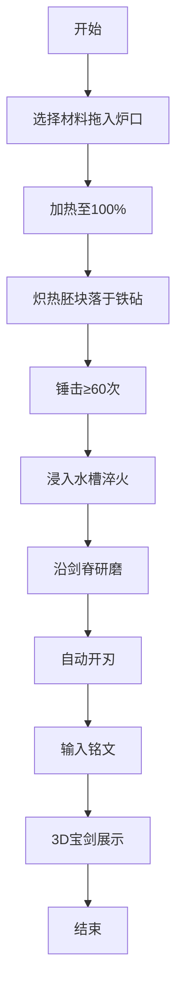

## 1. 产品概述

古代铸剑师模拟器是一款沉浸式3D交互体验应用，让用户化身隐居深山的铸剑大师，通过锤炼、淬火、研磨和开刃四步古法工艺锻造一柄属于自己的宝剑。项目通过精美的3D视觉效果和流畅的交互体验，传承中华剑文化的独特魅力。

- 核心价值：将传统铸剑工艺数字化，让用户亲身感受从铁矿石到神兵利器的完整锻造过程
- 目标用户：对传统文化、3D交互体验感兴趣的用户

## 2. 核心功能

### 2.1 用户角色
| 角色 | 注册方式 | 核心权限 |
|------|----------|----------|
| 铸剑师 | 无需注册，直接体验 | 完整的铸剑流程操作、铭文自定义、宝剑展示 |

### 2.2 功能模块
1. **材料加热阶段**：材料拖拽、炉火粒子效果、加热进度、材料软化变色
2. **锤炼塑形阶段**：鼠标点击锤击、铁砧震动、胚块形变、温度冷却
3. **淬火研磨阶段**：水槽淬火、蒸汽效果、砂石研磨、方向检测
4. **开刃展示阶段**：自动开刃、3D宝剑展示、铭文刻字、旋转特效

### 2.3 页面详情

| 页面名称 | 模块名称 | 功能描述 |
|-----------|-------------|---------------------|
| 主铸剑页面 | 剑炉场景 | 青砖剑炉、火焰粒子系统、温度控制 |
| 主铸剑页面 | 材料架 | 三种材料（玄铁、陨铁、寒铁）拖拽交互 |
| 主铸剑页面 | 铁砧区域 | 锤击交互、胚块形变、敲击音效 |
| 主铸剑页面 | 水槽区域 | 水波动画、蒸汽粒子、冷却效果 |
| 主铸剑页面 | 研磨区域 | 砂石拖拽、方向检测、火星效果 |
| 主铸剑页面 | 宝剑展示 | 3D模型旋转、铭文显示、特效展示 |
| 主铸剑页面 | UI层 | 进度条、提示信息、铭文输入框 |

## 3. 核心流程

用户打开应用后，首先看到古朴的铸剑场景，剑炉中火光摇曳。用户从右侧材料架选择材料拖入炉口，材料逐渐加热至100%后自动取出成为炽热胚块。胚块落在铁砧上，用户快速点击鼠标进行锤击，超过60次后胚块自动浸入水槽淬火。淬火完成后进入研磨阶段，用户沿剑脊方向拖拽砂石磨去氧化层。最后自动开刃，生成带有用户铭文的3D宝剑悬浮旋转展示。

## 4. 用户界面设计

### 4.1 设计风格

- **主色调**：暗暖色系，深棕色木制墙壁背景 `#4a2e1a`，青石板地面 `#3a3a3a`，入口背景 `#2a1e0e`
- **辅助色**：炉火橙 `#ff6600`，蓝白 `#aaddff`，金属灰 `#555555`，神秘紫 `#8844aa`，幽蓝 `#3366ff`
- **字体**：Google Fonts - Noto Serif SC（古风宋体，契合铸剑主题）
- **动效**：所有过渡使用 ease-out 缓动，工具切换 0.3s 淡入过渡
- **视觉元素**：烛光径向渐变光晕、炉火粒子喷射、熔岩流动纹理、金属反光效果

### 4.2 页面设计概述

| 页面名称 | 模块名称 | UI元素 |
|-----------|-------------|----------|
| 主铸剑页面 | 剑炉场景 | 青砖纹理剑炉、动态火焰粒子（100颗/秒，橙至蓝白渐变）、温度从1200℃降至800℃ |
| 主铸剑页面 | 铁砧 | 半透明2x1.5单位、锤击凹痕纹理、震动反馈 |
| 主铸剑页面 | 材料架 | 三种金属块（玄铁灰、陨铁紫、寒铁蓝）、拖拽交互 |
| 主铸剑页面 | 水槽 | 水波荡漾、粒子飞溅、蒸汽升起 |
| 主铸剑页面 | 宝剑展示 | 镜面反射、悬浮旋转（10s周期）、铭文刻字、发光特效 |
| 主铸剑页面 | UI层 | 加热进度条、锤击计数、研磨进度、方向错误提示、铭文输入框 |

### 4.3 响应式设计

- **桌面优先**：1920x1080 为基准设计
- **中等屏幕**：1366x768 适配，剑炉和铁砧缩小至80%，材料架从右侧移至正下方
- **性能要求**：主循环45fps以上，粒子系统最多500颗，超出自动丢弃最早粒子

### 4.4 3D场景指导

- **环境**：深棕色木制墙壁、青石板地面、左侧烛光（半径20px径向渐变光晕）
- **光照**：环境光 `#4a3a2a`，方向光 `#fff4e6`，火光点光源动态变化
- **相机**：透视相机，视野45度，固定视角观察铸剑台
- **粒子系统**：
  - 炉火粒子：每秒100颗，橙#ff6600至蓝白#aaddff渐变
  - 蒸汽粒子：淬火时生成，向上飘散
  - 火星粒子：研磨方向错误时生成
- **后期效果**：
  - 炽热胚块：橙红光芒，熔岩流动纹理
  - 剑身：光洁如镜，反射周围火光
  - 开刃：边缘锋利反光效果
