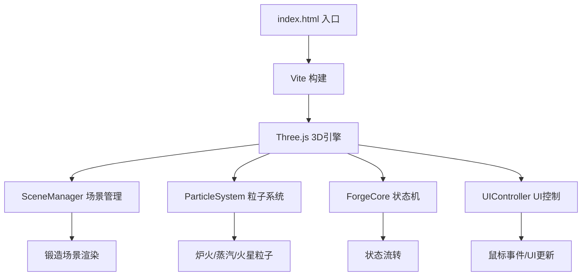

## 1. 架构设计



## 2. 技术描述

- **前端框架**：TypeScript + Three.js
- **构建工具**：Vite
- **3D引擎**：Three.js (r120+)
- **类型定义**：@types/three
- **初始化方式**：Vite 初始化 Vanilla TypeScript 项目

## 3. 文件结构

```
├── package.json          # 项目依赖配置
├── index.html          # 入口HTML页面
├── vite.config.js      # Vite构建配置
├── tsconfig.json       # TypeScript配置
└── src/
    ├── main.ts              # 应用入口
    ├── forgeCore.ts       # 核心状态机
    ├── sceneManager.ts   # 3D场景管理
    ├── uiController.ts   # UI交互控制
    └── particleSystem.ts # 粒子系统
```

## 4. 核心模块说明

### 4.1 ForgeCore (锻造核心状态机)
- **职责**：管理锻造流程的状态机，包含加热、锤击、淬火、研磨、开刃、展示六个状态
- **核心属性**：
  - `currentState`: 当前状态
  - `hammerCount`: 锤击计数
  - `temperature`: 温度数值
  - `materialType`: 材料类型
  - `heatingProgress`: 加热进度
  - `grindingProgress`: 研磨进度
- **核心方法**：
  - `enterState(state)`: 切换状态
  - `update(delta)`: 帧更新

### 4.2 SceneManager (场景管理器)
- **职责**：创建Three.js场景、相机、光源，管理所有3D对象
- **核心属性**：
  - `scene`: Three.js场景
  - `camera`: 透视相机（fov: 45°）
  - `renderer`: WebGL渲染器
  - `forge`: 剑炉模型
  - `anvil`: 铁砧模型
  - `sword`: 宝剑模型
- **核心方法**：
  - `init()`: 初始化场景
  - `render()`: 渲染循环
  - `createForge()`: 创建剑炉
  - `createAnvil()`: 创建铁砧
  - `createSword()`: 创建宝剑

### 4.3 ParticleSystem (粒子系统)
- **职责**：管理炉火、蒸汽、火星等粒子效果
- **核心属性**：
  - `maxParticles`: 最大粒子数（500）
  - `particles`: 粒子池
- **核心方法**：
  - `emitFireParticles()`: 发射炉火粒子
  - `emitSteamParticles()`: 发射蒸汽粒子
  - `emitSparkParticles()`: 发射火星粒子
  - `update()`: 更新粒子状态

### 4.4 UIController (UI控制器)
- **职责**：监听鼠标事件，更新UI，调用ForgeCore方法
- **核心方法**：
  - `initEventListeners()`: 初始化事件监听
  - `updateProgressBar()`: 更新进度条
  - `showMessage()`: 显示提示信息
  - `handleDragStart()`: 处理拖拽开始
  - `handleDragEnd()`: 处理拖拽结束
  - `handleHammerClick()`: 处理锤击
  - `handleGrind()`: 处理研磨

## 5. 状态流转定义

```typescript
type ForgeState = 'idle' | 'heating' | 'hammering' | 'quenching' | 'grinding' | 'sharpening' | 'showing';
```

## 6. 性能优化策略

- **帧率控制**：主循环使用 requestAnimationFrame，目标45fps+
- **粒子池**：最多500颗上限，FIFO丢弃策略
- **响应式**：监听 resize 事件，1366x768 以下缩放80%
- **内存管理**：及时释放不再使用的3D对象和粒子
