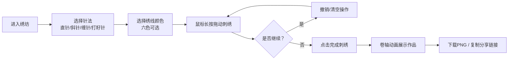

## 1. 产品概述

虚拟古代绣坊互动应用是一款基于浏览器的国风刺绣创作工具，让用户化身姑苏绣娘，以鼠标为针、屏幕为绢，在宣纸底稿上进行刺绣创作，最终生成可下载分享的数字绣品。

- 核心价值：传承苏绣文化，让传统技艺数字化、互动化，用户无需专业工具即可体验刺绣乐趣
- 目标用户：国风文化爱好者、手工艺术爱好者、数字艺术创作者
- 市场价值：填补传统刺绣数字化互动体验的空白，兼具文化传播和艺术创作价值

## 2. 核心功能

### 2.1 用户角色

| 角色 | 注册方式 | 核心权限 |
|------|----------|----------|
| 普通用户 | 无需注册 | 使用所有刺绣功能、下载作品、分享链接 |

### 2.2 功能模块

1. **刺绣主界面**：绣架展示、宣纸底稿、针法工具栏、绣线盘、控制按钮
2. **刺绣画布**：底稿渲染、鼠标交互、针法效果模拟、绣迹管理
3. **针法系统**：直针、斜针、缠针、打籽针四种传统苏绣针法
4. **绣线系统**：六种传统丝线颜色选择
5. **作品管理**：撤销、清空、完成刺绣
6. **分享展示**：卷轴式作品展示、PNG下载、Base64链接分享

### 2.3 页面详情

| 页面名称 | 模块名称 | 功能描述 |
|----------|----------|----------|
| 绣坊主界面 | 绣架组件 | 木质绣架（#8b5e3c，600x450px），左右莲花纹立柱，固定宣纸底稿 |
| 绣坊主界面 | 针法工具栏 | 竖排四个古风按钮（直针、斜针、缠针、打籽针），毛笔字体，羊皮纸背景，水墨晕染切换效果 |
| 绣坊主界面 | 绣线盘 | 六格丝线球（朱红、鹅黄、石绿、靛蓝、绛紫、粉白），点击切换颜色，放大动画 |
| 绣坊主界面 | 控制按钮 | 撤销（竹简图标）、清空（拂尘图标）、完成（玉玺图标），圆形40px |
| 绣坊主界面 | 作品展示区 | 卷轴式展开动画，显示绣品图、作品名称、时间戳 |
| 刺绣画布 | 底稿渲染 | 半透明宣纸，灰色细线牡丹花线稿，线宽0.5px |
| 刺绣画布 | 光标指示 | 圆形光标显示针迹大小（默认半径3px） |
| 刺绣画布 | 绣迹生成 | 鼠标长按拖动生成绣迹，四种针法不同排布样式 |
| 分享功能 | PNG下载 | canvas.toDataURL导出，文件名"绣品_时间戳.png" |
| 分享功能 | 链接分享 | Base64编码绣品数据，复制到剪贴板，2秒提示 |

## 3. 核心流程

用户进入绣坊 → 选择针法 → 选择绣线颜色 → 在底稿上长按鼠标拖动刺绣 → 可随时撤销/清空 → 完成刺绣 → 卷轴展示作品 → 下载/分享

## 4. 用户界面设计

### 4.1 设计风格

- **主色调**：仿古宣纸色#fcf5e8（背景）、绣架木色#8b5e3c（主色）、金色#ffd700（高亮）
- **丝线配色**：朱红#c0392b、鹅黄#f1c40f、石绿#27ae60、靛蓝#2980b9、绛紫#8e44ad、粉白#fadbd8
- **按钮样式**：仿旧羊皮纸#e5d5b0背景，黑色细线水墨边框，转角圆润
- **字体**：Google Fonts - Ma Shan Zheng（毛笔字体）用于按钮和标题
- **图标风格**：古风简约图标（竹简、拂尘、玉玺、箭头、链条）
- **动效风格**：水墨晕染、水波扩散、卷轴展开、丝绸纹理渐变

### 4.2 页面设计概述

| 页面名称 | 模块名称 | UI元素 |
|----------|----------|--------|
| 绣坊主界面 | 整体布局 | 三栏式：左针法栏、中绣架区、右绣线盘+作品展示；下方控制按钮 |
| 绣坊主界面 | 绣架 | 木质纹理#8b5e3c，600x450px，左右莲花纹雕刻立柱 |
| 绣坊主界面 | 针法按钮 | 竖排，羊皮纸背景#e5d5b0，Ma Shan Zheng字体，水墨晕染过渡0.3s，选中外发光#ffd700 6px |
| 绣坊主界面 | 绣线盘 | 2x3网格，丝线球带光泽渐变，点击放大1.1倍/0.15s，底部20x20px色块预览 |
| 绣坊主界面 | 控制按钮 | 圆形40px，竹简/拂尘/玉玺图标，位于绣架正下方 |
| 作品展示区 | 卷轴 | 从顶部向下展开0.6s，显示绣品图、名称输入框、时间戳 |
| 作品展示区 | 分享按钮 | 下载箭头和链条图标，位于卷轴下方 |

### 4.3 响应式

- **桌面优先**：1024px以上分辨率，绣架居中600x450px
- **平板适配**：768px-1024px，绣架宽度缩小至80%，调整字号和控件间距
- **交互优化**：所有过渡动画0.3s ease，悬停状态反馈清晰

### 4.4 性能要求

- Canvas刷新率 ≥ 60FPS
- 绣迹生成延迟 ≤ 16ms
- 撤销操作响应 < 50ms
