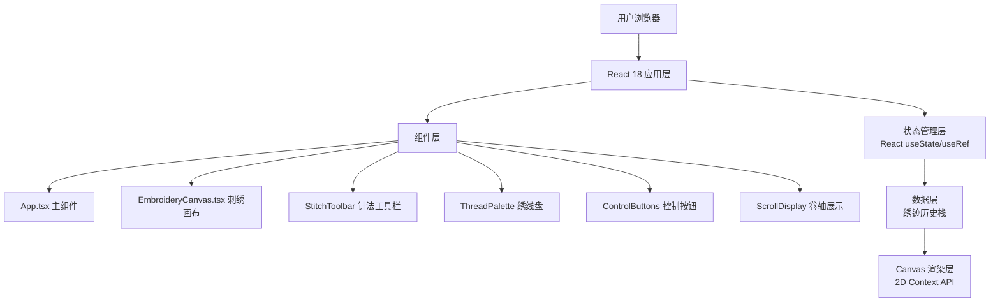
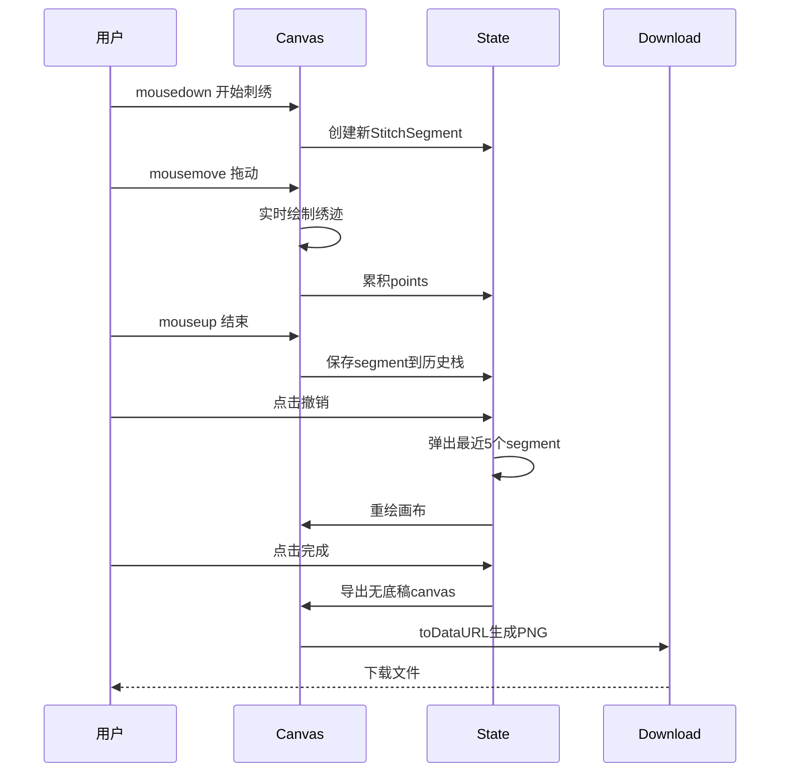

## 1. 架构设计



## 2. 技术描述

- **前端框架**：React@18 + TypeScript@5 + Vite@5
- **构建工具**：Vite@5 + @vitejs/plugin-react@4
- **状态管理**：React useState（UI状态） + useRef（Canvas引用、绣迹历史）
- **图形渲染**：HTML5 Canvas 2D API
- **唯一标识**：uuid@9
- **样式方案**：原生CSS + CSS变量 + CSS动画
- **字体**：Google Fonts - Ma Shan Zheng

## 3. 项目结构

```
├── package.json          # 依赖配置
├── index.html            # 入口HTML
├── vite.config.js        # Vite配置
├── tsconfig.json         # TypeScript配置
└── src/
    ├── main.tsx          # 应用入口
    ├── App.tsx           # 主组件（状态管理、布局）
    ├── components/
    │   └── EmbroideryCanvas.tsx  # 核心画布组件
    ├── types/
    │   └── embroidery.ts # 类型定义
    └── utils/
        └── stitches.ts   # 针法绘制工具
```

## 4. 核心类型定义

```typescript
// 针法类型
type StitchType = 'straight' | 'diagonal' | 'twist' | 'seed';

// 绣线颜色
type ThreadColor = '#c0392b' | '#f1c40f' | '#27ae60' | '#2980b9' | '#8e44ad' | '#fadbd8';

// 单个绣迹点
interface StitchPoint {
  x: number;
  y: number;
  pressure: number;
  timestamp: number;
}

// 一条绣迹线段
interface StitchSegment {
  id: string;
  type: StitchType;
  color: ThreadColor;
  points: StitchPoint[];
  radius: number;
}

// 绣品数据
interface EmbroideryData {
  segments: StitchSegment[];
  name: string;
  createdAt: number;
}
```

## 5. 核心算法

### 5.1 针法渲染

1. **直针**：密集平行短线段，沿鼠标路径垂直方向
2. **斜针**：45度角斜线段，等间距排列
3. **缠针**：螺旋缠绕线条，基于贝塞尔曲线
4. **打籽针**：小圆点组合，每个点独立绘制

### 5.2 绣迹历史管理

- 使用数组栈存储绣迹段
- 撤销操作弹出最近5个元素
- 清空操作重置数组但保留底稿

### 5.3 性能优化

- 使用requestAnimationFrame确保60FPS
- 离屏Canvas预渲染底稿
- 绣迹段批量绘制，减少Canvas API调用
- 鼠标事件节流，确保≤16ms延迟

## 6. 数据流转



## 7. 性能保障

- **Canvas分层**：底稿层 + 绣迹层双Canvas，避免重复绘制底稿
- **事件节流**：mousemove事件使用requestAnimationFrame节流
- **批量绘制**：同一针法颜色的绣迹批量绘制
- **内存管理**：限制最大历史记录数（默认100段）
