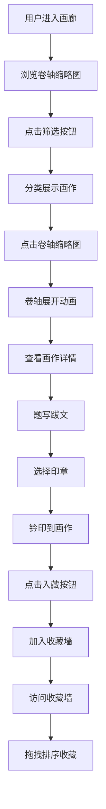

## 1. 产品概述

古风卷轴画廊互动应用，让用户以鉴藏家身份在虚拟绢布卷轴上浏览、筛选和品鉴古代书画作品。用户可为心仪画作题写跋文、钤盖印章，最终生成可分享的个人收藏卷轴墙。

- 核心价值：沉浸式古风书画品鉴体验，融合艺术欣赏与互动创作
- 目标用户：传统文化爱好者、书画艺术鉴赏者、收藏爱好者
- 市场定位：文化艺术类互动Web应用，弘扬中华传统书画艺术

## 2. 核心功能

### 2.1 用户角色
| 角色 | 注册方式 | 核心权限 |
|------|---------|---------|
| 访客用户 | 无需注册 | 浏览画廊、筛选画作、查看详情、题写跋文、钤盖印章、收藏作品、管理个人收藏墙 |

### 2.2 功能模块
1. **画廊主页**：卷轴缩略图网格展示、分类筛选、悬停交互动效
2. **卷轴详情**：卷轴展开动画、画作大图展示、跋文题写、印章钤盖、入藏功能
3. **个人收藏墙**：瀑布流展示收藏作品、拖拽排序、滚动淡入动画

### 2.3 页面详情
| 页面名称 | 模块名称 | 功能描述 |
|---------|---------|---------|
| 画廊主页 | 筛选导航栏 | 五个筛选按钮（全部、山水、花鸟、人物、书法），0.3秒淡出淡入切换 |
| 画廊主页 | 卷轴缩略图网格 | 4列布局，悬停放大1.08倍，边框变色，半透明绢布遮罩 |
| 卷轴详情 | 卷轴展开动画 | 从中心向两侧徐徐展开1.5秒，云纹粒子飘散效果 |
| 卷轴详情 | 详情侧栏 | 320px宽仿旧绢布背景，展示画作信息、跋文输入、印章选择 |
| 卷轴详情 | 跋文题写 | 最多100字，从右向左逐字毛笔书写动画 |
| 卷轴详情 | 印章钤盖 | 五种印章样式可选，三种颜色，随机0-15度旋转 |
| 卷轴详情 | 入藏功能 | 玉印按钮，金色"藏"字水印，收藏计数+1 |
| 个人收藏墙 | 瀑布流布局 | 两列布局展示收藏作品，带跋文和印章 |
| 个人收藏墙 | 拖拽排序 | 卡片半透明跟随，弹性动画重新排布 |
| 个人收藏墙 | 滚动加载 | 淡入动画效果，仿古宣纸纹理背景 |

## 3. 核心流程

用户浏览画廊 → 点击筛选按钮分类查看 → 点击感兴趣的卷轴 → 卷轴展开动画播放 → 查看画作详情 → 题写跋文（毛笔书写动画）→ 选择印章样式和颜色 → 钤印到画作上 → 点击入藏按钮 → 作品加入个人收藏墙 → 访问收藏墙查看所有收藏 → 拖拽调整排序

## 4. 用户界面设计

### 4.1 设计风格
- **主色调**：绢本黄 #f3ebd8（背景）、深褐木 #5d4037（边框）、朱红 #c0392b（点缀）
- **辅助色**：松木色 #8d6e63、金色 #d4a017、靛蓝 #2c3e50、墨黑 #2c2c2c
- **按钮风格**：圆角方形（border-radius: 4px），朱红渐变（#c0392b到#e74c3c），白色文字，点击弹性缩放（scale 0.95）
- **字体**：Ma Shan Zheng（毛笔字体，标题/跋文）、ZCOOL XiaoWei（古风字体，正文/标签）
- **布局风格**：卡片式网格布局，卷轴视觉隐喻，仿古宣纸纹理背景
- **图标风格**：古风玉器、印章等元素，使用lucide-react图标库

### 4.2 页面设计概述
| 页面名称 | 模块名称 | UI元素 |
|---------|---------|--------|
| 画廊主页 | 顶部导航 | 应用标题、收藏入口（带计数徽章）、仿古木色边框 |
| 画廊主页 | 筛选栏 | 五个古风按钮，选中状态朱红底色，未选绢布底色 |
| 画廊主页 | 缩略图网格 | 4列卡片，宣纸纹理内边框3px，松木外边框，悬停放大1.08倍，外框变宽5px加深颜色 |
| 画廊主页 | 缩略图遮罩 | 半透明绢布遮罩，悬停透明度从0.5降至0.2 |
| 卷轴详情 | 展开动画 | scaleX从0到1，中心固定，1.5秒缓动，云纹粒子飘散 |
| 卷轴详情 | 画作展示 | 最大4K分辨率，支持缩放查看，左侧空白显示跋文，右下角钤印 |
| 卷轴详情 | 侧栏面板 | 仿旧绢布#e8d8b0背景，贴边阴影，画作名称、作者、朝代、描述信息 |
| 卷轴详情 | 跋文输入 | 毛笔墨迹字体渲染，从右向左逐字书写动画，最多100字计数 |
| 卷轴详情 | 印章选择 | 浮窗展示5种64x64印章，浅浮雕效果，点击高亮，颜色选择器 |
| 卷轴详情 | 入藏按钮 | 带穗子玉印图标，点击后触发金色"藏"字水印动画 |
| 个人收藏墙 | 背景 | 仿古宣纸纹理，深褐木色边框装饰 |
| 个人收藏墙 | 瀑布流 | 两列布局，卡片带淡入动画，滚动触发 |
| 个人收藏墙 | 收藏卡片 | 展示画作缩略图、跋文、印章，支持拖拽 |
| 个人收藏墙 | 拖拽效果 | 拖拽时半透明，放下后弹性动画重排 |

### 4.3 响应式
- **桌面端**：缩略图网格4列，详情侧栏右侧滑出320px宽
- **平板端（<900px）**：缩略图网格2列，详情侧栏保持右侧滑出
- **移动端（<600px）**：缩略图网格1列全宽，详情侧栏改为底部弹出面板
- **触控优化**：按钮最小44x44px，触摸反馈明显，拖拽支持触摸操作

### 4.4 动效设计
- **缩略图悬停**：0.3秒过渡，缩放1.08倍，边框颜色变化，遮罩透明度变化
- **筛选切换**：0.3秒淡出淡入动画
- **卷轴展开**：1.5秒scaleX动画，中心固定，云纹粒子用requestAnimationFrame驱动
- **跋文书写**：CSS关键帧模拟毛笔笔触，逐字从右向左显示
- **印章钤盖**：缩放+旋转动画，轻微弹跳效果
- **收藏动画**：金色"藏"字水印淡入，收藏数字+1弹跳效果
- **滚动淡入**：IntersectionObserver监听，opacity从0到1，translateY从20px到0
- **拖拽排序**：requestAnimationFrame驱动位置更新，弹性动画过渡
