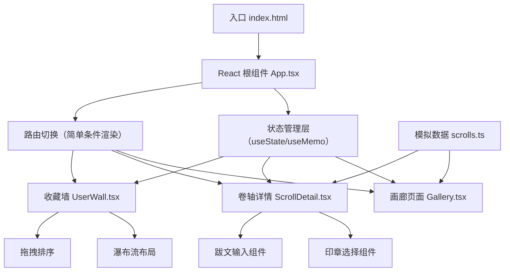

## 1. 架构设计

本应用为纯前端单页应用（SPA），采用React组件化架构，通过状态管理实现页面切换和数据共享，使用本地状态存储用户收藏和交互数据。



## 2. 技术描述

- **前端框架**：React 18 + TypeScript 5
- **构建工具**：Vite 5（端口8080）
- **状态管理**：React useState/useMemo（轻量级，无需额外状态管理库）
- **样式方案**：原生CSS + CSS Modules（结合CSS变量实现主题系统）
- **动画方案**：CSS Keyframes + requestAnimationFrame（高性能动画）
- **图标库**：lucide-react（玉印、收藏等图标）
- **唯一ID**：uuid（用于收藏项标识）
- **数据来源**：静态模拟数据（src/data/scrolls.ts）
- **浏览器兼容**：Chrome/Firefox最新版，稳定60FPS

## 3. 路由定义

采用简单的条件渲染实现页面切换，无需react-router-dom：

| 视图 | 触发条件 | 说明 |
|------|---------|------|
| 画廊主页 | 默认 / currentView='gallery' | 展示所有卷轴缩略图，支持筛选 |
| 卷轴详情 | 点击缩略图 / currentView='detail' | 卷轴展开动画，详情侧栏 |
| 个人收藏墙 | 点击收藏入口 / currentView='wall' | 瀑布流展示用户收藏 |

## 4. 类型定义

```typescript
// 画作类型
interface Scroll {
  id: string;
  name: string;
  author: string;
  dynasty: string;
  thumbnailUrl: string;
  largeImageUrl: string;
  description: string;
  category: '山水' | '花鸟' | '人物' | '书法';
}

// 印章类型
interface Seal {
  id: string;
  shape: 'gourd' | 'square' | 'circle' | 'oval' | 'rectangle';
  character: '永' | '赏' | '藏' | '鉴' | '玩';
  color: '#c0392b' | '#2c3e50' | '#2c2c2c';
  rotation: number; // 0-15度
  position: { x: number; y: number };
}

// 收藏项类型
interface CollectedScroll extends Scroll {
  colophon: string; // 跋文
  seal: Seal | null;
  collectedAt: number;
  order: number; // 排序位置
}

// 应用状态类型
interface AppState {
  scrolls: Scroll[];
  collectedScrolls: CollectedScroll[];
  selectedScroll: Scroll | null;
  currentView: 'gallery' | 'detail' | 'wall';
  filterCategory: string;
  isDetailOpen: boolean;
  isSealPanelOpen: boolean;
  selectedSealColor: string;
}
```

## 5. 项目文件结构

```
auto242/
├── package.json              # 项目依赖和脚本
├── index.html                # 入口HTML，Google Fonts引入
├── vite.config.js            # Vite配置，端口8080
├── tsconfig.json             # TypeScript配置，严格模式
├── .trae/
│   └── documents/
│       ├── PRD.md           # 产品需求文档
│       └── tech-arch.md     # 技术架构文档
└── src/
    ├── App.tsx              # 主应用组件，状态管理
    ├── main.tsx             # React入口
    ├── index.css            # 全局样式，CSS变量
    ├── data/
    │   └── scrolls.ts       # 8幅虚拟画作数据
    ├── components/
    │   ├── Gallery.tsx      # 画廊组件，缩略图网格
    │   ├── ScrollDetail.tsx # 卷轴详情，跋文印章
    │   ├── UserWall.tsx     # 收藏墙，瀑布流拖拽
    │   ├── SealSelector.tsx # 印章选择浮窗
    │   ├── ColophonInput.tsx # 跋文输入组件
    │   └── ScrollThumbnail.tsx # 卷轴缩略图组件
    ├── hooks/
    │   ├── useAnimation.ts  # 动画相关自定义Hook
    │   ├── useDragDrop.ts   # 拖拽排序Hook
    │   └── useScrollReveal.ts # 滚动淡入Hook
    └── utils/
        ├── particles.ts     # 云纹粒子系统
        └── sealShapes.tsx   # 印章SVG形状
```

## 6. 性能优化策略

### 6.1 渲染性能
- 使用 `React.memo` 包裹缩略图组件，避免不必要重渲染
- 使用 `useMemo` 缓存筛选后的画作列表
- 缩略图使用 `loading="lazy"` 懒加载
- 大图使用适当的压缩格式，支持4K但按需加载

### 6.2 动画性能
- 卷轴展开和粒子效果使用 `requestAnimationFrame` 驱动
- 动画属性仅限 `transform` 和 `opacity`，避免触发重排重绘
- 使用 `will-change` 提示浏览器优化
- 粒子数量控制在合理范围（20-30个）

### 6.3 内存管理
- 动画结束后及时清理 `requestAnimationFrame` 回调
- 粒子系统在组件卸载时销毁
- 大图在离开详情页时释放内存

## 7. 组件职责划分

| 组件 | 职责 | 核心Props |
|------|------|----------|
| App.tsx | 全局状态管理、视图切换、数据传递 | scrolls, collectedScrolls, currentView |
| Gallery.tsx | 筛选按钮、缩略图网格渲染、筛选动画 | scrolls, filterCategory, onSelect, onFilterChange |
| ScrollDetail.tsx | 卷轴展开动画、画作展示、详情侧栏、跋文输入、印章钤盖、入藏 | scroll, onClose, onCollect, onUpdateScroll |
| UserWall.tsx | 瀑布流布局、拖拽排序、滚动淡入 | collectedScrolls, onReorder |
| ScrollThumbnail.tsx | 单张缩略图渲染、悬停动效、收藏水印 | scroll, isCollected, onClick |
| SealSelector.tsx | 印章样式选择、颜色选择、钤印确认 | onSelect, onClose |
| ColophonInput.tsx | 跋文输入、毛笔书写动画、字数限制 | value, onChange, maxLength |
