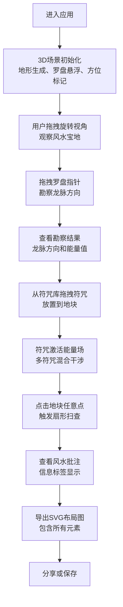

## 1. 产品概述

本项目是一款基于WebGL的3D风水罗盘交互应用，用户可以在虚拟的风水宝地中模拟古代堪舆师的工作流程，通过调整罗盘指针、布置符咒来改变地块的风水能量场，最终生成可分享的风水布局图。本应用解决了传统风水知识缺乏直观三维交互演示的问题，让用户能够以可视化的方式理解和体验风水学说。

- 核心目的：提供直观的3D风水交互体验，让用户以游戏化方式学习和应用风水知识
- 解决的问题：传统风水知识抽象难懂，缺乏可视化、可交互的演示工具
- 目标用户：风水爱好者、文化研究者、对东方传统文化感兴趣的普通用户

## 2. 核心特性

### 2.1 功能模块

1. **3D风水宝地场景**：随机生成的噪声地形、八卦方位标记、可旋转视角控制
2. **风水罗盘系统**：悬浮罗盘、可拖拽指针、龙脉方向勘察、粒子拖尾效果
3. **符咒系统**：符咒库、拖拽放置、能量场生成与混合、波纹干涉效果
4. **风水分析系统**：扇形扫查动画、信息标签生成、随机风水批注
5. **导出分享系统**：SVG风水布局图导出、等高线绘制、能量场标记

### 2.2 页面详情

| 页面名称 | 模块名称 | 功能描述 |
|-----------|-------------|---------------------|
| 主应用页面 | 3D场景模块 | 渲染直径20单位的圆形地块，中心有随机生成的微型山脉，支持鼠标拖拽旋转视角（Y轴0-360度，俯仰角15-75度），四周有八个半透明方位标记（乾、坤、震、巽、坎、离、艮、兑） |
| 主应用页面 | 罗盘交互模块 | 中央悬浮半透明风水罗盘（直径4单位，24山向刻度，60秒自转周期），金色指针可拖拽旋转，拖尾粒子效果，勘察结果实时显示 |
| 主应用页面 | 符咒放置模块 | 右侧符咒库包含五种符咒（招财符、化煞符、旺丁符、文昌符、桃花符），支持拖拽放置到地块任意位置，放置后激活动态能量场 |
| 主应用页面 | 风水分析模块 | 点击地块任意点触发扇形扫查动画（120度，3半径，2秒），生成半透明信息标签显示风水批注，环绕8个旋转八卦符号 |
| 主应用页面 | 导出功能模块 | 导出当前布局为SVG格式，包含等高线图、符咒位置、龙脉方向箭头、用户批注，生成时间≤2秒 |

## 3. 核心流程

主要用户流程：用户进入应用后，首先通过鼠标拖拽旋转3D视角观察整个风水宝地。然后拖动中央罗盘的金色指针来勘察龙脉走向，系统会实时显示龙脉方向和能量值。接着用户可以从右侧符咒库中选择不同类型的符咒，拖拽到地块的合适位置，每个符咒会激活动态的能量场，多个符咒的能量场会产生颜色混合和波纹干涉效果。用户还可以点击任意位置进行风水扫查，获取该位置的风水批注。最后，用户可以将当前的风水布局导出为SVG格式的图片，用于分享或保存。

## 4. 用户界面设计

### 4.1 设计风格

- **主色调**：古风暗色调，背景色#1a1a2a，营造神秘典雅的氛围
- **辅助色**：地面网格线#2a2a3a，方位标记#f0e68c（悬停#ffaa00），罗盘盘面#d4a574，指针#ffd700
- **符咒配色**：招财符#ff4444（红）、化煞符#4444ff（蓝）、旺丁符#44ff44（绿）、文昌符#aa44ff（紫）、桃花符#ff66aa（粉）
- **地形渐变**：溪流蓝#1a6b8a → 山脊青#4a7c59
- **字体**：使用楷体展示中文风水批注，字号14px，颜色#333333
- **按钮样式**：半透明圆角按钮，悬停时有轻微放大和发光效果
- **布局风格**：全屏3D场景为主体，右侧固定符咒库面板，顶部悬浮信息显示

### 4.2 页面设计概述

| 页面名称 | 模块名称 | UI元素 |
|-----------|-------------|-------------|
| 主应用页面 | 3D场景 | 圆形地块（直径20单位）、随机噪声山脉（高度-2到5）、渐变地形颜色、半透明方位标记（8个）、古风暗色调背景 |
| 主应用页面 | 罗盘UI | 半透明罗盘盘面（透明度0.3）、24山向刻度、金色指针、指针拖尾粒子（20个，2px大小）、勘察结果面板（半透明） |
| 主应用页面 | 符咒库 | 右侧垂直面板、5种符咒卡片（60x90px）、古篆符文纹理、拖拽时弹性缩放动画（1.1倍后回弹，0.3秒） |
| 主应用页面 | 能量场效果 | 圆形能量场（半径1.2单位，透明度0.3）、呼吸脉动效果（周期2秒）、重叠区域颜色混合、波纹干涉（波峰透明度0.5，波谷0.1） |
| 主应用页面 | 扫查与标签 | 扇形扫查动画（120度，白色#ffffff，透明度0.2，2秒）、半透明信息标签（自下而上弹入动画，-20px到0，0.4秒easeOut）、8个旋转八卦符号（周期4秒） |
| 主应用页面 | 导出UI | 导出按钮、SVG预览、等高线（等高距0.5，颜色#6b4423，透明度0.6）、龙脉方向箭头（金色，线宽2px，发光效果） |

### 4.3 响应式设计

- **设计原则**：Desktop-first，支持1920x1080到1024x768分辨率范围
- **3D场景适配**：自动根据屏幕尺寸调整相机参数和渲染分辨率
- **符咒库面板**：在小屏幕上可折叠为图标栏，点击展开
- **信息显示**：根据屏幕宽度调整字体大小和面板位置
- **触摸优化**：支持触摸拖拽旋转视角、触摸拖拽符咒、触摸点击扫查

### 4.4 3D场景设计

- **环境与氛围**：古风神秘氛围，深色背景配合柔和的环境光，营造夜晚观星勘察的意境
- **光照设置**：使用半球光（HemisphereLight）模拟天空光，配合方向光（DirectionalLight）模拟月光，添加柔和的环境光（AmbientLight）
- **相机设置**：透视相机（PerspectiveCamera），初始位置距离中心约25单位，俯仰角45度，支持轨道控制（OrbitControls）限制在Y轴0-360度、俯仰角15-75度范围
- **构图与焦点**：罗盘为视觉中心，位于地块正上方悬浮，符咒库位于右侧不遮挡主场景，信息标签在扫查点上方动态生成
- **交互与动画**：
  - 所有元素进入时透明度从0渐变到1（0.5秒）
  - 罗盘指针旋转时金色辉光效果（glowEffect半径0.1→0.3，周期0.5秒）
  - 方位标记悬停时放大1.2倍、变色#ffaa00、顺时针旋转（15度/秒）
  - 能量场呼吸脉动效果（周期2秒）
  - 信息标签弹入动画（-20px→0，0.4秒easeOut）
- **后处理效果**：轻微的Bloom效果增强发光元素，FXAA抗锯齿提升画面质量
- **性能预算**：帧率≥45FPS，粒子总数≤200，内存占用≤300MB，SVG导出时间≤2秒

## 5. 动画与交互细节

### 5.1 微交互动画

- **符咒拖拽**：拖拽开始时放大1.1倍，释放时回弹至原大小，持续0.3秒，使用easeOut弹性曲线
- **方位标记悬停**：鼠标悬停时缩放至1.2倍，颜色从#f0e68c变为#ffaa00，同时开始顺时针旋转（15度/秒）
- **罗盘指针辉光**：指针旋转时，周围金色辉光半径在0.1到0.3之间脉动，周期0.5秒
- **能量场呼吸**：已放置符咒的能量场半径在1.0到1.2倍之间脉动，透明度在0.2到0.4之间变化，周期2秒
- **信息标签出现**：扫查完成后，标签从-20px位移到0，透明度从0到1，使用easeOut曲线，持续0.4秒

### 5.2 性能要求

- **渲染帧率**：不低于45FPS，目标60FPS
- **粒子系统**：符咒放置时能量场粒子数不超过200
- **导出性能**：SVG生成时间不超过2秒
- **内存占用**：运行时不超过300MB
