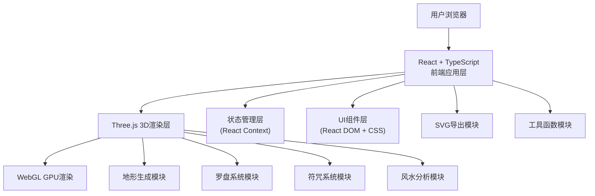

## 1. 架构设计



本项目采用纯前端架构，基于React + TypeScript + Three.js技术栈。主要分为三个层次：
1. **前端应用层**：使用React管理UI状态和组件生命周期，TypeScript提供类型安全
2. **3D渲染层**：使用Three.js进行WebGL渲染，包含地形、罗盘、符咒、粒子等核心3D元素
3. **业务逻辑层**：包含地形生成、罗盘交互、符咒系统、风水分析、SVG导出等独立模块

## 2. 技术说明

- **前端框架**：React@18 + TypeScript@5 + Vite@5
- **3D引擎**：three@0.160 + @types/three@0.160
- **构建工具**：Vite@5 + @vitejs/plugin-react@4
- **UI渲染**：React DOM@18（用于2D UI层）
- **辅助库**：uuid@9（唯一标识生成）、html2canvas@1（截图辅助，可选）
- **状态管理**：React Context + useReducer（轻量级状态管理）
- **动画系统**：Three.js Animation + CSS Animations + requestAnimationFrame

## 3. 文件结构与职责

| 文件路径 | 职责描述 | 核心功能 |
|-----------|----------|----------|
| `package.json` | 项目依赖配置 | 定义three、@types/three、typescript、vite、react、react-dom、uuid、html2canvas等依赖及启动脚本 |
| `vite.config.js` | Vite构建配置 | 配置React插件、开发服务器端口、构建输出路径 |
| `tsconfig.json` | TypeScript配置 | 启用严格模式、配置模块解析、JSX支持 |
| `index.html` | 应用入口 | 设置背景色#1a1a2a、加载根组件、配置viewport |
| `src/main.ts` | Three.js场景主入口 | 场景初始化、相机设置、轨道控制、渲染循环、事件分发 |
| `src/terrainGenerator.ts` | 地形生成模块 | 噪声地形生成、等高线计算、圆形地块网格构建、地形颜色渐变 |
| `src/compass.ts` | 罗盘系统模块 | 罗盘模型创建、24山向刻度、指针拖拽交互、龙脉方向计算、粒子拖尾系统 |
| `src/talisman.ts` | 符咒系统模块 | 符咒数据定义、拖拽放置逻辑、能量场生成、多能量场混合与波纹干涉 |
| `src/fengshuiAnalyzer.ts` | 风水分析模块 | 扇形扫查动画、信息标签生成、随机批注算法、SVG导出功能 |
| `src/utils.ts` | 工具函数模块 | 颜色混合函数、动画缓动函数、坐标转换、随机风水批注生成、噪声函数 |

## 4. 核心数据结构

### 4.1 TypeScript类型定义

```typescript
// 方位类型
type Direction = '乾' | '坤' | '震' | '巽' | '坎' | '离' | '艮' | '兑';

// 24山向类型
type Mountain24 = string; // 包含二十四山向名称

// 符咒类型
type TalismanType = 'wealth' | 'ward' | 'prosperity' | 'wisdom' | 'romance';

// 符咒数据接口
interface Talisman {
  id: string;
  type: TalismanType;
  name: string;
  color: string;
  position: THREE.Vector3;
  energyField: EnergyField;
}

// 能量场接口
interface EnergyField {
  radius: number;
  color: string;
  opacity: number;
  pulsePhase: number;
}

// 龙脉勘察结果
interface DragonVeinResult {
  direction: Direction;
  angle: number;
  energy: number; // 0-100
  mountain: Mountain24;
}

// 风水批注
interface FengshuiAnnotation {
  id: string;
  position: THREE.Vector3;
  content: string;
  waterOutlet?: {
    direction: Direction;
    angle: number;
  };
  recommendation: string;
}

// 地形高度数据
interface TerrainData {
  heights: number[][];
  size: number;
  minHeight: number;
  maxHeight: number;
  contours: ContourLine[];
}

// 等高线
interface ContourLine {
  height: number;
  points: THREE.Vector2[];
}

// 应用状态
interface AppState {
  dragonVein: DragonVeinResult | null;
  talismans: Talisman[];
  annotations: FengshuiAnnotation[];
  compassAngle: number;
  isDraggingCompass: boolean;
  isDraggingTalisman: boolean;
  activeTalismanType: TalismanType | null;
}
```

### 4.2 核心算法

1. **地形噪声生成**：使用改进的Perlin噪声算法，多层噪声叠加生成自然山脉形态
2. **等高线计算**：基于Marching Squares算法从高度场提取等高线路径
3. **龙脉方向计算**：根据指针角度映射到24山向和8个方位，结合地形高度计算能量值
4. **能量场混合**：使用Additive Blending算法进行多能量场颜色混合，正弦函数模拟波纹干涉
5. **扇形扫查**：使用Three.js的BufferGeometry动态更新扇形顶点实现扫查动画
6. **SVG导出**：将3D坐标投影到2D平面，使用原生SVG API绘制等高线、符咒、箭头、文字

## 5. 核心模块设计

### 5.1 地形生成模块 (terrainGenerator.ts)

```typescript
export class TerrainGenerator {
  constructor(size: number, segments: number);
  generateHeights(seed?: number): number[][];
  generateMesh(heights: number[][]): THREE.Mesh;
  calculateContours(heights: number[][], interval: number): ContourLine[];
  getHeightAt(x: number, z: number): number;
}
```

**关键实现点**：
- 圆形地块：使用圆形裁剪，将半径外的顶点高度设为-2
- 颜色渐变：根据顶点高度在#1a6b8a和#4a7c59之间进行插值
- 性能优化：使用BufferGeometry，合理设置分段数（建议64x64）

### 5.2 罗盘系统模块 (compass.ts)

```typescript
export class CompassSystem {
  constructor(scene: THREE.Scene, camera: THREE.Camera);
  createCompass(): THREE.Group;
  createNeedle(): THREE.Mesh;
  create24MountainMarkers(): THREE.Group;
  updatePointerRotation(angle: number): void;
  calculateDragonVein(angle: number): DragonVeinResult;
  updateParticles(deltaTime: number): void;
  handlePointerDrag(event: MouseEvent): void;
}
```

**关键实现点**：
- 粒子系统：使用THREE.Points管理20个粒子，更新位置和透明度实现拖尾效果
- 60秒自转：在渲染循环中更新罗盘rotation.y
- 指针交互：使用Raycaster检测鼠标与指针的碰撞

### 5.3 符咒系统模块 (talisman.ts)

```typescript
export class TalismanSystem {
  constructor(scene: THREE.Scene);
  createTalisman(type: TalismanType, position: THREE.Vector3): Talisman;
  createEnergyField(talisman: Talisman): THREE.Mesh;
  handleDragStart(type: TalismanType): void;
  handleDragMove(position: THREE.Vector3): void;
  handleDragEnd(position: THREE.Vector3): Talisman | null;
  updateEnergyFields(deltaTime: number): void;
  blendEnergyFields(): void;
}
```

**关键实现点**：
- 拖拽系统：实现HTML元素到3D场景的坐标映射（使用Raycaster）
- 呼吸脉动：使用sin(time)函数更新能量场的scale和opacity
- 波纹干涉：在Shader中叠加多个正弦波，根据距离计算波峰波谷

### 5.4 风水分析模块 (fengshuiAnalyzer.ts)

```typescript
export class FengshuiAnalyzer {
  constructor(scene: THREE.Scene, terrain: TerrainGenerator);
  startSweep(position: THREE.Vector3, duration: number): Promise<void>;
  generateAnnotation(position: THREE.Vector3): FengshuiAnnotation;
  createAnnotationLabel(annotation: FengshuiAnnotation): THREE.Group;
  createTrigramSymbols(position: THREE.Vector3): THREE.Group;
  exportSVG(options: ExportOptions): string;
}
```

**关键实现点**：
- 扇形扫查：动态更新扇形几何体的角度属性，从0到120度过渡
- SVG导出：使用等高线路径、符咒位置投影、龙脉方向线等元素拼接SVG
- 随机批注：基于位置的地形特征（高度、坡度、与龙脉夹角）生成有意义的批注

### 5.5 工具函数模块 (utils.ts)

```typescript
// 动画缓动函数
export const easeOutQuad = (t: number): number => t * (2 - t);
export const easeOutElastic = (t: number): number => {
  const c4 = (2 * Math.PI) / 3;
  return t === 0 ? 0 : t === 1 ? 1 : Math.pow(2, -10 * t) * Math.sin((t * 10 - 0.75) * c4) + 1;
};

// 颜色混合
export const blendColors = (color1: string, color2: string, ratio: number): string;

// 噪声函数
export const perlinNoise2 = (x: number, y: number, seed?: number): number;

// 坐标转换
export const worldToScreen = (position: THREE.Vector3, camera: THREE.Camera, width: number, height: number): { x: number; y: number };

// 随机风水批注生成
export const generateFengshuiCommentary = (position: THREE.Vector3, height: number, dragonAngle: number): string;

// 24山向映射
export const angleTo24Mountain = (angle: number): { mountain: Mountain24; direction: Direction };
```

## 6. 性能优化策略

### 6.1 渲染性能

- **几何体复用**：符咒和能量场使用InstancedMesh减少Draw Call
- **LOD技术**：地形使用不同细节层级，远距离时降低分段数
- **视锥体剔除**：确保所有对象都设置了frustumCulled = true
- **粒子优化**：使用BufferGeometry管理粒子，每帧仅更新必要的属性

### 6.2 内存管理

- **对象池**：粒子和扫查动画对象使用对象池复用，避免频繁GC
- **及时清理**：移除的符咒和标签调用dispose()释放几何体和材质
- **纹理复用**：符咒纹理使用TextureLoader缓存，避免重复加载

### 6.3 导出优化

- **Web Worker**：SVG导出在Web Worker中执行，避免阻塞主线程
- **增量计算**：等高线数据缓存，仅在地形变更时重新计算
- **简化路径**：使用Douglas-Peucker算法简化等高线路径，减小SVG体积

## 7. 开发与运行

### 7.1 安装依赖
```bash
npm install
```

### 7.2 开发模式
```bash
npm run dev
```

### 7.3 生产构建
```bash
npm run build
```

### 7.4 类型检查
```bash
npx tsc --noEmit
```
