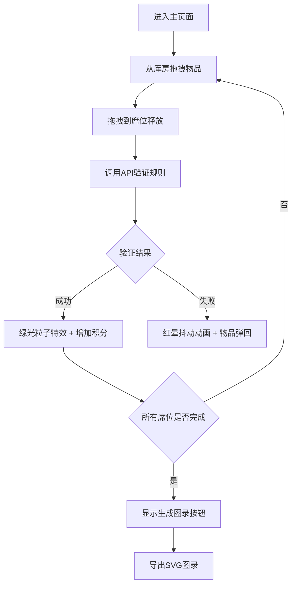

## 1. 产品概述
司膳官宴席编排系统是一款基于历史文化的互动式Web应用，用户扮演古代司膳官角色，通过拖拽匹配不同朝代的酒器与菜肴，确保宴席搭配符合历史礼仪规范。
- 主要用途：历史文化教育、互动式游戏体验
- 目标用户：历史爱好者、文化教育机构、普通用户
- 市场价值：将传统文化与现代交互设计结合，提供沉浸式历史学习体验

## 2. 核心功能

### 2.1 用户角色
| 角色 | 注册方法 | 核心权限 |
|------|----------|----------|
| 普通用户 | 无需注册，直接访问 | 拖拽匹配、查看积分、导出图录 |
| 管理员 | 口令验证"司膳令" | 修改搭配规则库 |

### 2.2 功能模块
1. **主页面**：拖拽交互区、积分显示、历史记录
2. **库房面板**：酒器/菜肴卡片列表，可拖拽，点击查看详情
3. **席位网格**：3x2席位布局，支持放置验证与特效反馈
4. **规则验证系统**：后端API验证朝代搭配规则
5. **积分系统**：实时计算礼仪积分，记录匹配历史
6. **宴席图录导出**：SVG格式导出宴席布局图
7. **管理员页面**：动态修改搭配规则库

### 2.3 页面详情
| 页面名称 | 模块名称 | 功能描述 |
|---------|---------|----------|
| 主页面 | 顶部状态栏 | 显示礼仪积分、历史记录列表 |
| 主页面 | 左侧库房面板 | 展示酒器/菜肴卡片，支持拖拽、点击查看详情 |
| 主页面 | 右侧席位网格 | 3x2席位布局，接受拖拽放置，显示匹配特效 |
| 主页面 | 底部操作区 | 生成图录按钮（全部匹配后显示） |
| 物品详情浮层 | 描述卡片 | 显示物品高清图、年代背景、匹配建议 |
| 图录导出浮层 | SVG预览 | 显示宴席平面图、八芒星装饰、司膳官印水印 |
| 管理员页面 | 规则管理 | 口令验证后可增删改搭配规则 |

## 3. 核心流程
用户进入主页面后，从左侧库房拖拽酒器或菜肴卡片到右侧对应朝代的席位中。系统通过后端API验证朝代匹配规则，验证成功则触发绿光粒子特效并增加积分，验证失败则显示红晕抖动动画。当所有6个席位都至少匹配一组酒器和菜肴后，可导出SVG格式的宴席礼仪图录。

## 4. 用户界面设计

### 4.1 设计风格
- **主色调**：米黄色古籍纸张色 #fcf5e8
- **辅助色**：深棕色 #8b4513、浅棕色 #8b5e3c、木纹棕 #6b4c3a
- **强调色**：成功绿 #7fff00、警告红 #ff3333
- **字体**：标题使用Ma Shan Zheng，正文使用ZCOOL XiaoWei
- **按钮风格**：圆角矩形，深棕色边框，悬停有轻微阴影
- **布局风格**：左右两栏布局，卡片式设计，木纹边框装饰
- **图标风格**：古风简约图标，使用线条绘制

### 4.2 页面设计概述
| 页面名称 | 模块名称 | UI元素 |
|---------|---------|--------|
| 主页面 | 顶部状态栏 | 大标题"司膳官宴席编排"、礼仪积分计数器、历史记录下拉列表 |
| 主页面 | 左侧库房面板 | 浅棕色木纹边框、标题"库房"、酒器/菜肴卡片网格、朝代标签 |
| 主页面 | 右侧席位网格 | 3x2席位布局、每个席位标注朝代、双槽位设计（酒器上/菜肴下） |
| 主页面 | 底部操作区 | 居中"生成图录"按钮（条件显示） |
| 物品详情浮层 | 描述卡片 | 半透明背景rgba(0,0,0,0.6)、450x280px居中卡片、高清图、年代描述、匹配建议、关闭按钮 |
| 图录导出浮层 | SVG预览 | 圆形宴席平面图、八芒星外圈装饰、司膳官印水印、积分显示、下载按钮 |

### 4.3 响应式设计
- **桌面端（>800px）**：左右两栏布局，卡片100x140px，席位120x160px，3x2网格
- **移动端（<800px）**：上下堆叠布局，库房在上席位在下，卡片缩小为80x110px，席位变为2x3网格
- **触摸优化**：增加触摸目标尺寸，支持触摸拖拽事件

### 4.4 动画与特效
- **拖拽**：卡片跟随鼠标，原位置保留半透明副本（opacity: 0.3），拖拽时阴影box-shadow: 0 4px 8px rgba(0,0,0,0.2)
- **成功特效**：20-30个#7fff00绿色粒子从中心爆出，大小从6px缩小到0px，持续1.5s
- **失败特效**：席位边框变为#ff3333红色，translateX在-3px到3px间摆动3次，持续0.3s
- **悬停**：卡片轻微放大，按钮颜色加深
