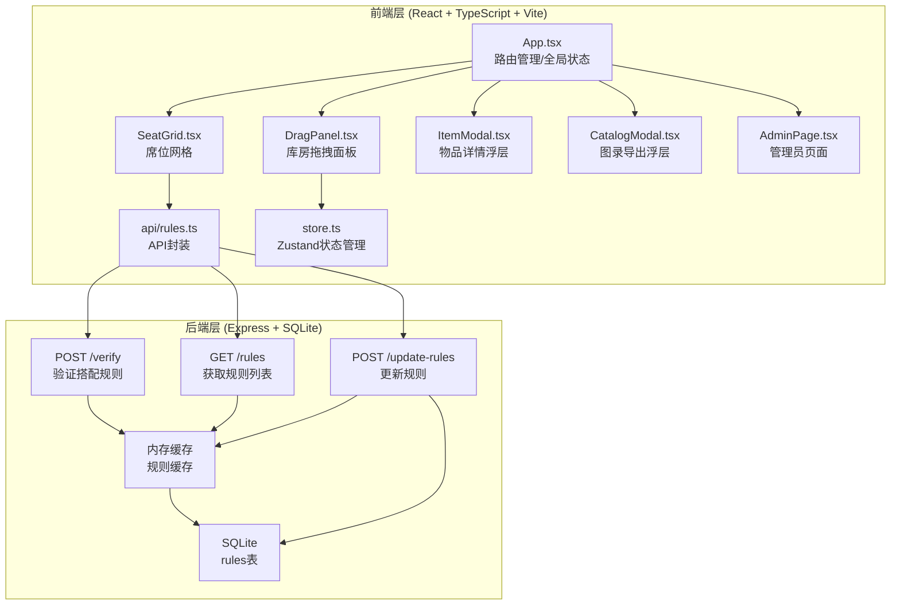
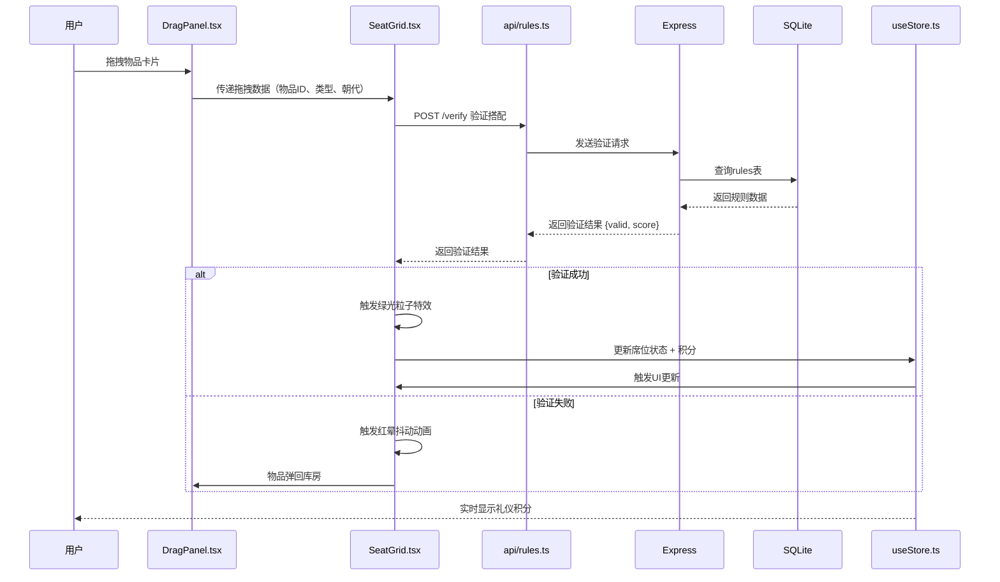
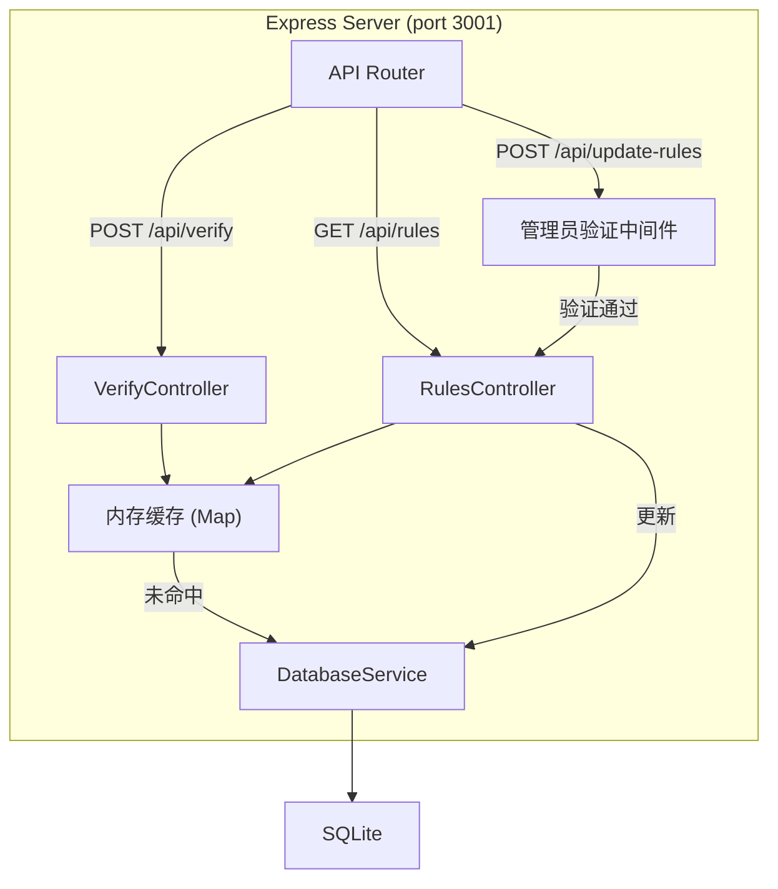
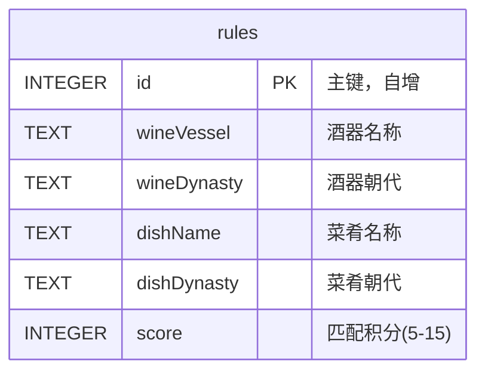

## 1. 架构设计



## 2. 技术描述
- **前端**: React@18 + TypeScript@5 + Vite@5 + Zustand@4
- **样式**: CSS Modules + CSS Variables
- **后端**: Express@4 + SQLite3@5
- **数据库**: SQLite（本地文件存储）
- **构建工具**: Vite@5
- **包管理器**: npm
- **其他依赖**: react-router-dom@6, uuid@9, cors@2, multer@1, concurrently@8

## 3. 目录结构

```
auto244/
├── .trae/documents/          # 项目文档
├── src/                       # 前端源码
│   ├── components/            # React组件
│   │   ├── DragPanel.tsx      # 库房拖拽面板
│   │   ├── SeatGrid.tsx       # 席位网格
│   │   ├── ItemModal.tsx      # 物品详情浮层
│   │   ├── CatalogModal.tsx   # 图录导出浮层
│   │   ├── ParticleEffect.tsx # 粒子特效组件
│   │   └── ItemCard.tsx       # 物品卡片组件
│   ├── api/                   # API封装
│   │   └── rules.ts           # 规则验证API
│   ├── store/                 # 状态管理
│   │   └── useStore.ts        # Zustand store
│   ├── types/                 # TypeScript类型定义
│   │   └── index.ts           # 类型定义
│   ├── data/                  # 静态数据
│   │   ├── wineVessels.ts     # 酒器数据
│   │   └── dishes.ts          # 菜肴数据
│   ├── utils/                 # 工具函数
│   │   ├── dragUtils.ts       # 拖拽工具
│   │   └── svgGenerator.ts    # SVG生成工具
│   ├── App.tsx                # 主应用组件
│   ├── main.tsx               # 入口文件
│   └── index.css              # 全局样式
├── server/                    # 后端源码
│   ├── index.js               # Express服务器入口
│   ├── database.js            # 数据库操作
│   └── database.sql           # 数据库初始化脚本
├── public/                    # 静态资源
│   └── images/                # 物品图片占位符
├── package.json               # 项目配置
├── vite.config.js             # Vite配置
├── tsconfig.json              # TypeScript配置
└── index.html                 # HTML入口
```

## 4. 数据流向



## 5. 路由定义
| 路由 | 用途 |
|------|------|
| / | 主页面，拖拽编排界面 |
| /admin | 管理员页面，口令验证后管理规则 |

## 6. API 定义

### 6.1 验证搭配规则
- **路径**: `POST /api/verify`
- **请求体**:
  ```typescript
  interface VerifyRequest {
    seatDynasty: string;      // 席位朝代
    itemType: 'wineVessel' | 'dish';
    itemDynasty: string;      // 物品朝代
    itemName: string;
  }
  ```
- **响应**:
  ```typescript
  interface VerifyResponse {
    valid: boolean;
    score: number;            // 5-15分，0表示不匹配
    message?: string;
  }
  ```

### 6.2 获取所有规则
- **路径**: `GET /api/rules`
- **响应**:
  ```typescript
  interface Rule {
    id: number;
    wineVessel: string;
    wineDynasty: string;
    dishName: string;
    dishDynasty: string;
    score: number;
  }
  
  type RulesResponse = Rule[];
  ```

### 6.3 更新规则（需管理员验证）
- **路径**: `POST /api/update-rules`
- **请求头**: `X-Admin-Token: 司膳令`
- **请求体**:
  ```typescript
  interface UpdateRulesRequest {
    rules: Omit<Rule, 'id'>[];
  }
  ```
- **响应**:
  ```typescript
  interface UpdateRulesResponse {
    success: boolean;
    message: string;
    updatedCount: number;
  }
  ```

## 7. 服务端架构



## 8. 数据模型

### 8.1 数据库表结构



### 8.2 数据库初始化SQL
```sql
-- 创建规则表
CREATE TABLE IF NOT EXISTS rules (
  id INTEGER PRIMARY KEY AUTOINCREMENT,
  wineVessel TEXT NOT NULL,
  wineDynasty TEXT NOT NULL,
  dishName TEXT NOT NULL,
  dishDynasty TEXT NOT NULL,
  score INTEGER NOT NULL CHECK (score >= 0 AND score <= 15)
);

-- 创建索引
CREATE INDEX IF NOT EXISTS idx_wine_dynasty ON rules(wineDynasty);
CREATE INDEX IF NOT EXISTS idx_dish_dynasty ON rules(dishDynasty);

-- 预置20条历史合规搭配数据
INSERT INTO rules (wineVessel, wineDynasty, dishName, dishDynasty, score) VALUES
('青铜觚', '商', '胙肉', '商', 10),
('青铜觚', '商', '羹汤', '商', 8),
('青铜爵', '商', '胙肉', '商', 10),
('青铜爵', '商', '糕点', '商', 7),
('青铜爵', '西周', '胙肉', '西周', 10),
('青铜爵', '西周', '羹汤', '西周', 8),
('青铜斝', '商', '胙肉', '商', 9),
('青铜尊', '西周', '胙肉', '西周', 10),
('青铜尊', '西周', '糕点', '西周', 7),
('青铜壶', '东周', '羹汤', '东周', 9),
('青铜壶', '东周', '胙肉', '东周', 10),
('漆耳杯', '汉', '羹汤', '汉', 8),
('漆耳杯', '汉', '糕点', '汉', 7),
('青瓷壶', '唐', '羹汤', '唐', 9),
('青瓷壶', '唐', '糕点', '唐', 8),
('执壶', '宋', '羹汤', '宋', 9),
('执壶', '宋', '糕点', '宋', 8),
('梅瓶', '宋', '胙肉', '宋', 10),
('玉壶春瓶', '元', '羹汤', '元', 9),
('玉壶春瓶', '元', '糕点', '元', 8);
```

### 8.3 前端数据模型
```typescript
// 物品类型
interface Item {
  id: string;
  name: string;
  dynasty: string;
  type: 'wineVessel' | 'dish';
  description: string;
  matchSuggestion: string;
  image: string;  // base64占位图
}

// 席位状态
interface Seat {
  id: string;
  dynasty: string;
  wineVessel: Item | null;
  dish: Item | null;
  score: number;
}

// 匹配历史记录
interface MatchRecord {
  id: string;
  timestamp: Date;
  seatId: string;
  seatDynasty: string;
  itemName: string;
  itemType: 'wineVessel' | 'dish';
  score: number;
}

// 全局状态
interface AppState {
  seats: Seat[];
  totalScore: number;
  matchHistory: MatchRecord[];
  selectedItem: Item | null;
  showCatalog: boolean;
}
```

## 9. 性能优化策略

### 9.1 拖拽性能
- 使用 `requestAnimationFrame` 驱动拖拽动画，确保响应延迟 < 15ms
- 使用 CSS `transform` 而非 `top/left` 进行位置更新，启用GPU加速
- 拖拽元素使用 `will-change: transform` 提示浏览器优化

### 9.2 粒子特效性能
- 粒子总数限制在 20-30 个，总粒子数不超过 50
- 使用 CSS 动画而非 Canvas 绘制，简化实现并保证性能
- 粒子动画使用 `transform` 和 `opacity` 属性，避免重排重绘

### 9.3 API 性能
- 后端使用内存缓存存储规则数据，首次加载后直接从内存读取
- 缓存命中率预计 > 99%，响应时间 < 200ms
- 规则更新后自动失效缓存，刷新页面重新加载

### 9.4 首屏加载性能
- 图片占位符使用 base64 内联，减少网络请求
- 使用 Vite 构建优化，代码分割，Tree Shaking
- 静态资源启用 gzip 压缩
- 目标 LCP < 2秒
