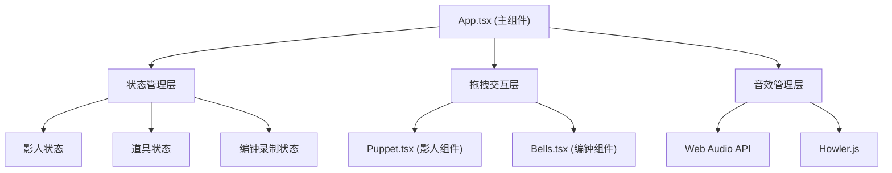

## 1. 架构设计



## 2. 技术描述

- **前端框架**：React@18 + TypeScript@5 + Vite@5
- **构建工具**：Vite@5，@vitejs/plugin-react
- **音频处理**：howler@2.2.4 + Web Audio API（原生）
- **工具库**：uuid@9
- **开发服务器**：Vite devServer，端口3000
- **状态管理**：React useState/useReducer（轻量场景，无需zustand）
- **动画方案**：CSS Transitions + requestAnimationFrame

## 3. 核心文件结构

| 文件路径 | 职责 |
|-------|---------|
| `package.json` | 项目依赖配置，scripts |
| `index.html` | 入口HTML，字体引入，背景色 |
| `vite.config.js` | Vite构建配置，devServer端口 |
| `tsconfig.json` | TypeScript配置（strict模式，ES2020） |
| `src/app.tsx` | 主组件，布局管理，状态协调，拖拽逻辑 |
| `src/puppet.tsx` | 影人组件，剪影渲染，关节动画，道具吸附 |
| `src/bells.tsx` | 编钟组件，钟鸣音效，录制/回放逻辑 |
| `src/types.ts` | 全局TypeScript类型定义 |
| `src/utils/audio.ts` | Web Audio音效生成工具 |
| `src/styles/global.css` | 全局样式，CSS变量，动画关键帧 |

## 4. 核心数据模型

### 4.1 影人数据结构
```typescript
interface Puppet {
  id: string;
  name: 'scholar' | 'general' | 'heroine' | 'clown';
  color: string;
  position: { x: number; y: number };
  isOnStage: boolean;
  joints: {
    leftArm: { angle: number; animated: boolean };
    rightArm: { angle: number; animated: boolean };
    leftLeg: { angle: number; animated: boolean };
    rightLeg: { angle: number; animated: boolean };
    head: { rotation: number };
  };
  props: Prop[];
  danceAction: 'idle' | 'jump' | 'spin' | 'bow';
}
```

### 4.2 道具数据结构
```typescript
interface Prop {
  id: string;
  name: 'moneyBag' | 'sword' | 'fan' | 'wineCup' | 'letter' | 'drum';
  position: { x: number; y: number };
  attachedTo: string | null;
  attachmentPoint: 'leftHand' | 'rightHand' | 'back' | null;
}
```

### 4.3 编钟数据结构
```typescript
interface Bell {
  id: string;
  note: 'Do' | 'Re' | 'Mi' | 'Fa' | 'Sol' | 'La' | 'Si';
  frequency: number;
  isActive: boolean;
}

interface Recording {
  events: Array<{ note: string; timestamp: number }>;
  startTime: number;
  duration: number;
}
```

## 5. 性能优化策略

1. **编钟音效预生成**：应用启动时预生成所有编钟音频缓冲区，点击时直接播放，确保延迟<50ms
2. **CSS动画优先**：使用transform和opacity属性动画，触发GPU加速
3. **will-change提示**：对频繁动画的元素添加will-change提示
4. **requestAnimationFrame**：粒子特效使用RAF调度，确保帧率稳定
5. **事件委托**：拖拽事件使用事件委托减少监听器数量
6. **内存管理**：录制结束后及时清理音频缓冲区，移除事件监听器

## 6. 动画与特效实现

### 6.1 拖拽弹性动画
```css
.dragging {
  transition: transform 0.15s cubic-bezier(0.25, 0.1, 0.25, 1);
  transition-delay: 0.05s;
}
```

### 6.2 关节动画
```css
.joint-animation {
  transition: transform 0.3s cubic-bezier(0.25, 0.1, 0.25, 1);
}
```

### 6.3 发光效果
```css
.backlight-effect {
  filter: drop-shadow(0 0 8px #ffaa00) drop-shadow(0 0 16px #ffaa00);
  opacity: 0.85;
}
```

### 6.4 粒子系统
- 粒子数：10-15个
- 颜色：#ffd700
- 大小：3-5px
- 持续时间：0.5s
- 扩散速度：随机方向，50-100px/s
