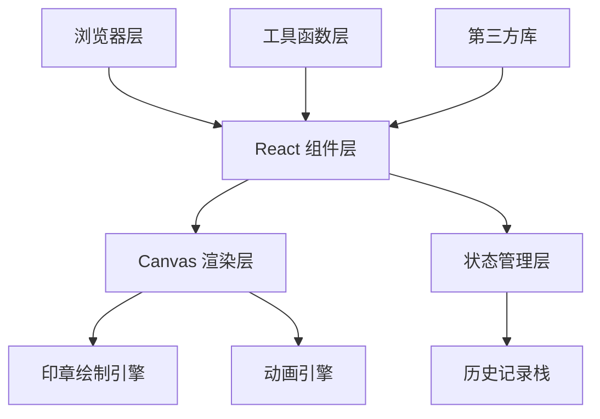

## 1. 架构设计



## 2. 技术描述

- **前端框架**：React@18 + TypeScript@5
- **构建工具**：Vite@5 + @vitejs/plugin-react@4
- **UI渲染**：HTML5 Canvas 2D API + SVG路径渲染
- **动画库**：canvas-confetti@1（粒子效果）
- **工具库**：uuid@9（生成唯一ID）
- **CSS方案**：原生CSS + CSS变量
- **字体方案**：Google Fonts - Ma Shan Zheng

## 3. 项目结构

```
.
├── package.json
├── index.html
├── vite.config.js
├── tsconfig.json
├── src/
│   ├── App.tsx              # 主应用组件
│   ├── main.tsx             # 入口文件
│   ├── components/
│   │   ├── SealDesigner.tsx # 印章设计画布
│   │   ├── StampGallery.tsx # 印谱收藏组件
│   │   ├── Toolbar.tsx      # 顶部工具栏
│   │   └── PreviewModal.tsx # 预览模态框
│   ├── hooks/
│   │   ├── useHistory.ts    # 撤销/重做Hook
│   │   └── useSealEngine.ts # 印章绘制引擎Hook
│   ├── utils/
│   │   ├── sealGenerator.ts # 印章生成工具
│   │   ├── strokeAdjuster.ts # 笔画调整工具
│   │   └── zhuanshuPaths.ts # 篆书SVG路径数据
│   ├── types/
│   │   └── index.ts         # TypeScript类型定义
│   └── index.css            # 全局样式
```

## 4. 数据类型定义

```typescript
// 篆书字体类型
type SealFont = 'xiaozhuan' | 'miaozhuan' | 'jiudiezhuan';

// 印面尺寸类型
type SealSize = '1cun' | '1.5cun' | '2cun';

// 刀法风格类型
type CarvingStyle = 'yinke' | 'yangke';

// 笔画数据
interface StrokeData {
  id: string;
  char: string;
  position: { x: number; y: number };
  originalPosition: { x: number; y: number };
  path: string;
  bounds: { width: number; height: number };
}

// 印章状态
interface SealState {
  font: SealFont;
  size: SealSize;
  style: CarvingStyle;
  characters: string[];
  strokes: StrokeData[];
}

// 印谱数据
interface StampItem {
  id: string;
  imageData: string;
  characters: string[];
  font: SealFont;
  style: CarvingStyle;
  createdAt: number;
}

// 历史记录项
interface HistoryItem {
  state: SealState;
  actionName: string;
}
```

## 5. 核心模块设计

### 5.1 印章绘制引擎
- **职责**：负责在Canvas上绘制印石纹理、篆字形、刻痕效果
- **关键函数**：
  - `drawStoneTexture()` - 绘制青田石纹理
  - `drawSealCharacters()` - 绘制篆书文字
  - `applyCarvingEffect()` - 应用阴刻/阳刻光影效果
  - `drawStrokeAdjustment()` - 绘制笔画调整状态

### 5.2 笔画调整系统
- **职责**：处理鼠标拖拽、弹性跟随、弹簧归位动画
- **关键参数**：
  - 拖拽范围：半径20px
  - 弹性系数：0.3
  - 归位动画：0.3秒弹簧效果

### 5.3 历史记录系统
- **职责**：管理撤销/重做操作，最多保存15步
- **数据结构**：双栈结构（历史栈 + 重做栈）
- **关键操作**：
  - `pushState()` - 保存当前状态
  - `undo()` - 撤销上一步
  - `redo()` - 重做上一步

### 5.4 钤盖动效系统
- **职责**：处理钤盖动画、粒子效果、宣纸渲染
- **动画序列**：
  1. 印章缩放至90%并旋转2度（0.3s）
  2. 回弹至原始大小（0.5s）
  3. 触发30个朱红色粒子
  4. 生成宣纸纹理印谱

## 6. 性能优化策略

### 6.1 Canvas渲染优化
- 使用离屏Canvas预渲染印石纹理
- 采用分层渲染：背景层 → 印文层 → 交互层
- requestAnimationFrame控制渲染帧率
- 脏区域重绘，避免全画布重绘

### 6.2 笔画调整优化
- 使用requestAnimationFrame处理拖拽更新
- 限制事件触发频率（节流）
- 提前计算笔画碰撞边界

### 6.3 印谱列表优化
- 虚拟滚动（如需要大量数据时）
- 图片懒加载
- 使用CSS transform实现动画，避免重排

## 7. 第三方库说明

| 库名 | 版本 | 用途 |
|------|------|------|
| react | ^18.2.0 | UI框架 |
| react-dom | ^18.2.0 | DOM渲染 |
| typescript | ^5.2.0 | 类型系统 |
| vite | ^5.0.0 | 构建工具 |
| @vitejs/plugin-react | ^4.2.0 | React支持 |
| uuid | ^9.0.0 | 生成唯一ID |
| canvas-confetti | ^1.9.0 | 粒子效果 |
