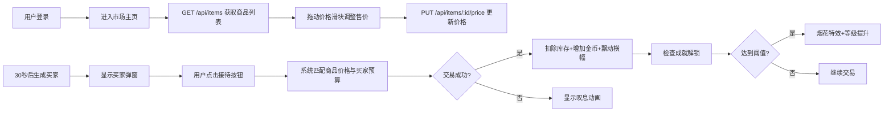
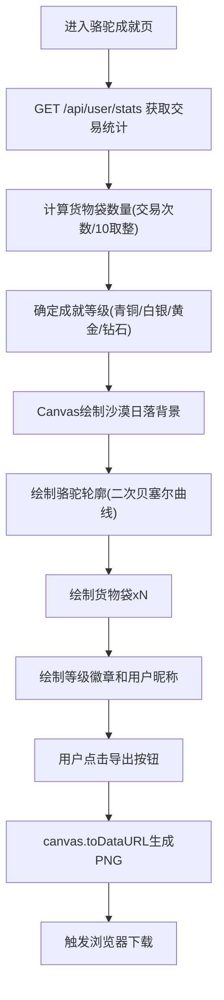

## 1. 产品概述

丝路胡商是一款基于浏览器的全栈模拟经营类Web应用，让用户扮演古代丝绸之路上的胡商，在虚拟市集中管理商品库存、动态调整售价、与模拟买家进行实时交易，最终解锁商队骆驼成就。

- 核心玩法：通过价格策略吸引买家，完成交易赚取金币，积累交易次数解锁成就
- 目标用户：喜欢模拟经营、历史题材游戏的玩家
- 产品价值：将古代丝绸之路文化与现代游戏机制结合，提供沉浸式的贸易体验

## 2. 核心功能

### 2.1 用户角色

| 角色 | 注册方式 | 核心权限 |
|------|---------|---------|
| 胡商玩家 | 用户名密码注册 | 管理商品库存、调整售价、接待买家、查看骆驼成就 |

### 2.2 功能模块

1. **用户认证模块**：注册、登录、退出登录
2. **市场主页**：商品卡片展示、价格调整滑块、实时价格更新
3. **库存管理**：商品上架/下架切换、库存查看
4. **模拟交易系统**：定时买家弹窗、交易匹配、金币结算、成就解锁
5. **骆驼成就系统**：Canvas绘制商队骆驼图、成就等级展示、PNG导出

### 2.3 页面详情

| 页面名称 | 模块名称 | 功能描述 |
|---------|---------|---------|
| 登录/注册页 | 认证表单 | 用户名密码输入、表单验证、注册登录切换 |
| 市场主页 | 商品卡片网格 | 6个初始商品展示、价格滑块、实时调价、金币闪光动画 |
| 市场主页 | 模拟买家系统 | 30秒定时生成买家弹窗、接待按钮、交易匹配逻辑 |
| 市场主页 | 成交横幅 | 交易成功后飘动金币横幅、数字跳动动画 |
| 我的库存页 | 库存列表 | 已上架/未上架商品分类、上架/下架按钮切换 |
| 骆驼成就页 | Canvas绘制 | 沙漠背景、骆驼绘制、货物袋随交易次数增加、等级徽章 |
| 骆驼成就页 | 导出功能 | 点击按钮导出PNG图片、触发下载 |
| 全站 | 成就解锁系统 | 交易次数达到阈值时触发烟花特效、金币音效 |

## 3. 核心流程

### 3.1 主交易流程

### 3.2 骆驼成就生成流程

## 4. 用户界面设计

### 4.1 设计风格

- **主色调**：#f2e6c9（羊皮纸色），营造古丝路市集氛围
- **辅助色**：#8b5e3c（胡桃木棕）、#c87d4a（骆驼棕）、#d42529（赤陶红）
- **字体**：Google Fonts - ZCOOL XiaoWei，中文古风字体
- **卡片风格**：半透明羊皮纸质感，粗糙莎草纸纹理，边角轻微磨损效果
- **动效风格**：轻盈自然的过渡动画，金币闪光、卡片上浮、飘动横幅等微交互
- **整体调性**：温暖、复古、充满异域风情的沙漠市集

### 4.2 页面设计概述

| 页面名称 | 模块名称 | UI元素 |
|---------|---------|--------|
| 全局导航栏 | 顶部导航 | 定高60px，背景#8b5e3c，文字#fff，左侧骆驼剪影图标，右侧金币计数，三个标签：市场/库存/骆驼成就 |
| 市场主页 | 商品卡片 | 160x220px，圆角8px，内边距12px，半透明莎草纸背景，展示名称/产地/售价/库存/调价滑块，hover放大1.05倍，点击抖动0.1s |
| 市场主页 | 价格滑块 | 步进1%，范围-20%~+20%，轨道颜色从#4caf50渐变到#f44336 |
| 市场主页 | 买家弹窗 | 半透明#d2a679背景，边框#8b5e3c，圆角12px，显示买家头像、预算、偏好商品类型、接待按钮 |
| 市场主页 | 成交横幅 | 右上角飞入，"成交！+xx金币"，从右向左飘动，2秒后消失 |
| 我的库存页 | 库存列表 | 左右分栏展示已上架/未上架商品，上架/下架按钮切换 |
| 骆驼成就页 | Canvas画布 | 沙漠日落渐变背景(#ff6b35→#f7c948)，骆驼主体(#b5955a)，驼峰(#c87d4a)，鞍辔(#d42529)，货物袋标注交易次数，右下角等级徽章 |

### 4.3 响应式设计

- **桌面端**（≥768px）：顶部导航60px，内容区左右分栏（侧边栏280px + 主区域自适应），商品卡片多列网格布局
- **移动端**（<768px）：顶部导航缩减至50px，字体缩小0.9倍，商品卡片变为2列布局，侧边栏隐藏或转为底部抽屉
- **触摸优化**：滑块拖动区域扩大，按钮最小尺寸44x44px，确保触摸操作流畅

### 4.4 动画特效说明

1. **价格更新**：数字0.2s过渡动画，卡片轻微上浮(translateY -4px)，金币闪光0.3s
2. **交易成功**：右上角飘动横幅（从右向左飞入，2秒消失），金币数字0.1s间隔逐次跳动
3. **交易失败**：缩小的叹气表情动画
4. **成就解锁**：屏幕中央烟花特效（60-80粒子，颜色#ffd700/#ff6347/#00ced1，持续2s），金币抖动音效
5. **卡片交互**：hover放大1.05倍+投影，点击抖动0.1s
