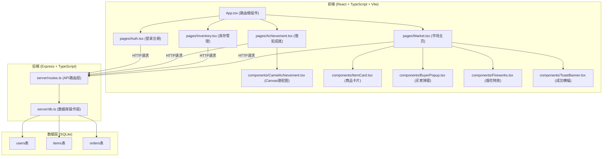
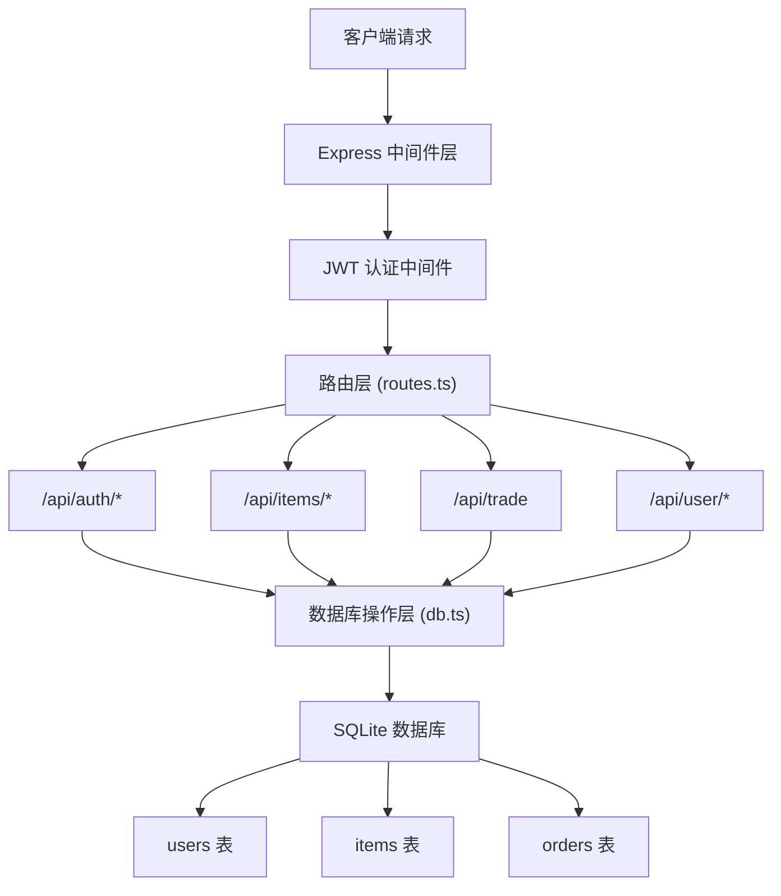
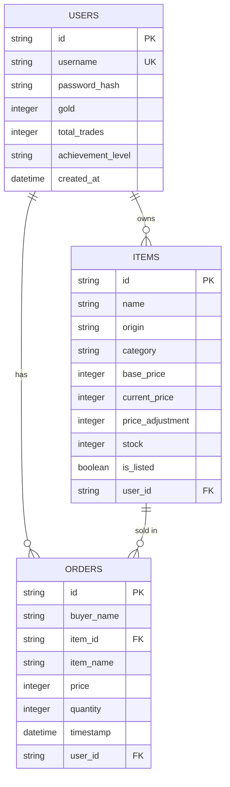

## 1. 架构设计



**数据流向说明：**
1. 前端页面组件 → HTTP请求 → 后端路由层(routes.ts) → 数据库操作层(db.ts) → SQLite数据库
2. 数据库查询结果 → db.ts → routes.ts → JSON响应 → 前端组件状态更新 → UI渲染

## 2. 技术描述

- **前端框架**：React@18 + TypeScript@5
- **构建工具**：Vite@5 + @vitejs/plugin-react@4
- **路由管理**：react-router-dom@6
- **后端框架**：Express@4
- **数据库**：SQLite3 (sqlite3包)
- **工具库**：uuid (生成唯一ID)、bcrypt (密码加密)、jsonwebtoken (用户认证)
- **开发工具**：concurrently (同时运行前后端)、ts-node (运行TypeScript后端)
- **样式方案**：原生CSS + CSS变量 + CSS Modules
- **动画方案**：CSS Transitions + CSS Animations + Canvas API

## 3. 路由定义

| 路由路径 | 页面/接口 | 用途 |
|---------|----------|------|
| / | 重定向 | 未登录跳转/login，已登录跳转/market |
| /login | Auth.tsx | 用户登录页面 |
| /register | Auth.tsx | 用户注册页面 |
| /market | Market.tsx | 市场主页，商品交易 |
| /inventory | Inventory.tsx | 我的库存管理 |
| /achievement | Achievement.tsx | 骆驼成就展示 |
| **API路由** | | |
| POST /api/auth/register | routes.ts | 用户注册 |
| POST /api/auth/login | routes.ts | 用户登录 |
| GET /api/items | routes.ts | 获取商品列表 |
| PUT /api/items/:id/price | routes.ts | 更新商品价格 |
| PUT /api/items/:id/status | routes.ts | 商品上架/下架 |
| POST /api/trade | routes.ts | 处理交易匹配 |
| GET /api/user/stats | routes.ts | 获取用户交易统计 |

## 4. API 类型定义

```typescript
// 商品类型
interface Item {
  id: string;
  name: string;
  origin: string;
  category: 'spice' | 'gem' | 'fabric';
  basePrice: number;
  currentPrice: number;
  priceAdjustment: number; // -20 到 +20
  stock: number;
  isListed: boolean;
  userId: string;
}

// 用户类型
interface User {
  id: string;
  username: string;
  gold: number;
  totalTrades: number;
  achievementLevel: 'none' | 'bronze' | 'silver' | 'gold' | 'diamond';
  createdAt: string;
}

// 订单类型
interface Order {
  id: string;
  buyerId: string;
  itemId: string;
  itemName: string;
  price: number;
  quantity: number;
  timestamp: string;
  userId: string;
}

// 买家类型
interface Buyer {
  id: string;
  name: string;
  avatar: string;
  budget: number; // 50-500
  preference: 'spice' | 'gem' | 'fabric';
}

// 认证请求
interface AuthRequest {
  username: string;
  password: string;
}

// 认证响应
interface AuthResponse {
  token: string;
  user: Omit<User, 'password'>;
}

// 价格更新请求
interface PriceUpdateRequest {
  adjustment: number;
}

// 交易请求
interface TradeRequest {
  buyerId: string;
  itemId: string;
}

// 交易响应
interface TradeResponse {
  success: boolean;
  message: string;
  goldEarned?: number;
  item?: Item;
  newAchievement?: string;
}

// 用户统计响应
interface UserStatsResponse {
  totalTrades: number;
  totalGold: number;
  achievementLevel: string;
  nextMilestone: number;
}
```

## 5. 服务端架构



**调用关系：**
- `server/index.ts` → 启动Express服务器，挂载中间件和路由
- `server/routes.ts` → 定义所有API端点，处理请求参数，调用db.ts方法
- `server/db.ts` → 封装SQLite操作，提供CRUD接口，处理数据持久化

## 6. 数据模型

### 6.1 ER 图



### 6.2 DDL 语句

```sql
-- 用户表
CREATE TABLE IF NOT EXISTS users (
  id TEXT PRIMARY KEY,
  username TEXT UNIQUE NOT NULL,
  password_hash TEXT NOT NULL,
  gold INTEGER DEFAULT 100,
  total_trades INTEGER DEFAULT 0,
  achievement_level TEXT DEFAULT 'none',
  created_at DATETIME DEFAULT CURRENT_TIMESTAMP
);

-- 商品表
CREATE TABLE IF NOT EXISTS items (
  id TEXT PRIMARY KEY,
  name TEXT NOT NULL,
  origin TEXT NOT NULL,
  category TEXT NOT NULL CHECK(category IN ('spice', 'gem', 'fabric')),
  base_price INTEGER NOT NULL,
  current_price INTEGER NOT NULL,
  price_adjustment INTEGER DEFAULT 0,
  stock INTEGER NOT NULL,
  is_listed BOOLEAN DEFAULT 1,
  user_id TEXT NOT NULL,
  FOREIGN KEY (user_id) REFERENCES users(id)
);

-- 订单表
CREATE TABLE IF NOT EXISTS orders (
  id TEXT PRIMARY KEY,
  buyer_name TEXT NOT NULL,
  item_id TEXT NOT NULL,
  item_name TEXT NOT NULL,
  price INTEGER NOT NULL,
  quantity INTEGER DEFAULT 1,
  timestamp DATETIME DEFAULT CURRENT_TIMESTAMP,
  user_id TEXT NOT NULL,
  FOREIGN KEY (item_id) REFERENCES items(id),
  FOREIGN KEY (user_id) REFERENCES users(id)
);

-- 索引
CREATE INDEX IF NOT EXISTS idx_items_user_id ON items(user_id);
CREATE INDEX IF NOT EXISTS idx_orders_user_id ON orders(user_id);
CREATE INDEX IF NOT EXISTS idx_orders_timestamp ON orders(timestamp);
```

### 6.3 初始数据

```typescript
// 6个初始商品，新用户注册时自动创建
const INITIAL_ITEMS = [
  { name: '胡椒', origin: '大马士革', category: 'spice', basePrice: 50 },
  { name: '肉桂', origin: '撒马尔罕', category: 'spice', basePrice: 40 },
  { name: '蓝宝石', origin: '波斯', category: 'gem', basePrice: 100 },
  { name: '丝绸', origin: '长安', category: 'fabric', basePrice: 80 },
  { name: '地毯', origin: '土耳其', category: 'fabric', basePrice: 70 },
  { name: '乳香', origin: '阿拉伯', category: 'spice', basePrice: 60 },
];

// 成就等级阈值
const ACHIEVEMENT_LEVELS = [
  { level: 'bronze', name: '青铜骆驼', tradesRequired: 10 },
  { level: 'silver', name: '白银骆驼', tradesRequired: 25 },
  { level: 'gold', name: '黄金骆驼', tradesRequired: 50 },
  { level: 'diamond', name: '钻石骆驼', tradesRequired: 100 },
];

// 买家名字池
const BUYER_NAMES = ['阿里', '哈桑', '法蒂玛', '穆罕默德', '艾哈迈德', '莱拉', '奥马尔', '阿伊莎'];

// 买家头像表情
const BUYER_AVATARS = ['👳', '🧕', '👲', '🧔', '👨‍🦱', '👩‍🦰', '👨‍🦳', '👩‍🦳'];
```

## 7. 性能优化策略

1. **数据库层**：使用SQLite内存模式+定期持久化，创建索引优化查询
2. **前端渲染**：React.memo优化商品卡片重渲染，useCallback缓存事件处理函数
3. **状态管理**：使用React Context + useReducer管理全局状态（用户信息、金币、成就）
4. **动画性能**：CSS动画使用transform和opacity属性，触发GPU加速
5. **请求优化**：价格滑块使用防抖(debounce 50ms)减少API请求频率
6. **资源加载**：路由懒加载，图片资源按需加载
7. **空闲性能**：定时器在页面隐藏时暂停，使用requestAnimationFrame处理Canvas绘制
