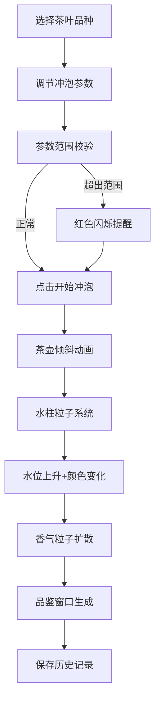

## 1. 产品概述

沉浸式3D茶道交互学习应用，通过虚拟茶室场景模拟传统茶艺冲泡过程，解决传统茶道技艺缺乏沉浸式交互学习与可视化反馈的问题。

- 主要用途：茶道爱好者、茶艺初学者通过交互式3D场景学习不同茶叶的冲泡技艺
- 目标用户：茶道爱好者、茶艺学习者、文化传播者
- 市场价值：将传统茶道文化与现代3D交互技术结合，提供可量化、可视化的茶道学习体验

## 2. 核心功能

### 2.1 功能模块

1. **3D虚拟茶室场景**：可环绕观察的茶室空间，包含茶台、茶具、庭院背景
2. **冲泡控制面板**：水温、注水角度、冲泡时长三个核心参数调节
3. **冲泡动画系统**：虚拟手注水、水柱粒子、水位上升、香气粒子扩散
4. **品鉴反馈面板**：茶汤色度可视化、香气指数评价、冲泡建议生成
5. **茶叶品种预设**：四种茶叶预设参数及范围校验提醒
6. **历史记录系统**：本地存储最多20条品鉴记录

### 2.2 页面详情

| 页面名称 | 模块名称 | 功能描述 |
|---------|---------|---------|
| 主界面 | 3D茶室场景 | 鼠标拖拽环绕视角（Y轴0-360度，俯仰30-60度），滚轮缩放（1-8单位） |
| 主界面 | 左侧控制面板 | 三个参数滑块实时调节，预设茶叶选择，开始/重置按钮 |
| 主界面 | 冲泡动画系统 | 茶壶倾斜注水、抛物线水柱粒子、水位上升、香气粒子扩散 |
| 主界面 | 右后方品鉴窗口 | Canvas实时渲染色度、香气指数文字评价、品评建议 |
| 主界面 | 历史记录列表 | 面板下方展示最多20条历史冲泡记录 |

## 3. 核心流程

用户选择茶叶品种 → 调节冲泡参数（水温、角度、时长）→ 系统校验参数范围 → 点击开始冲泡 → 注水动画播放（水柱粒子+水位上升） → 茶汤颜色变化 → 香气粒子扩散 → 品鉴窗口展示结果 → 自动保存历史记录

## 4. 用户界面设计

### 4.1 设计风格
- **主色调**：暖色调米色#f5e6d3、竹色#cfb997、深褐#5c3a21
- **点缀色**：灯芯草色#e6c300（微光边缘）
- **按钮样式**：半透明磨砂玻璃效果，圆角8px，点击按压反馈（0.05s缩放至0.95，颜色变暗15%）
- **字体**：选用雅致的宋体类衬线字体搭配清晰的无衬线字体
- **布局风格**：3D场景为主，控制面板悬浮于左侧，品鉴窗口悬浮于右后方
- **视觉效果**：柔和阴影（模糊10px，偏移2px）、微光边缘（内发光，#e6c300，透明度0.1-0.15）

### 4.2 页面设计概述

| 页面名称 | 模块名称 | UI元素 |
|---------|---------|---------|
| 主界面 | 3D茶室场景 | 10x8x5单位房间，竹席纹理地面，纸拉门庭院背景，紫砂茶台，茶具（茶壶、茶杯、茶则、茶巾），光泽材质+阴影 |
| 主界面 | 控制面板 | 200x300px半透明磨砂玻璃，水温滑块（蓝红渐变轨道），角度滑块，时长滑块，预设选择下拉框，开始/重置按钮 |
| 主界面 | 品鉴窗口 | 200x150px半透明磨砂玻璃，Canvas色度显示区，香气指数文字，品评建议文字 |
| 主界面 | 历史记录 | 可滚动列表，每条记录包含时间戳、参数值、色度、香气、品评 |

### 4.3 响应式设计
- **桌面端（>768px）**：3D场景为主，控制面板左侧悬浮，品鉴窗口右后方悬浮
- **移动端（≤768px）**：控制面板和品鉴窗口移至屏幕下方单列排列，高度不超过窗口30%，粒子数缩减至75%

### 4.4 3D场景指导
- **环境**：暖色调柔和光照，模拟茶室自然光
- **光照设置**：环境光+方向光主光源，投射柔和阴影
- **摄像机设置**：PerspectiveCamera，视角环绕Y轴0-360度，俯仰角30-60度，距离1-8单位
- **构图**：茶台位于场景中心，为视觉焦点
- **交互动画**：茶壶倾斜0.5s，粒子动画，所有过渡0.3-0.8s缓动（ease-in-out）
- **后处理**：柔和色调映射，适度抗锯齿
- **性能预算**：帧率30fps以上，粒子总数≤200/帧，Canvas渲染≤15fps

## 5. 动画与过渡规范
- 茶壶倾斜动画：0.5s，角度由注水角度滑块决定
- 水柱粒子：每秒60-100颗，半透明蓝白，受重力影响
- 水位上升速度：>60s时3s注满，30s时2s注满，<10s时1s注满
- 茶汤颜色：<70℃淡黄#e8d5a3，70-90℃金黄#d4a84b，>90℃深褐#8b5e3c
- 香气粒子：>60s时80颗，30-60s时50颗，<30s时20颗，白#ffffff渐变至淡绿#b0e57c，扩散半径2单位，持续3s
- 所有状态变化过渡：0.3-0.8s，cubic-bezier(0.4, 0, 0.2, 1)
- 参数超范围提醒：红色闪烁，周期0.5s，透明度0.2-0.5，持续3s
