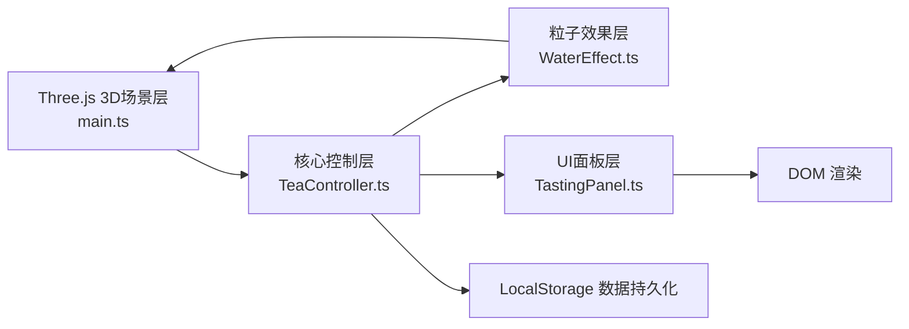

## 1. 架构设计



## 2. 技术描述

- **前端框架**：原生 TypeScript + Three.js（用户指定，不使用React框架）
- **构建工具**：Vite
- **3D引擎**：Three.js @0.160.0
- **类型定义**：@types/three @0.160.0
- **语言**：TypeScript 5.3+
- **后端**：无（纯前端应用）
- **数据存储**：LocalStorage（品鉴历史记录）
- **初始化方式**：手动创建文件结构（用户明确指定文件组织）

## 3. 项目文件结构

```
/
├── package.json          # 项目依赖与脚本
├── index.html            # 入口HTML
├── vite.config.js        # Vite配置
├── tsconfig.json         # TypeScript配置
└── src/
    ├── main.ts           # Three.js场景初始化、动画循环
    ├── TeaController.ts  # 冲泡参数控制器
    ├── WaterEffect.ts    # 水柱与香气粒子系统
    └── TastingPanel.ts   # 品鉴面板与历史记录
```

## 4. 核心模块设计

### 4.1 TeaController 类

```typescript
interface TeaParams {
  waterTemp: number;      // 0-100℃，默认85
  pourAngle: number;      // 0-90度，默认45
  brewDuration: number;   // 0-180秒，默认30
}

interface TeaPreset {
  name: string;
  origin: string;
  recommendedTemp: [number, number];
  recommendedAngle: [number, number];
  recommendedDuration: [number, number];
}

class TeaController {
  params: TeaParams;
  currentPreset: TeaPreset | null;
  presets: TeaPreset[];    // 龙井、铁观音、普洱、正山小种
  
  setWaterTemp(value: number): void;
  setPourAngle(value: number): void;
  setBrewDuration(value: number): void;
  loadPreset(presetName: string): void;
  validateParams(): { temp: boolean; angle: boolean; duration: boolean };
  onParamsChange(callback: (params: TeaParams) => void): void;
  reset(): void;
}
```

### 4.2 WaterEffect 类

```typescript
class WaterEffect {
  scene: THREE.Scene;
  waterParticles: THREE.Points;
  aromaParticles: THREE.Points;
  maxParticles: number;    // 200
  
  createWaterParticleSystem(): void;
  createAromaParticleSystem(): void;
  startPouring(angle: number, duration: number): void;
  updateWaterParticles(delta: number): void;
  updateAromaParticles(delta: number): void;
  stopPouring(): void;
  releaseAroma(count: number): void;
  getTeaColor(temp: number): THREE.Color;
  dispose(): void;
}
```

### 4.3 TastingPanel 类

```typescript
interface TastingRecord {
  timestamp: number;
  params: TeaParams;
  chroma: { r: number; g: number; b: number };
  aromaLevel: string;      // 清幽/宜人/馥郁
  comment: string;
}

class TastingPanel {
  container: HTMLElement;
  canvas: HTMLCanvasElement;
  records: TastingRecord[];
  maxRecords: number;      // 20
  
  renderChroma(r: number, g: number, b: number): void;
  renderAromaLevel(particleCount: number): string;
  generateComment(params: TeaParams): string;
  showPanel(record: TastingRecord): void;
  hidePanel(): void;
  saveRecord(record: TastingRecord): void;
  loadRecords(): TastingRecord[];
  renderHistoryList(): void;
}
```

## 5. 数据模型

### 5.1 茶叶预设数据

```typescript
const TEA_PRESETS: TeaPreset[] = [
  {
    name: '龙井',
    origin: '浙江杭州',
    recommendedTemp: [75, 85],
    recommendedAngle: [30, 45],
    recommendedDuration: [10, 20]
  },
  {
    name: '铁观音',
    origin: '福建安溪',
    recommendedTemp: [90, 95],
    recommendedAngle: [45, 60],
    recommendedDuration: [30, 45]
  },
  {
    name: '普洱',
    origin: '云南',
    recommendedTemp: [95, 100],
    recommendedAngle: [60, 75],
    recommendedDuration: [60, 120]
  },
  {
    name: '正山小种',
    origin: '福建武夷山',
    recommendedTemp: [85, 90],
    recommendedAngle: [45, 60],
    recommendedDuration: [20, 30]
  }
];
```

### 5.2 品鉴记录存储键

```typescript
const STORAGE_KEY = 'tea_tasting_records';
```

## 6. 性能优化策略

1. **粒子系统限制**：总粒子数≤200/帧，使用BufferGeometry减少绘制调用
2. **Canvas渲染节流**：品鉴窗口Canvas渲染≤15fps，使用requestAnimationFrame控制
3. **几何复用**：茶具使用简单几何或基本Mesh，避免复杂模型
4. **材质优化**：使用MeshStandardMaterial，减少纹理采样
5. **事件节流**：鼠标移动、滚轮事件使用throttle/debounce
6. **响应式降级**：移动端粒子数缩减至75%

## 7. 动画时序控制

使用统一的动画控制器管理所有过渡动画：
- 缓动函数统一使用 `cubic-bezier(0.4, 0, 0.2, 1)`
- 使用 `performance.now()` 精确控制动画时长
- 粒子更新与Three.js渲染循环同步
