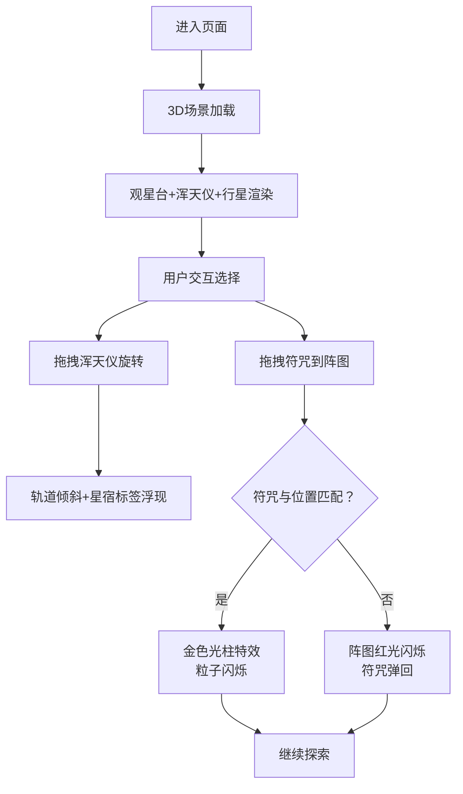

## 1. 产品概述

本项目是一个在浏览器中运行的3D占星推演模拟应用，让用户化身古代监天司官员，在观星台上通过操作浑天仪、观测星象、摆放符咒来预测国运。项目融合中国传统文化元素与现代3D交互技术，打造沉浸式的神秘占星体验。

## 2. 核心功能

### 2.1 用户角色
| 角色 | 注册方式 | 核心权限 |
|------|----------|----------|
| 监天司官员 | 无需注册，直接访问 | 操作浑天仪、拖拽符咒、观测星象变化 |

### 2.2 功能模块
1. **3D观星台场景**：汉白玉观星台、青铜浑天仪、五行星运行、八卦符咒旗帜
2. **浑天仪交互系统**：鼠标拖拽旋转浑天仪外环、行星轨道随动倾斜、星宿名称标签浮现
3. **符咒拖拽系统**：右侧符咒库、八卦阵图匹配、金色光柱触发/红光弹回反馈
4. **视觉特效系统**：银河背景、粒子效果、符咒飘动、光柱粒子闪烁

### 2.3 页面详情
| 页面名称 | 模块名称 | 功能描述 |
|---------|----------|----------|
| 主场景页 | 3D观星台 | 直径16单位汉白玉台，二十八星宿线刻图（暗金色#b8860b），90秒缓慢自转 |
| 主场景页 | 青铜浑天仪 | 半径6单位，青色#0099cc经纬线，透明度0.3，可拖拽旋转X/Y轴0-360度 |
| 主场景页 | 五行星系统 | 金木水火土五颗行星沿轨道运动，周期5s-30s不等，颜色各异 |
| 主场景页 | 八卦符咒旗 | 八面符咒旗帜环绕观星台，半透明材质，方位对应不同颜色，缓缓飘动 |
| 主场景页 | 星宿标签 | 浑天仪旋转时浮现星宿名称，半透明白色方块，楷体字体，始终面向摄像机 |
| 主场景页 | 符咒库面板 | 右侧UI面板，8种卦象符咒图标，60x60px，朱砂红#cc3333背景 |
| 主场景页 | 八卦阵图 | 浑天仪下方4单位直径八边形，对应八个卦象位置 |
| 主场景页 | 匹配反馈 | 匹配成功触发金色光柱（30个闪烁粒子），失败则红光闪烁弹回 |

## 3. 核心流程

用户进入页面后，首先看到3D观星台全景，中央浑天仪悬浮，行星缓缓运行，符咒旗帜环绕飘动。用户可以：
1. 鼠标拖拽浑天仪外环旋转，观察行星轨道倾斜变化和星宿标签
2. 从右侧符咒库拖拽符咒到下方八卦阵图
3. 若符咒与位置匹配，金色光柱冲天而起；若不匹配，阵图红光闪烁，符咒弹回
4. 重复尝试不同组合，探索天机

## 4. 用户界面设计

### 4.1 设计风格
- **主色调**：深空底色#0d0d1a，暗金色#b8860b，朱红色#cc3333
- **字体**：Google Fonts ZCOOL XiaoWei（楷体风格）
- **视觉风格**：神秘古风，星空宇宙，东方玄学
- **按钮效果**：按下时弹性缩放（scale 0.95），0.3s ease-out过渡
- **拖拽效果**：半透明阴影跟随（偏移5px，模糊8px）
- **背景**：银河旋臂渐变（紫#400080到深蓝#000033），星点粒子背景

### 4.2 页面设计概述
| 页面名称 | 模块名称 | UI元素 |
|---------|----------|--------|
| 主场景页 | 3D场景 | 观星台（汉白玉质感，星宿线刻）、浑天仪（青铜质感，青色经纬线）、五行星（五彩材质，轨道运行）、符咒旗（半透明，八方位颜色） |
| 主场景页 | 符咒库面板 | 右侧固定面板，8个符咒图标网格排列，悬停高亮，可拖拽 |
| 主场景页 | 八卦阵图 | 浑天仪正下方，八边形金色轮廓，八个方位高亮提示 |
| 主场景页 | 星宿标签 | 半透明白色方块，0.3单位大小，#ffffff，楷体文字，billboard效果 |
| 主场景页 | 特效层 | 金色光柱（高度8单位，直径0.5单位，30粒子闪烁2秒）、红光闪烁边框 |

### 4.3 响应式设计
- **桌面优先**：适配1920x1080和1440x900两种主流分辨率
- **布局自适应**：3D场景占满屏幕，符咒库面板固定右侧宽度240px
- **性能优化**：60FPS稳定帧率，Three.js渲染优化

### 4.4 3D场景指引
- **环境**：深空背景，银河渐变，星点粒子（500个随机分布）
- **光照**：环境光（强度0.4）+ 方向光（强度0.8，偏金色）+ 点光源（浑天仪中心，青色）
- **摄像机**：PerspectiveCamera，初始位置(0, 8, 20)，fov 60度
- **交互**：OrbitControls禁用，自定义拖拽旋转浑天仪
- **后处理**：轻微Bloom效果增强辉光，FXAA抗锯齿
- **动画**：所有过渡使用0.3s ease-out，行星运动使用requestAnimationFrame
