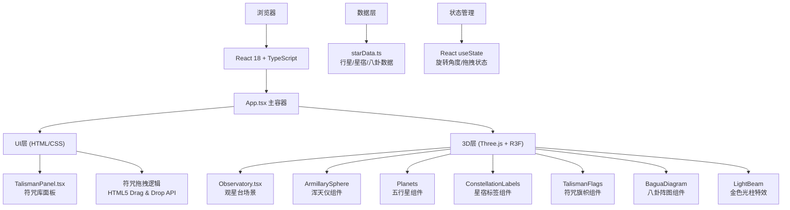

## 1. 架构设计



## 2. 技术描述

- **前端框架**: React 18 + TypeScript
- **构建工具**: Vite 5
- **3D引擎**: Three.js r160 + @react-three/fiber 8 + @react-three/drei 9
- **类型声明**: @types/three, @types/react, @types/react-dom
- **样式方案**: CSS Modules + CSS Variables (主题色定义)
- **字体**: Google Fonts - ZCOOL XiaoWei (楷体)
- **无后端**：纯前端应用，所有数据本地mock

## 3. 项目文件结构

```
d:\Solocoder\VersionFast\tasks\auto249\
├── package.json
├── index.html
├── vite.config.js
├── tsconfig.json
├── src/
│   ├── main.tsx          # React入口
│   ├── App.tsx           # 主应用组件
│   ├── components/
│   │   ├── Observatory.tsx      # 3D场景主组件
│   │   └── TalismanPanel.tsx    # UI符咒面板
│   ├── lib/
│   │   └── starData.ts          # 数据定义
│   └── styles/
│       └── global.css           # 全局样式
```

## 4. 核心技术实现

### 4.1 3D渲染方案
- 使用 @react-three/fiber (R3F) 声明式创建Three.js场景
- 使用 @react-three/drei 提供的辅助组件：Html, Billboard, Stars等
- 自定义 useFrame 钩子实现行星轨道运动和动画

### 4.2 浑天仪拖拽旋转
- 监听鼠标按下/移动/松开事件
- 将鼠标位移转换为X/Y轴旋转角度（0-360度）
- 使用 useRef 获取浑天仪group引用，实时更新rotation
- 行星轨道随浑天仪group旋转自动倾斜

### 4.3 符咒拖拽系统
- HTML5 Drag and Drop API实现符咒拖拽
- ondragstart 记录拖拽的符咒类型
- ondragover 允许放置，高亮目标位置
- ondrop 检测位置是否匹配，触发对应特效
- 拖拽时使用自定义半透明拖拽图像 + CSS阴影

### 4.4 数据模型定义

**行星数据类型**:
```typescript
interface Planet {
  name: string;
  color: string;
  orbitRadius: number;
  period: number;
  size: number;
}
```

**星宿数据类型**:
```typescript
interface Constellation {
  name: string;
  position: [number, number, number];
}
```

**八卦数据类型**:
```typescript
interface Trigram {
  name: string;
  symbol: string;
  color: string;
  position: number;
  direction: [number, number];
}
```

### 4.5 性能优化
- 使用 Three.js InstancedMesh 渲染星点粒子
- 行星运动使用 requestAnimationFrame + useFrame 60FPS
- 符咒旗帜飘动使用顶点shader动画，减少JS计算
- 使用 React.memo 避免不必要的组件重渲染

## 5. 配置文件说明

### 5.1 vite.config.js
```javascript
import { defineConfig } from 'vite';
import react from '@vitejs/plugin-react';

export default defineConfig({
  plugins: [react()],
  server: {
    port: 5173,
    open: true
  }
});
```

### 5.2 tsconfig.json
```json
{
  "compilerOptions": {
    "target": "ES2020",
    "useDefineForClassFields": true,
    "lib": ["ES2020", "DOM", "DOM.Iterable"],
    "module": "ESNext",
    "skipLibCheck": true,
    "moduleResolution": "bundler",
    "allowImportingTsExtensions": true,
    "resolveJsonModule": true,
    "isolatedModules": true,
    "noEmit": true,
    "jsx": "react-jsx",
    "strict": true,
    "noUnusedLocals": true,
    "noUnusedParameters": true,
    "noFallthroughCasesInSwitch": true
  },
  "include": ["src"]
}
```

### 5.3 package.json 依赖
- react: ^18.2.0
- react-dom: ^18.2.0
- three: ^0.160.0
- @react-three/fiber: ^8.15.12
- @react-three/drei: ^9.92.7
- typescript: ^5.3.3
- vite: ^5.0.8
- @vitejs/plugin-react: ^4.2.1
- @types/three: ^0.160.0
- @types/react: ^18.2.43
- @types/react-dom: ^18.2.17

## 6. 动画与过渡规范

| 交互类型 | 动画属性 | 时长 | 缓动函数 |
|---------|---------|------|----------|
| 所有过渡 | transition | 0.3s | ease-out |
| 按钮按下 | transform: scale | 0.15s | cubic-bezier(0.4, 0, 0.2, 1) |
| 按钮释放 | transform: scale | 0.15s | cubic-bezier(0.4, 0, 0.2, 1) |
| 符咒拖拽 | box-shadow | 0.3s | ease-out |
| 阵图高亮 | border-color / box-shadow | 0.2s | ease-out |
| 光柱出现 | opacity / scale | 0.3s | ease-out |
| 光柱消失 | opacity | 2s | ease-out |
| 符咒弹回 | transform | 0.4s | cubic-bezier(0.68, -0.55, 0.265, 1.55) |
