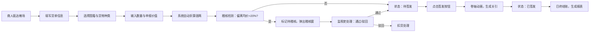

## 1. 产品概述

榷场互市货税管理系统是一款模拟辽宋时期边境贸易税收管理的Web应用，用户扮演监税吏角色，管理五国商人的货物登记、汇率换算、税金核算与通关放行，防止走私偷税。

- 核心价值：通过沉浸式的历史场景体验，让用户了解古代榷场税收制度，同时提供完整的货单管理、税金核算、稽核预警等业务功能。
- 目标用户：历史爱好者、教育工作者、游戏玩家。

## 2. 核心 Features

### 2.1 用户角色
| 角色 | 注册方式 | 核心权限 |
|------|----------|----------|
| 监税吏 | 无需注册，直接进入 | 货单登记、汇率管理、税金核算、关引签发、稽核处理、日结报表 |

### 2.2 功能模块
1. **货单登记页面**：五国商人选择、货物信息录入、申报价值提交
2. **稽核预警页面**：异常货单展示、稽核处理、历史记录
3. **税簿面板**：实时货单列表、汇率牌价、税金总额、状态管理
4. **日结报表**：按国籍分组统计、饼图可视化、签发率分析

### 2.3 页面详情
| 页面名称 | 模块名称 | 功能描述 |
|----------|----------|----------|
| 货单登记 | 商人选择 | 宋/辽/西夏/高丽/回鹘五国商人下拉选择 |
| 货单登记 | 货物信息 | 货物名称、数量、申报价值、种类（茶/马/盐/铁/绸缎/药材）输入 |
| 货单登记 | 提交反馈 | 0.4秒绿色对勾动画提示提交成功 |
| 稽核预警 | 异常检测 | 申报价偏离均价20%自动标红 |
| 稽核预警 | 稽核弹窗 | 显示货单摘要与偏离幅度，提供"合规通过"和"驳回扣货"按钮 |
| 税簿面板 | 货单列表 | 竹简样式表格，展示国籍、货物、数量、申报价值、折算银两、税率、税金、状态 |
| 税簿面板 | 汇率牌价 | 银两:绢帛=1:8、铁钱:银两=100:1，每30秒波动±5% |
| 税簿面板 | 税金总额 | 镶金边框卡片，数字滚动动画 |
| 税簿面板 | 关引签发 | 卷轴展开动画，生成关引编号YYYYMMDD-XXXX |
| 日结报表 | 统计图表 | 按国籍分组饼图（recharts），不同国家对应不同颜色 |
| 日结报表 | 数据汇总 | 总税额、签发率百分比展示 |

## 3. 核心流程

## 4. 用户界面设计

### 4.1 设计风格
- **整体风格**：宋代书卷风格，粗麻布纹理背景
- **主色调**：浅米色#e8dcc8（麻布）、木质棕色#8b5a2b、竹简黄#d4c9a8
- **点缀色**：金色#f5a623（汇率闪烁）、红色#d94a4a（稽核预警）、绿色#4ad94a（成功提示）
- **国籍配色**：宋#4a90d9、辽#d94a4a、西夏#d9a94a、高丽#4ad94a、回鹘#9a4ad9
- **字体**：思源宋体，营造古籍氛围
- **边框样式**：木质镶边3px宽度，圆角8px
- **按钮风格**：仿古代印章样式，圆角，按压效果

### 4.2 页面设计概述
| 页面名称 | 模块名称 | UI元素 |
|----------|----------|--------|
| 主布局 | 左右两栏 | 左60%榷场大厅（木质镶边），右40%税簿面板（竹简风格） |
| 榷场大厅 | 货单表单 | 竖排标签，古风水墨边框，输入框仿古线装书样式 |
| 税簿面板 | 汇率牌价 | 浮动数字，变化时金色闪烁0.5秒 |
| 税簿面板 | 竹简列表 | 每条记录为横向竹简，竹节纹理渐变，悬停抬起效果 |
| 税簿面板 | 税金卡片 | 镶金边框，数字从0滚动到目标值动画 |
| 稽核弹窗 | 呼吸灯边框 | 红色边框呼吸效果，货单摘要醒目展示 |
| 关引签发 | 卷轴动画 | 从中间向两侧展开0.6秒，仿卷轴展开效果 |
| 日结报表 | 饼图展示 | recharts饼图，国籍配色，扇区hover高亮 |

### 4.3 响应式
- 桌面端：左右两栏布局，左60%右40%
- 平板/移动端（<768px）：上下堆叠布局，左栏在上右栏在下，竹简行宽100%
- 触控优化：按钮最小高度44px，表单元素间距适配手指操作

### 4.4 动画效果
- 汇率变化：数字颜色闪烁为#f5a623，持续0.5秒
- 货单提交：绿色对勾缩放淡入动画，0.4秒
- 竹简悬停：transform: translateY(-2px)，box-shadow加深
- 关引签发：卷轴从中间向两侧展开，0.6秒
- 稽核预警：浅红色背景#ffcccc，边缘红光闪烁，0.5秒周期
- 税金总额：数字从0滚动到当前值
- 高价值货单：背景色从#f0e6d3渐变为#d4a76a（>1000两）
