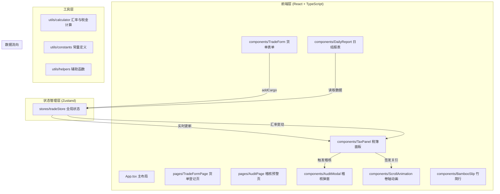

## 1. 架构设计



## 2. 技术描述

* **前端框架**：React\@18 + TypeScript

* **构建工具**：Vite\@5 + @vitejs/plugin-react

* **路由管理**：react-router-dom\@6

* **状态管理**：zustand\@4

* **动画库**：framer-motion\@11

* **图表库**：recharts\@2

* **HTTP客户端**：axios\@1

* **样式方案**：原生CSS + CSS Modules（不使用Tailwind，需精细控制宋代书卷风格）

* **初始化方式**：使用Vite官方react-ts模板

## 3. 目录结构

```
d:\Solocoder\VersionFast\tasks\auto25
├── .trae/documents/           # 项目文档
├── index.html                 # 入口HTML
├── package.json               # 依赖配置
├── tsconfig.json              # TS配置
├── vite.config.js             # Vite配置
└── src/
    ├── main.tsx               # React入口
    ├── App.tsx                # 主布局组件
    ├── stores/
    │   └── tradeStore.ts      # Zustand状态管理
    ├── components/
    │   ├── TradeForm.tsx      # 货单登记表单
    │   ├── TaxPanel.tsx       # 税簿面板
    │   ├── AuditModal.tsx     # 稽核弹窗
    │   ├── DailyReport.tsx    # 日结报表
    │   ├── BambooSlip.tsx     # 竹简行组件
    │   ├── ScrollAnimation.tsx # 卷轴动画组件
    │   └── ExchangeRate.tsx   # 汇率牌价组件
    ├── pages/
    │   ├── TradeFormPage.tsx  # 货单登记页
    │   └── AuditPage.tsx      # 稽核预警页
    ├── utils/
    │   ├── constants.ts       # 常量定义
    │   ├── calculator.ts      # 计算函数
    │   └── helpers.ts         # 辅助函数
    ├── types/
    │   └── index.ts           # TypeScript类型定义
    └── styles/
        ├── global.css         # 全局样式
        └── variables.css      # CSS变量
```

## 4. 调用关系与数据流向

### 4.1 模块调用关系

| 模块               | 依赖模块                                 | 调用方式                                 |
| ---------------- | ------------------------------------ | ------------------------------------ |
| App.tsx          | TradeFormPage, AuditPage, TaxPanel   | 路由渲染 + 布局组合                          |
| TradeForm.tsx    | tradeStore                           | useTradeStore().addCargo()           |
| TaxPanel.tsx     | tradeStore, BambooSlip, ExchangeRate | useTradeStore()获取状态，渲染子组件            |
| BambooSlip.tsx   | ScrollAnimation, AuditModal          | 条件渲染子组件                              |
| DailyReport.tsx  | tradeStore, recharts                 | useTradeStore()获取数据，recharts渲染图表     |
| ExchangeRate.tsx | tradeStore                           | useTradeStore().updateExchangeRate() |
| tradeStore.ts    | calculator, constants                | 内部工具函数调用                             |

### 4.2 数据流向

1. **货单登记数据流**：

   ```
   TradeForm表单输入 → 表单验证 → tradeStore.addCargo() → 
   calculator.calculateSilverValue() → 触发稽核检测 → 
   状态更新 → TaxPanel实时渲染
   ```

2. **汇率变动数据流**：

   ```
   定时器(30秒) → tradeStore.updateExchangeRate() → 
   重算所有未签发货单的银两价值 → TaxPanel重新渲染 → 
   汇率数字闪烁动画
   ```

3. **稽核预警数据流**：

   ```
   新增/修改货单 → calculator.checkAudit() → 偏离>20% → 
   tradeStore.triggerAudit() → 状态标记为"待稽核" → 
   AuditModal弹出 + 竹简行红光闪烁
   ```

4. **关引签发数据流**：

   ```
   点击签发按钮 → ScrollAnimation卷轴展开 → 
   helpers.generateCustomsId()生成关引编号 → 
   tradeStore.issueCustoms() → 状态更新为"已签发" → 
   行置灰且不可编辑
   ```

## 5. 路由定义

| 路由          | 页面组件                     | 功能说明               |
| ----------- | ------------------------ | ------------------ |
| `/`         | TradeFormPage + TaxPanel | 默认页面，左侧货单登记，右侧税簿面板 |
| `/register` | TradeFormPage + TaxPanel | 货单登记页（同首页）         |
| `/audit`    | AuditPage + TaxPanel     | 稽核预警页，展示所有待稽核货单    |

## 6. 数据模型

### 6.1 TypeScript类型定义

```typescript
// 国籍类型
type Nationality = '宋' | '辽' | '西夏' | '高丽' | '回鹘';

// 货物种类
type CargoType = '茶' | '马' | '盐' | '铁' | '绸缎' | '药材';

// 货单状态
type CargoStatus = '待签发' | '待稽核' | '已签发' | '已驳回';

// 汇率表
interface ExchangeRate {
  silverToSilk: number;      // 银两兑绢帛，默认8
  ironToSilver: number;      // 铁钱兑银两，默认100
  lastUpdated: Date;
}

// 货单记录
interface CargoRecord {
  id: string;
  nationality: Nationality;
  cargoName: string;
  cargoType: CargoType;
  quantity: number;
  declaredValue: number;    // 申报价值（单位：对应货币）
  currency: '银两' | '绢帛' | '铁钱';
  silverValue: number;       // 折算银两价值
  taxRate: number;           // 税率 5%/10%/15%
  taxAmount: number;         // 税金
  status: CargoStatus;
  customsId?: string;        // 关引编号 YYYYMMDD-XXXX
  auditDeviation?: number;   // 稽核偏离幅度%
  createdAt: Date;
  issuedAt?: Date;
}

// 稽核记录
interface AuditRecord {
  cargoId: string;
  deviation: number;
  marketPrice: number;
  declaredPrice: number;
  handled: boolean;
  result?: '通过' | '驳回';
  handledAt?: Date;
}

// 日结统计
interface DailyStats {
  date: string;
  totalTax: number;
  totalCargos: number;
  issuedCargos: number;
  issueRate: number;
  byNationality: Record<Nationality, number>;
}
```

### 6.2 常量定义（constants.ts）

```typescript
// 国籍配色
export const NATIONALITY_COLORS: Record<Nationality, string> = {
  '宋': '#4a90d9',
  '辽': '#d94a4a',
  '西夏': '#d9a94a',
  '高丽': '#4ad94a',
  '回鹘': '#9a4ad9',
};

// 货物市场参考均价（银两/单位）
export const MARKET_PRICES: Record<CargoType, number> = {
  '茶': 20,    // 两/担
  '马': 300,   // 两/匹
  '盐': 5,     // 两/袋
  '铁': 15,    // 两/担
  '绸缎': 50,  // 两/匹
  '药材': 10,  // 两/斤
};

// 货物税率
export const TAX_RATES: Record<CargoType, number> = {
  '茶': 0.1,   // 10%
  '马': 0.15,  // 15%
  '盐': 0.05,  // 5%
  '铁': 0.1,   // 10%
  '绸缎': 0.15, // 15%
  '药材': 0.1,  // 10%
};

// 初始汇率
export const INITIAL_RATES: ExchangeRate = {
  silverToSilk: 8,
  ironToSilver: 100,
  lastUpdated: new Date(),
};
```

## 7. 核心计算逻辑

### 7.1 银两折算公式

```typescript
// calculator.ts
export function calculateSilverValue(
  declaredValue: number,
  currency: '银两' | '绢帛' | '铁钱',
  rates: ExchangeRate
): number {
  switch (currency) {
    case '银两':
      return declaredValue;
    case '绢帛':
      return declaredValue / rates.silverToSilk;
    case '铁钱':
      return declaredValue / rates.ironToSilver;
    default:
      return declaredValue;
  }
}
```

### 7.2 稽核检测公式

```typescript
export function checkAudit(
  cargoType: CargoType,
  quantity: number,
  declaredSilverValue: number
): { needAudit: boolean; deviation: number; marketPrice: number } {
  const unitPrice = MARKET_PRICES[cargoType];
  const marketValue = unitPrice * quantity;
  const deviation = ((declaredSilverValue - marketValue) / marketValue) * 100;
  
  return {
    needAudit: Math.abs(deviation) > 20,
    deviation: Number(deviation.toFixed(2)),
    marketPrice: unitPrice,
  };
}
```

### 7.3 汇率波动逻辑

```typescript
export function fluctuateRate(currentRate: number): number {
  // ±5%随机波动
  const fluctuation = (Math.random() - 0.5) * 0.1; // -5% ~ +5%
  return Number((currentRate * (1 + fluctuation)).toFixed(2));
}
```

## 8. 性能优化策略

1. **React.memo优化**：

   * BambooSlip组件使用React.memo包裹，仅当props变化时重渲染

   * 货单列表超过50条时启用虚拟滚动

2. **useMemo/useCallback优化**：

   * TaxPanel中筛选、排序逻辑使用useMemo缓存

   * 事件处理函数使用useCallback包装

3. **状态分片**：

   * Zustand store使用selector精确订阅，避免全局重渲染

   * 汇率更新时仅重算未签发的货单

4. **列表虚拟化**：

   * 自定义虚拟滚动实现，仅渲染可视区域的竹简行

## 9. 初始化命令

根据Windows环境，使用以下命令初始化项目：

```bash
npm init vite-init@latest -y . "--" --template react-ts --force
```

依赖安装：

```bash
npm install
```

启动开发服务器：

```bash
npm run dev
```

