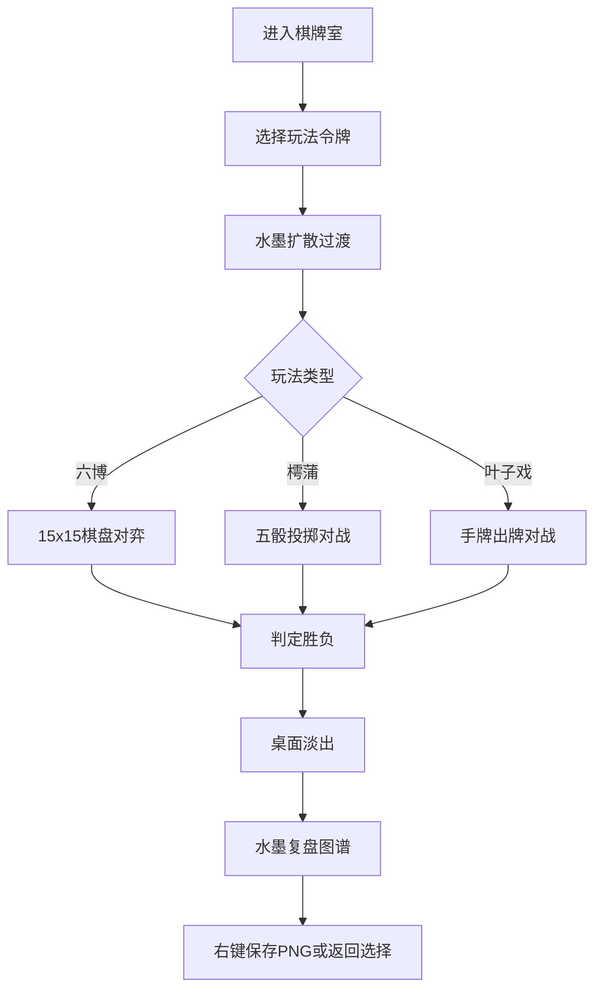

## 1. 产品概述

基于浏览器的虚拟古代棋牌室桌游应用，让用户在古色古香的桌面上与AI对手对弈或双人对战，体验三种中国传统棋牌玩法（六博、樗蒲、叶子戏），并自动记录牌局与生成对弈复盘图谱。

- **核心价值**：传承中华传统棋牌文化，提供沉浸式古风游戏体验
- **目标用户**：棋牌爱好者、传统文化爱好者、休闲游戏玩家

## 2. 核心功能

### 2.1 用户角色

| 角色 | 注册方式 | 核心权限 |
|------|----------|----------|
| 玩家 | 无需注册，直接进入 | 选择玩法、与AI对战、查看复盘图谱 |

### 2.2 功能模块

1. **主界面**：古风棋牌室场景，三种玩法切换令牌，古文匾额
2. **六博玩法**：15x15棋盘，四子连线对战，粒子特效
3. **樗蒲玩法**：五骰投掷，摇骰动画，胜负判定与特效
4. **叶子戏玩法**：手牌管理，出牌动画，组合计分
5. **复盘系统**：水墨风格复盘图谱，PNG导出

### 2.3 页面详情

| 页面名称 | 模块名称 | 功能描述 |
|----------|----------|----------|
| 主界面 | 棋牌室场景 | 木纹桌面、铜包边、古文匾额、青铜令牌切换 |
| 六博对弈 | 棋盘系统 | 15x15网格落子、四子连线判定、粒子爆炸效果 |
| 樗蒲对弈 | 骰筒系统 | 摇骰动画、五骰散落、胜负判定与光环特效 |
| 叶子戏对弈 | 牌局系统 | 手牌管理、出牌翻转动画、组合计分动画 |
| 复盘图谱 | 复盘系统 | 水墨风格图谱、关键步骤标注、PNG保存 |

## 3. 核心流程

## 4. 用户界面设计

### 4.1 设计风格

- **主色调**：深褐 #2c1e0e（背景），木纹 #6b4e3a（桌面）
- **点缀色**：金色 #ffd700，朱红 #cc3333，青砖 #7b8a6b
- **字体**：马善政楷体（Ma Shan Zheng），标题24px，内容16px
- **按钮风格**：青铜质感，悬停放大1.1倍，金色微光box-shadow
- **布局**：桌面居中，上方为玩法切换令牌，中央为游戏区域，四周留空营造空间感
- **动画**：缓入缓出曲线，时长0.3-1.5s，水墨扩散、粒子爆炸、翻牌等特效

### 4.2 页面设计概览

| 页面名称 | 模块名称 | UI元素 |
|----------|----------|--------|
| 主界面 | 棋牌室场景 | 木纹渐变桌面、铜角装饰、暗红色织锦匾额、三种青铜令牌 |
| 六博对弈 | 棋盘系统 | 15x15青砖网格、篆体棋子、落子动画、四子连线粒子爆炸 |
| 樗蒲对弈 | 骰筒系统 | 彩色木制骰筒、五枚六色骰子、摇晃动画、胜负光环 |
| 叶子戏对弈 | 牌局系统 | 古书卷牌背、手绘人物牌面、出牌翻转、墨迹分数动画 |
| 复盘图谱 | 复盘系统 | 水墨晕染背景、关键步骤标注、篆体印章"甲寅之局" |

### 4.3 响应式

- **桌面优先**：1200px以上完整显示
- **平板适配**：768-1200px，缩放至90%
- **移动端**：<768px，棋盘和牌局缩小至80%，骰筒支持触摸操作
- **触摸优化**：增大点击区域，优化滑动手势

## 5. 性能要求

-