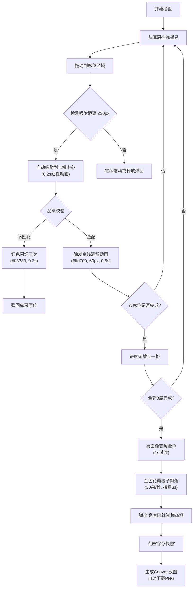

## 1. 产品概述

古风宫廷宴席摆盘互动应用，用户扮演司膳官，根据宾客品级和喜好在虚拟宴席桌面上摆放餐具，体验古代宫廷礼制的严谨与典雅。

- 核心目标：通过互动游戏形式，让用户了解古代宴席礼制，体验餐具摆放的仪式感
- 目标用户：对古风文化、宫廷礼制感兴趣的玩家
- 产品价值：寓教于乐，传播中华传统礼制文化，提供沉浸式的古风互动体验

## 2. 核心功能

### 2.1 用户角色
| 角色 | 注册方式 | 核心权限 |
|------|----------|----------|
| 司膳官（玩家） | 无需注册，直接使用 | 拖拽餐具、摆放席位、查看进度、重置布局、保存快照 |

### 2.2 功能模块
1. **宴席桌面区域**：8个席位呈两列四行排列，每个席位含9个卡槽（3x3网格），显示品级边框
2. **餐具库房区域**：右侧展示12种可拖拽餐具，包含名称、缩略图和品级要求
3. **拖拽与吸附系统**：餐具拖拽跟随、自动吸附卡槽中心、线性插值动画
4. **品级校验系统**：根据席位品级和餐具要求进行匹配校验，正确触发金线涟漪，错误触发红色闪烁
5. **进度追踪系统**：左上角进度条显示完成情况，完成每席增长一格
6. **完成效果系统**：全部完成后桌面渐变暖金色、飘落金色花瓣粒子、弹出快照模态框
7. **重置功能**：底部中央重置按钮，一键清空所有布局

### 2.3 页面详情
| 页面名称 | 模块名称 | 功能描述 |
|----------|----------|----------|
| 主界面 | 宴席桌面 | 8个席位布局，暗红木纹背景，品级边框 |
| 主界面 | 餐具库房 | 12种餐具列表，可拖拽，显示品级信息 |
| 主界面 | 进度条 | 显示"宴席布置 X/8"，带灯盏装饰 |
| 主界面 | 重置按钮 | 圆形按钮，悬停旋转放大，重置所有状态 |
| 主界面 | 完成动画 | 金色花瓣粒子飘落，桌面渐变暖金 |
| 模态框 | 快照保存 | 生成Canvas截图，自动下载PNG |

## 3. 核心流程

用户从右侧库房拖拽餐具到左侧席位卡槽 → 系统检测吸附距离（阈值30px）→ 自动吸附到最近卡槽中心（线性插值动画0.2s）→ 品级校验：匹配则触发金线涟漪动画（半径60px，#ffd700，0.6s），不匹配则红色闪烁三次并弹回库房 → 每完成一席进度条增长一格 → 全部8席完成后桌面渐变暖金色（1s过渡），飘落金色花瓣（30朵/秒，持续3s）→ 弹出"宴席已就绪"模态框，点击"保存快照"生成PNG下载

## 4. 用户界面设计

### 4.1 设计风格
- **主色调**：深色仿古木背景 #1a0f0a，暗红木质纹理 #400000，暗金 #b8860b，金色 #ffd700
- **品级色**：一品金 #ffd700、二品银 #c0c0c0、三品铜 #b87333、四至八品灰 #808080
- **按钮样式**：重置按钮为圆形（直径40px），背景 #8b0000，悬停旋转360度并放大至50px
- **字体**：标题使用 Ma Shan Zheng（马善政楷体），正文使用 ZCOOL XiaoWei（站酷小薇体）
- **布局风格**：左侧宴席区域（8席两列四行），右侧库房面板，中间细金线分隔
- **装饰元素**：灯盏装饰（暖黄光晕，半径12px，透明度0.3），卡槽虚线/实线边框

### 4.2 页面设计概述
| 页面名称 | 模块名称 | UI 元素 |
|----------|----------|---------|
| 主界面 | 宴席桌面 | 暗红木质纹理背景，8个席位（160x220px，间距20px），品级边框，3x3卡槽网格 |
| 主界面 | 餐具库房 | 半透明深褐面板 #3e2723（透明度0.85），餐具圆角卡片（背景 #5c3a21，阴影2px，透明度0.4），拖拽时缩放1.1倍，半透明0.5 |
| 主界面 | 进度条 | 宽200px，高20px，未完成段 #4a3b32，已完成段金色渐变 #ffd700 → #cc8800，两侧灯盏装饰 |
| 主界面 | 重置按钮 | 圆形40px，背景 #8b0000，悬停旋转360度（0.5s过渡），放大至50px |
| 主界面 | 动画效果 | 金线涟漪、红色闪烁、暖金渐变、花瓣粒子飘落 |
| 模态框 | 快照保存 | "宴席已就绪"标题，"保存快照"按钮，Canvas截图下载 |

### 4.3 响应式
- Desktop-first 设计，优先适配桌面端
- 整体居中于视口，最小宽度1200px
- 触摸设备优化拖拽交互

### 4.4 性能约束
- 拖拽过程保持60fps，使用 requestAnimationFrame 和 CSS transform
- 卡槽吸附动画帧耗时 ≤5ms
- 花瓣粒子数 ≤200
- 快照生成 ≤100ms
