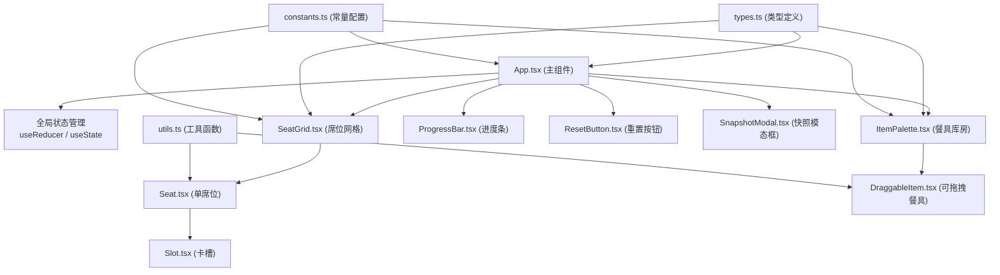

## 1. 架构设计



## 2. 技术描述

- **前端框架**：React 18 + TypeScript
- **构建工具**：Vite 5，target es2020
- **状态管理**：React useState + useReducer（局部状态）
- **拖拽实现**：原生 HTML5 DragEvent + 自定义跟随逻辑（requestAnimationFrame）
- **动画实现**：requestAnimationFrame + CSS transition/animation
- **快照功能**：html2canvas 或原生 Canvas API
- **粒子效果**：CSS 动画 + requestAnimationFrame 控制
- **依赖**：react、react-dom、typescript、vite、@vitejs/plugin-react、uuid

## 3. 文件结构与调用关系

```
project/
├── package.json              # 项目依赖和脚本
├── vite.config.js            # Vite 构建配置（target es2020）
├── tsconfig.json             # TypeScript 配置（严格模式，jsx react-jsx）
├── index.html                # 入口页面（背景 #1a0f0a，Google Fonts）
├── src/
│   ├── App.tsx               # 主组件，全局状态管理
│   │   ├── 维护：selectedSeat、placedItems、progress
│   │   ├── 调用：SeatGrid、ItemPalette、ProgressBar、ResetButton、SnapshotModal
│   │   └── 处理：拖拽事件、品级校验、状态更新
│   ├── SeatGrid.tsx          # 8个席位网格渲染
│   │   ├── 调用：Seat x 8
│   │   └── 处理：拖放事件分发
│   ├── Seat.tsx              # 单席位组件
│   │   ├── 调用：Slot x 9（3x3网格）
│   │   ├── 功能：品级边框渲染、涟漪动画触发
│   │   └── 依赖：utils.ts（animations）
│   ├── Slot.tsx              # 卡槽组件
│   │   ├── 功能：接收拖放、吸附检测、占位显示
│   │   └── 依赖：utils.ts（collision）
│   ├── ItemPalette.tsx       # 餐具库房面板
│   │   ├── 调用：DraggableItem x 12
│   │   └── 功能：餐具列表渲染、弹回动画
│   ├── DraggableItem.tsx     # 可拖拽餐具组件
│   │   ├── 功能：拖拽开始/结束、跟随鼠标、吸附逻辑
│   │   └── 依赖：utils.ts（animations）
│   ├── ProgressBar.tsx       # 进度条组件
│   │   └── 功能：进度显示、灯盏装饰
│   ├── ResetButton.tsx       # 重置按钮组件
│   │   └── 功能：悬停动画、重置状态
│   ├── SnapshotModal.tsx     # 快照模态框
│   │   └── 功能：Canvas截图、PNG下载
│   ├── PetalEffect.tsx       # 花瓣粒子效果
│   │   └── 功能：金色花瓣飘落动画
│   ├── types.ts              # TypeScript 类型定义
│   │   ├── Item、Seat、Slot、PlacedItem 接口
│   │   └── Grade 枚举
│   ├── constants.ts          # 常量配置
│   │   ├── SEATS（8个席位配置：id、grade、position）
│   │   ├── ITEMS（12种餐具配置：id、name、grade、size、icon）
│   │   ├── GRADE_COLORS（品级颜色映射）
│   │   └── ANIMATION_CONFIG（动画参数）
│   └── utils.ts              # 工具函数
│       ├── animations.ts     # 动画函数（涟漪、闪烁、插值）
│       ├── collision.ts      # 碰撞检测、距离计算
│       ├── grade.ts          # 品级校验逻辑
│       └── snapshot.ts       # Canvas截图生成
└── .trae/documents/
    ├── prd.md                # 产品需求文档
    └── tech_arch.md          # 技术架构文档
```

**数据流方向**：
1. DraggableItem → 拖拽事件 → App.tsx → 品级校验 → Seat/Slot → 状态更新
2. App.tsx → props → SeatGrid/ItemPalette → 渲染更新
3. ResetButton → onClick → App.tsx → 状态重置
4. SnapshotModal → html2canvas → 下载 PNG

## 4. 核心数据模型

### 4.1 类型定义

```typescript
// 品级枚举
export enum Grade {
  GRADE_1 = 1,  // 一品
  GRADE_2 = 2,  // 二品
  GRADE_3 = 3,  // 三品
  GRADE_4 = 4,  // 四品
  GRADE_5 = 5,  // 五品
  GRADE_6 = 6,  // 六品
  GRADE_7 = 7,  // 七品
  GRADE_8 = 8,  // 八品
}

// 餐具类型
export interface Item {
  id: string;
  name: string;
  minGrade: Grade;  // 最低品级要求
  width: number;
  height: number;
  icon: string;     // emoji 或 SVG
}

// 席位类型
export interface Seat {
  id: string;
  grade: Grade;
  row: number;      // 0-3 (四行)
  col: number;      // 0-1 (两列)
}

// 卡槽类型
export interface Slot {
  id: string;
  seatId: string;
  row: number;      // 0-2
  col: number;      // 0-2
  centerX: number;
  centerY: number;
}

// 已摆放餐具
export interface PlacedItem {
  id: string;       // uuid
  itemId: string;
  seatId: string;
  slotId: string;
}

// 全局应用状态
export interface AppState {
  selectedSeatId: string | null;
  placedItems: PlacedItem[];
  completedSeats: string[];  // 已完成的席位ID
  isComplete: boolean;
  showSnapshotModal: boolean;
}
```

### 4.2 常量配置

```typescript
// 席位配置（2列4行）
export const SEATS: Seat[] = [
  { id: 'seat-1', grade: Grade.GRADE_1, row: 0, col: 0 },
  { id: 'seat-2', grade: Grade.GRADE_1, row: 0, col: 1 },
  { id: 'seat-3', grade: Grade.GRADE_2, row: 1, col: 0 },
  { id: 'seat-4', grade: Grade.GRADE_2, row: 1, col: 1 },
  { id: 'seat-5', grade: Grade.GRADE_3, row: 2, col: 0 },
  { id: 'seat-6', grade: Grade.GRADE_3, row: 2, col: 1 },
  { id: 'seat-7', grade: Grade.GRADE_5, row: 3, col: 0 },
  { id: 'seat-8', grade: Grade.GRADE_5, row: 3, col: 1 },
];

// 品级颜色映射
export const GRADE_COLORS: Record<Grade, string> = {
  [Grade.GRADE_1]: '#ffd700',  // 金
  [Grade.GRADE_2]: '#c0c0c0',  // 银
  [Grade.GRADE_3]: '#b87333',  // 铜
  [Grade.GRADE_4]: '#808080',  // 灰
  [Grade.GRADE_5]: '#808080',
  [Grade.GRADE_6]: '#808080',
  [Grade.GRADE_7]: '#808080',
  [Grade.GRADE_8]: '#808080',
};

// 动画配置
export const ANIMATION_CONFIG = {
  SNAP_DURATION: 200,          // 吸附动画时长 ms
  RIPPLE_RADIUS: 60,           // 涟漪半径 px
  RIPPLE_DURATION: 600,        // 涟漪时长 ms
  FLASH_DURATION: 300,         // 闪烁时长 ms
  FLASH_COUNT: 3,              // 闪烁次数
  SNAP_THRESHOLD: 30,          // 吸附阈值 px
  PETAL_DURATION: 3000,        // 花瓣持续时间 ms
  PETAL_RATE: 30,              // 每秒花瓣数
  GLOW_TRANSITION: 1000,       // 暖金过渡时长 ms
};
```

## 5. 性能优化策略

1. **拖拽性能**：
   - 使用 CSS `transform: translate(x, y)` 而非 `top/left`
   - 鼠标位置更新使用 `requestAnimationFrame` 批量处理
   - 拖拽元素使用 `will-change: transform` 提示浏览器优化

2. **动画优化**：
   - 涟漪动画使用 Canvas 或 CSS `box-shadow` 动画
   - 粒子效果使用 CSS `transform` 和 `opacity`，避免重排
   - 限制粒子总数 ≤200，超出则回收复用

3. **重渲染优化**：
   - 使用 `React.memo` 包装 Seat、Slot、DraggableItem 组件
   - 状态更新使用函数式更新，避免不必要的依赖
   - 拖拽状态使用 `useRef` 存储，避免频繁 re-render

4. **截图优化**：
   - 使用 `html2canvas` 的 `useCORS: true` 处理跨域
   - 限制截图区域为宴席桌面，而非整个页面
   - 截图完成后立即释放 Canvas 资源
