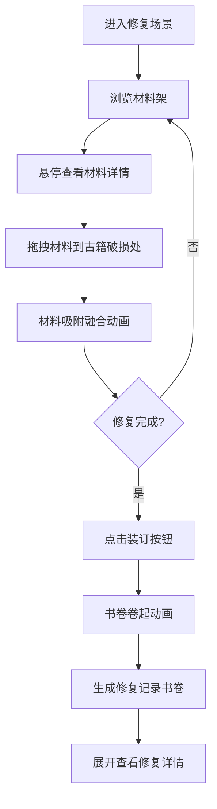

## 1. 产品概述

古籍修复3D交互可视化项目，用户化身深居简出的古籍修复师，在宋代文人雅舍风格的木制阁楼中，通过拖拽材料修复破损古籍，体验传统修复技艺的文化魅力。

- 核心目标：打造沉浸式古籍修复体验，传承中华传统文化
- 目标用户：文化爱好者、古籍研究者、游戏玩家
- 产品价值：将传统古籍修复技艺数字化，让用户在互动中感受文化之美

## 2. 核心特性

### 2.1 用户角色
| 角色 | 注册方式 | 核心权限 |
|------|----------|----------|
| 古籍修复师 | 无需注册，直接进入 | 完整的修复操作、材料使用、书卷生成 |

### 2.2 功能模块
1. **3D阁楼场景**：修复台、书架、材料架、环境氛围
2. **古籍修复系统**：破损标记、材料拖拽、修复动画
3. **材料管理系统**：材料展示、悬停详情、拖拽交互
4. **特效系统**：水墨晕染、粒子效果、对象池优化
5. **书卷生成系统**：装订动画、修复记录、火漆封印

### 2.3 页面详情
| 页面名称 | 模块名称 | 功能描述 |
|----------|----------|----------|
| 主修复场景 | 3D环境渲染 | 阁楼场景、修复台、古籍展示 |
| 材料架面板 | 材料拖拽交互 | 12种材料展示、悬停放大、拖拽吸附 |
| 修复操作区 | 古籍修复动画 | 虫蛀/霉斑/撕裂修复、融合动画 |
| 书卷展示区 | 修复记录生成 | 装订动画、展开查看、火漆封印 |

## 3. 核心流程

1. 用户进入3D修复场景，看到中央的修复台和左侧的材料架
2. 鼠标悬停在材料架的半透明方盒上，查看材料详情
3. 拖拽所选材料到古籍页面的破损区域（虫蛀、霉斑或撕裂）
4. 材料自动吸附到破损处，产生涟漪扩散和颜色渐变融合动画
5. 所有破损修复完成后，点击装订按钮
6. 古籍页面从右向左缓缓卷起，形成卷轴
7. 生成带火漆封印的修复记录书卷
8. 点击书卷展开，查看修复前后对比图、用材清单和修复师签名

## 4. 用户界面设计

### 4.1 设计风格
- **整体风格**：宋代文人雅舍，清雅古朴
- **主色调**：檀木褐 `#5c3a21`、松烟灰 `#8baa9a`、玉白 `#f5f0e6`
- **背景色**：米黄 `#d4c5a9`
- **修复台面**：淡青色绒布 `#8baa9a`
- **地板**：深色木 `#5c3a21`
- **字体**：标题使用 Ma Shan Zheng，正文使用 ZCOOL XiaoWei
- **按钮样式**：毛笔飞白描边，圆角设计
- **交互动效**：hover时水墨晕染扩散，拖拽时有柔和物理弹性反馈
- **缓动曲线**：`cubic-bezier(0.25, 0.1, 0.25, 1)` 慢入慢出

### 4.2 页面设计概述
| 页面名称 | 模块名称 | UI元素 |
|----------|----------|--------|
| 主修复场景 | 3D环境 | 12x9x6单位木制阁楼、四壁书架、线装书函、卷轴、深色木地板、中央3x2修复台、淡青色绒布台面 |
| 材料架面板 | 材料展示 | 左侧三层四格材料架、半透明方盒容器、悬停放大显示细节和说明文字 |
| 古籍页面 | 修复区域 | 摊开的古籍页面、三种破损标记（虫蛀/霉斑/撕裂）、修复融合动画 |
| 书卷展示 | 装订完成 | 卷轴卷起动画（2秒）、火漆封印发光、展开后显示修复前后对比图、用材清单、修复师签名 |

### 4.3 响应式
- 桌面端优先，适配主流分辨率（1920x1080及以上）
- 3D场景自适应窗口大小
- UI元素使用相对定位，保持合理的视觉层次

### 4.4 3D场景指引
- **环境**：木制阁楼，暖色调环境光，模拟窗边自然光
- **光照设置**：主光源（暖白色方向光）+ 环境光（柔和米黄色）+ 补光（冷色调，模拟窗外天光）
- **摄像机**：PerspectiveCamera，初始视角略微俯视修复台，OrbitControls 限制旋转角度
- **构图**：修复台位于场景中央，材料架在左侧，书架环绕四周，形成沉浸式空间
- **交互**：鼠标悬停高亮、拖拽操作有弹性反馈、点击装订触发书卷动画
- **后处理**：轻微泛光效果、色调映射，营造古朴氛围
- **性能**：修复动画30FPS+，粒子数≤150，采用对象池复用

## 5. 性能要求
- 修复动画全程保持30FPS以上
- 粒子数（水墨晕染、书卷展开特效）不超过150颗
- 采用对象池复用粒子对象
- 材料纹理使用合理压缩，加载优化
