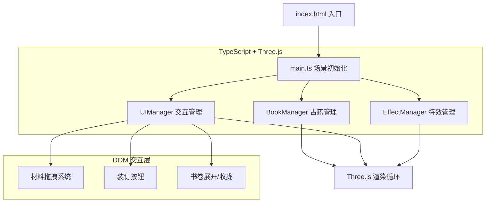

## 1. 架构设计



## 2. 技术描述
- **前端框架**：React 18 + TypeScript
- **3D引擎**：Three.js r150+
- **构建工具**：Vite 5.x
- **UI库**：自定义组件，毛笔飞白风格
- **字体**：Google Fonts (Ma Shan Zheng, ZCOOL XiaoWei)
- **状态管理**：React useState/useRef 轻量管理
- **无后端**：纯前端项目，所有数据本地mock

## 3. 项目结构
```
/
├── package.json          # 项目依赖与脚本
├── index.html            # 入口HTML
├── vite.config.js        # Vite配置
├── tsconfig.json         # TypeScript配置
└── src/
    ├── main.ts           # Three.js场景主入口
    ├── BookManager.ts    # 古籍页面与修复管理
    ├── UIManager.ts      # DOM交互与拖拽系统
    └── EffectManager.ts  # VFX特效与对象池
```

## 4. 核心模块职责

### 4.1 main.ts
- Three.js 基础场景初始化（渲染器、场景、摄像机）
- OrbitControls 相机控制
- 阁楼环境创建（地板、墙体、书架、修复台）
- 顶层动画循环（requestAnimationFrame）
- 修复状态机管理（待机→修复中→装订→完成）

### 4.2 BookManager.ts
- 古籍页面网格生成（纸张纹理、书页模型）
- 破损区域定义（虫蛀、霉斑、撕裂三种类型）
- 修复动画系统（涟漪扩散、颜色渐变，1.5秒）
- 修复状态接口（getDamages, applyRepair, isComplete）
- 书卷装订动画（从右向左滚动，2秒）
- 修复记录数据生成（前后对比、用材清单）

### 4.3 UIManager.ts
- 材料架UI生成（3层×4格，12种材料）
- 自定义拖拽系统（鼠标事件→Three.js坐标转换）
- 材料悬停放大与详情展示
- 装订按钮与交互
- 书卷展开/收拢事件处理
- DOM输入转Three.js操作指令

### 4.4 EffectManager.ts
- 水墨晕染粒子系统（hover触发）
- 书卷滚动粒子特效
- 火漆封印发光效果
- 对象池实现（粒子复用，最大150颗）
- 动画缓动曲线（cubic-bezier(0.25, 0.1, 0.25, 1)）

## 5. 关键数据结构

### 5.1 材料定义
```typescript
interface Material {
  id: string;
  name: string;
  type: 'paper' | 'silk' | 'paste' | 'pigment';
  color: string;
  textureUrl: string;
  description: string;
  repairTypes: DamageType[];
}
```

### 5.2 破损定义
```typescript
type DamageType = 'worm' | 'mold' | 'tear';

interface Damage {
  id: string;
  type: DamageType;
  position: { x: number; y: number };
  radius: number;
  repaired: boolean;
  repairMaterial?: string;
}
```

### 5.3 修复记录
```typescript
interface RepairRecord {
  beforeImage: string;
  afterImage: string;
  materials: { name: string; count: number }[];
  restorerSignature: string;
  timestamp: number;
}
```

### 5.4 粒子对象池
```typescript
interface Particle {
  mesh: THREE.Points;
  active: boolean;
  position: THREE.Vector3;
  velocity: THREE.Vector3;
  life: number;
  maxLife: number;
  type: 'ink' | 'scroll' | 'seal';
}
```

## 6. 性能优化策略
- **对象池**：粒子对象预分配，复用而非创建销毁
- **纹理压缩**：使用KTX2或WebP格式纹理
- **LOD**：远处书架使用简化模型
- **帧率控制**：动画循环中使用deltaTime，保证不同设备速度一致
- **事件节流**：鼠标移动事件使用requestAnimationFrame节流
- **状态批处理**：修复状态变更时批量更新而非逐帧更新
