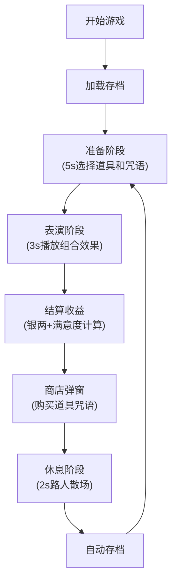

## 1. 产品概述

古代幻术师模拟游戏，玩家在3D古代街市中布置幻术摊位，通过组合道具与咒语表演幻术吸引路人，赚取银两并解锁新内容。解决传统幻术表演缺乏沉浸式交互练习与效果可视化的难题。

## 2. 核心功能

### 2.1 用户角色
| 角色 | 注册方式 | 核心权限 |
|------|----------|----------|
| 幻术师玩家 | 本地存档 | 表演幻术、购买道具咒语、查看历史记录 |

### 2.2 功能模块
1. **3D街市场景**: 幻术台、道具放置、路人AI动画
2. **道具系统**: 道具库、拖拽放置、光晕特效
3. **咒语系统**: 咒语书、翻页、粒子特效
4. **表演系统**: 组合效果、路人反应、满意度计算
5. **商店系统**: 购买新道具咒语、解锁进度
6. **回合系统**: 准备-表演-休息三阶段、存档进度
7. **UI面板**: 银两显示、回合进度、历史记录

### 2.3 页面详情
| 页面名称 | 模块名称 | 功能描述 |
|----------|----------|----------|
| 主游戏界面 | 3D场景模块 | Three.js渲染幻术台、方桌、道具位置、路人剪影 |
| 主游戏界面 | 道具库模块 | 点击箱子打开道具库，支持拖拽到桌面指定位置 |
| 主游戏界面 | 咒语书模块 | 右侧羊皮纸书页，可翻页选择咒语 |
| 主游戏界面 | 结算模块 | 表演结束后显示收益、满意度、路人数量 |
| 主游戏界面 | 商店模块 | 表演结束后弹出，购买新道具咒语 |
| 主游戏界面 | 进度卷轴 | 左侧古风卷轴，显示历史记录 |

## 3. 核心流程

玩家进入游戏后，每回合经历准备阶段(5s选择道具咒语)→表演阶段(3s播放效果结算)→休息阶段(2s路人散场)。表演成功吸引路人获得银两，用银两在商店解锁新内容。

## 4. 用户界面设计

### 4.1 设计风格
- 主色调：暗红#8b0000、淡黄#f5deb3、深褐#3e2723
- 按钮风格：仿古卷轴边框，按压效果translateY(2px)，0.1s过渡
- 字体：Ma Shan Zheng(标题)、ZCOOL XiaoWei(正文)
- 布局：flexible布局，1920x1080和1366x768适配
- 图标：SVG手绘风格，描边2px#d4af37，半透明填充

### 4.2 页面设计概述
| 页面名称 | 模块名称 | UI元素 |
|----------|----------|----------|
| 主游戏界面 | 3D场景 | 暗红色绒布台面、木质方桌、5个道具位置、灰白路人剪影 |
| 主游戏界面 | 道具库 | 仿古箱子图标，打开后网格展示道具，拖拽高亮 |
| 主游戏界面 | 咒语书 | 羊皮纸纹理书页，翻页动画，咒语符号闪烁 |
| 主游戏界面 | 满意度条 | 摊位上方，颜色红到绿渐变，0-100数值 |
| 主游戏界面 | 进度卷轴 | 左侧古风卷轴，可滚动查看历史记录 |
| 主游戏界面 | 商店窗口 | 600x400px仿古卷轴纹理，商品卡片带价格 |

### 4.3 响应式
- 桌面优先设计，适配1920x1080和1366x768
- 使用rem单位，flex布局自动调整
- Canvas和Three.js容器自适应窗口

### 4.4 3D场景指引
- 环境：古代街市，深褐色木板背景，柔和环境光
- 光照：半球光+方向光，突出台面和道具质感
- 相机：透视相机，固定视角俯视摊位
- 特效：道具放置光晕、咒语粒子、幻术组合动画
- 性能：控制模型面数，粒子总数≤100，帧率≥30fps
