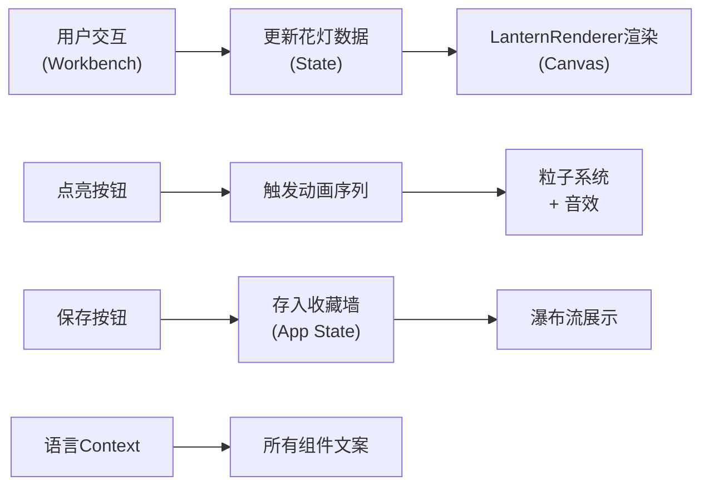

# 虚拟古代花灯铺互动应用 - 技术架构文档

## 1. 技术栈选型

| 类别 | 技术选型 | 说明 |
|------|----------|------|
| 前端框架 | React 18 | 组件化开发，状态管理 |
| 语言 | TypeScript | 类型安全，提升开发体验 |
| 构建工具 | Vite | 快速热更新，生产构建 |
| 渲染引擎 | HTML5 Canvas | 高性能花灯绘制与动画 |
| 动画库 | canvas-confetti | 点亮特效 |
| 音频 | Web Audio API | 生成燃烧音效 |
| 样式方案 | CSS Modules / 内联样式 | 组件级样式隔离 |

## 2. 项目结构

```
auto255/
├── package.json              # 项目依赖与脚本
├── index.html                # 入口页面
├── vite.config.js            # Vite配置
├── tsconfig.json             # TypeScript配置
├── .trae/
│   └── documents/
│       ├── prd.md            # 产品需求文档
│       └── architecture.md   # 技术架构文档
└── src/
    ├── App.tsx               # 主组件，全局状态与路由
    ├── Workbench.tsx         # 核心工作台组件
    ├── LanternRenderer.ts    # Canvas绘制引擎
    ├── types.ts              # 类型定义与库存数据
    ├── i18n.ts               # 多语言文案
    └── main.tsx              # 应用入口
```

## 3. 核心模块设计

### 3.1 类型系统 (types.ts)

```typescript
// 骨架类型
interface Skeleton {
  id: string;
  name: { zh: string; en: string };
  paths: Path2D[];  // Canvas路径
  viewBox: { x: number; y: number; w: number; h: number };
}

// 绢布颜色
interface SilkColor {
  id: string;
  name: { zh: string; en: string };
  hex: string;
  opacity: number;
}

// 颜料颜色
interface PaintColor {
  id: string;
  name: { zh: string; en: string };
  hex: string;
}

// 画笔笔触
interface BrushStroke {
  points: { x: number; y: number }[];
  color: string;
  radius: number;
}

// 直线
interface Line {
  start: { x: number; y: number };
  end: { x: number; y: number };
  color: string;
  radius: number;
}

// 花灯数据
interface Lantern {
  id: string;
  skeleton: Skeleton;
  silkColor: SilkColor;
  strokes: BrushStroke[];
  lines: Line[];
  isLit: boolean;
  createdAt: number;
  randomId: string;
}

// 库存数据
const SKELETONS: Skeleton[] = [...]
const SILK_COLORS: SilkColor[] = [...]
const PAINT_COLORS: PaintColor[] = [...]
```

### 3.2 Canvas渲染引擎 (LanternRenderer.ts)

**核心职责**：
- 花灯骨架绘制（半透明线框）
- 绢布纹理渲染（半透明填充）
- 用户绘制笔触渲染
- 点亮动画与粒子效果
- 烛光动态光照模拟

**核心方法**：
```typescript
class LanternRenderer {
  constructor(canvas: HTMLCanvasElement);
  
  // 绘制骨架
  drawSkeleton(skeleton: Skeleton): void;
  
  // 绘制绢布
  drawSilk(color: SilkColor): void;
  
  // 绘制用户笔触
  drawStrokes(strokes: BrushStroke[], lines: Line[]): void;
  
  // 点亮动画
  startLightingAnimation(onComplete?: () => void): void;
  
  // 停止动画
  stopAnimation(): void;
  
  // 导出PNG
  exportPNG(size?: { w: number; h: number }, transparent?: boolean): string;
}
```

### 3.3 工作台组件 (Workbench.tsx)

**核心职责**：
- 骨架选择交互
- 绢布颜色选择交互
- 颜料盘与画笔工具交互
- Canvas绘制事件处理
- 花灯数据状态管理

**状态管理**：
```typescript
interface WorkbenchState {
  selectedSkeleton: Skeleton | null;
  selectedSilk: SilkColor | null;
  selectedPaint: PaintColor;
  brushRadius: number;
  isLineMode: boolean;
  isDrawing: boolean;
  currentStroke: BrushStroke | null;
  currentLine: Line | null;
  strokes: BrushStroke[];
  lines: Line[];
  isLit: boolean;
}
```

### 3.4 主应用组件 (App.tsx)

**核心职责**：
- 全局语言状态管理（React Context）
- 页面整体布局
- 收藏墙状态管理
- 花灯保存与下载功能
- 响应式布局适配

**Context设计**：
```typescript
interface LanguageContextType {
  lang: 'zh' | 'en';
  toggleLang: () => void;
  t: (key: string) => string;
}
```

## 4. 数据流设计



## 5. 关键技术实现

### 5.1 高性能Canvas绘制

- **双缓冲技术**：使用离屏Canvas预渲染静态元素（骨架、绢布）
- **脏矩形渲染**：仅重绘变化区域
- **requestAnimationFrame**：统一动画循环，确保60fps
- **路径缓存**：骨架路径使用Path2D缓存，避免重复计算

### 5.2 点亮动画实现

```
时间轴（总时长2s）：
0ms     → 光源色：暗红#330000
500ms   → 光源色：橙红#ff4400
1000ms  → 光源色：橙黄#ff8800
1500ms  → 光源色：暖黄#ffcc66
2000ms  → 光源色：暖白#ffe8b0

粒子系统（0ms启动，1500ms消散）：
- 粒子数量：40-60颗
- 初始位置：花灯轮廓随机点
- 运动轨迹：缓慢向上漂浮 + 横向抖动
- 生命周期：1.5s，alpha从1线性衰减到0
```

### 5.3 Web Audio API音效

```typescript
// 生成纸张燃烧沙沙声
function createBurnSound(audioCtx: AudioContext) {
  const bufferSize = audioCtx.sampleRate * 2; // 2秒
  const buffer = audioCtx.createBuffer(1, bufferSize, audioCtx.sampleRate);
  const data = buffer.getChannelData(0);
  
  for (let i = 0; i < bufferSize; i++) {
    // 400-800Hz随机波动的白噪声
    const freq = 400 + Math.random() * 400;
    data[i] = (Math.random() * 2 - 1) * 0.1 * Math.sin(2 * Math.PI * freq * i / audioCtx.sampleRate);
  }
  
  const source = audioCtx.createBufferSource();
  source.buffer = buffer;
  // 包络：淡入淡出
  const gainNode = audioCtx.createGain();
  gainNode.gain.setValueAtTime(0, audioCtx.currentTime);
  gainNode.gain.linearRampToValueAtTime(0.3, audioCtx.currentTime + 0.2);
  gainNode.gain.linearRampToValueAtTime(0, audioCtx.currentTime + 2);
  
  source.connect(gainNode);
  gainNode.connect(audioCtx.destination);
  source.start();
}
```

### 5.4 响应式布局

```css
/* 桌面端 */
.workbench-container {
  display: grid;
  grid-template-columns: 240px 1fr 240px;
  gap: 20px;
}

/* 移动端 */
@media (max-width: 768px) {
  .workbench-container {
    grid-template-columns: 1fr;
    grid-template-rows: auto auto auto;
  }
  
  .canvas-container {
    width: 100%;
    max-width: 400px;
  }
}
```

## 6. 性能优化策略

### 6.1 Canvas优化
- 静态元素预渲染到离屏Canvas
- 使用Path2D缓存复杂路径
- 避免在绘制循环中创建新对象
- 合理使用save/restore，减少状态切换

### 6.2 React优化
- 使用`useMemo`缓存计算结果
- 使用`useCallback`避免不必要的重渲染
- 组件拆分，细粒度更新
- 收藏墙使用虚拟滚动（如超过50项）

### 6.3 动画优化
- 粒子数量限制在60以内
- 使用`transform`和`opacity`实现硬件加速
- 页面不可见时暂停动画（`visibilitychange`事件）

## 7. 安全考虑

- Canvas导出时验证尺寸，防止DoS攻击
- 音频播放需要用户交互触发（浏览器策略）
- 下载文件名安全过滤
