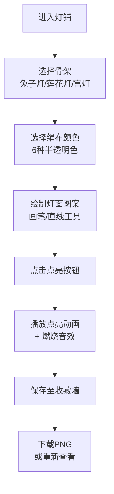

# 虚拟古代花灯铺互动应用 - 产品需求文档

## 1. 产品概述

### 1.1 产品定位
一款基于浏览器的沉浸式古代花灯制作互动应用，让用户体验北宋灯铺匠人的制作流程，从挑选骨架、裱糊绢布、绘制图案到最终点亮花灯，生成可分享的灯市夜景图。

### 1.2 目标用户
- 传统文化爱好者
- 手工艺体验者
- 社交媒体内容创作者
- 节日互动活动参与者

### 1.3 核心价值
- **沉浸式体验**：还原古代花灯制作的完整工艺流程
- **创意表达**：自由绘制灯面图案，个性化创作
- **情感共鸣**：通过点亮动画和视觉效果传递节日氛围
- **分享传播**：生成独特的花灯作品用于社交分享

## 2. 核心功能

### 2.1 骨架选择模块
- 提供三种预置花灯骨架：兔子灯、莲花灯、宫灯
- 半透明线框图形展示，hover时高亮效果
- 点击选中后骨架显示在工作台中央画布

### 2.2 裱糊绢布模块
- 根据选中骨架展示对应6种半透明绢布颜色
- 颜色包括：桃红#ff99cc、竹青#7bc67e、月白#d6e8f0等
- 选择后绢布纹理实时叠加在骨架上

### 2.3 灯面绘制模块
- 右侧颜料盘提供10种传统色：朱砂#c04040、石绿#2e8b57、胭脂#b3446c、藤黄#ffd700等
- 圆头画笔，笔触半径4-12px可通过滑块调节
- 直线辅助绘制功能
- 绘制过程中实时预览，绢布半透明纹理叠加笔触效果

### 2.4 点亮动画模块
- 渐进式点燃动画：光源从暗红#330000经橙黄#ff8800渐变至暖白#ffe8b0（持续2秒）
- 灯面图案浮现半透明发光层（透明度0.3）
- 花灯周围散落数十个微光粒子（大小2-4px，颜色#ffaa44，持续1.5秒后消散）
- 纸张燃烧沙沙音效（Web Audio API生成，频率400-800Hz随机波动）

### 2.5 收藏与分享模块
- 收藏墙采用瀑布流布局展示已保存花灯
- 每盏灯缩略图180x240px，带光晕效果
- 点击缩略图可放大查看
- 附带生成时间戳和随机编号
- 一键下载为PNG图（512x512px，背景透明）

### 2.6 多语言支持
- 中文/英文双语切换
- 右上角toggle按钮控制
- React Context管理语言状态

## 3. 用户流程

## 4. 界面设计要求

### 4.1 整体视觉风格
- **北宋市井灯铺氛围**：温暖、古朴、充满节日气息
- **主色调**：深棕木纹#2c1810、铜色#b87333、朱砂红#c04040
- **背景**：深棕木纹色#2c1810，顶部挂仿古纸灯笼（黄光#ffe08c）

### 4.2 布局结构
- **左侧**：骨架展示柜（旧木材质+铜色边框）
- **中央**：工作台（400x400px画布，亮面漆木纹理#5c3a21，细铜钉装饰）
- **右侧**：颜料盘货架（旧木材质+铜色边框）
- **下部**：收藏墙（瀑布流布局）
- **右上角**：语言切换按钮

### 4.3 交互元素
- **按钮**：圆角矩形（border-radius 8px），背景#c04040，hover时变#8b0000并上浮2px阴影，点击时scale(0.95)
- **画布**：400x400px，移动端自适应至100%（最大400px）

### 4.4 响应式设计
- 桌面端（≥768px）：左右三栏布局
- 移动端（<768px）：上下堆叠布局，画布宽度自适应

## 5. 性能要求

| 指标 | 要求 |
|------|------|
| Canvas绘制帧率 | ≥50fps |
| 点亮动画粒子数 | ≤60颗 |
| 灯面绘制延迟 | <30ms |
| 交互响应时间 | <100ms |

## 6. 技术约束

- 框架：React + TypeScript
- 构建工具：Vite
- 动画库：canvas-confetti
- 渲染：HTML5 Canvas
- 音效：Web Audio API
