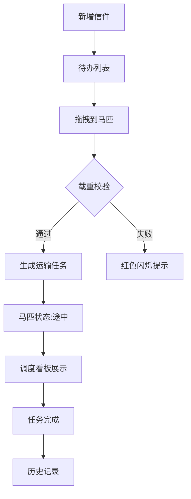

## 1. 产品概述

本产品为古代驿站管理系统，模拟古代驿丞管理往来信件与物资调拨的全栈Web应用。用户扮演驿丞角色，在管理面板中处理信件接收与派发、分配马匹和车队，查看运输任务状态与历史记录。

- 核心价值：通过游戏化的管理体验，让用户沉浸式体验古代驿站的运作流程，实现信件调度决策与资源管理。

## 2. 核心功能

### 2.1 用户角色

| 角色 | 注册方式 | 核心权限 |
|------|----------|----------|
| 驿丞 | 无需注册，直接使用 | 信件管理、马匹调度、任务查看、统计分析 |

### 2.2 功能模块

1. **信件管理面板**：信件新增、待办列表、紧急程度标签
2. **马匹与车队状态看板**：马匹状态展示、休息功能、车队载重监控
3. **调度分配控制台**：拖拽分配、载重校验、预计时间计算
4. **任务历史与统计面板**：任务列表、分页加载、数据统计
5. **响应式适配层**：桌面端拖拽、移动端点击分配

### 2.3 页面详情

| 页面名称 | 模块名称 | 功能描述 |
|---------|----------|----------|
| 管理主面板 | 信件表单模块 | 新增信件（收发人、目的地、紧急程度），自动计算预计派送时间 |
| 管理主面板 | 待办信件列表 | 展示待派发信件，支持拖拽操作 |
| 管理主面板 | 马匹状态网格 | 6匹马状态展示（空闲/途中/休息），休息按钮与冷却进度 |
| 管理主面板 | 车队状态面板 | 车队位置与载重实时展示 |
| 管理主面板 | 调度控制台 | 拖拽信件到马匹上完成分配，载重校验与反馈 |
| 任务历史侧边栏 | 任务列表 | 已完成/进行中任务记录，分页加载（50条以上分页，每次20条） |
| 任务历史侧边栏 | 统计面板 | 今日派送量、平均派送时长、超时率 |
| 调度看板 | 任务卡片 | 信件编号、目的地、紧急度、马匹分配、预计到达时间 |
| 调度看板 | 拖拽交互 | 拖拽调整马匹分配，金色光芒反馈 |

## 3. 核心流程

### 3.1 信件派发流程

用户新增信件 → 信件进入待办列表 → 用户拖拽信件到空闲马匹 → 系统校验载重 → 生成运输任务 → 马匹状态变为途中 → 任务展示在调度看板 → 任务完成后进入历史记录

### 3.2 马匹休息流程

用户点击休息按钮 → 马匹状态变为休息 → 30秒冷却（环形进度条）→ 状态恢复为空闲

## 4. 用户界面设计

### 4.1 设计风格

- **主色调**：米黄色背景 #f5e6c8
- **信件卡片**：牛皮纸色 #d4a373
- **马匹状态色**：空闲墨绿色 #2d6a4f、途中深褐色 #6b3a0f、休息灰色 #9c9c9c
- **紧急信件标签**：深红色 #a31f34
- **分配成功光芒**：金色 #ffd700
- **按钮样式**：复古边框，hover时上浮阴影变换（box-shadow增加4px，过渡0.2s）
- **字体**：Google Fonts ZCOOL XiaoWei（中文字体）
- **布局风格**：左侧历史侧边栏 + 中间调度看板 + 右侧马匹看板
- **图标风格**：SVG简笔画风格

### 4.2 页面设计概述

| 页面名称 | 模块名称 | UI元素 |
|-----------|----------|--------|
| 管理主面板 | 整体布局 | 三栏布局：左侧任务历史栏（25%）、中间调度区（50%）、右侧马匹面板（25%） |
| 管理主面板 | 沙漏动画 | 右上角12帧循环沙漏SVG，点击刷新 |
| 信件表单模块 | 表单元素 | 输入框、下拉选择紧急度，复古风格 |
| 待办信件列表 | 卡片布局 | 牛皮纸色卡片，紧急度标签，拖拽手柄 |
| 马匹状态网格 | 网格布局 3x2，每格包含SVG马匹头像、状态标签、休息按钮、环形冷却进度条 |
| 调度看板 | 卡片布局 | 任务卡片展示，支持拖拽调整，金色光芒反馈 |
| 任务历史侧边栏 | 列表布局 | 淡入动画（opacity从0到1，延迟0.1s逐行出现，分页按钮 |
| 统计面板 | 数据卡片 | 三个统计数据卡片展示关键指标 |

### 4.3 响应式

- **桌面端**：三栏布局，拖拽操作
- **移动端（<768px）**：纵向排列，信件列表和马匹看板上下堆叠，点击选择后分配
- **触控优化**：增大点击区域，移除hover效果改为tap反馈

### 4.4 动画与交互

- **拖拽反馈**：响应时间<50ms，即时视觉反馈
- **分配成功**：马匹头像泛起金色光芒0.3s
- **载重超限**：马匹图标闪烁红色警告0.5s并弹出提示
- **任务历史淡入**：opacity从0到1，延迟0.1s逐行出现
- **按钮hover**：box-shadow增加4px，过渡0.2s
- **沙漏动画**：12帧循环，代表时间流逝
