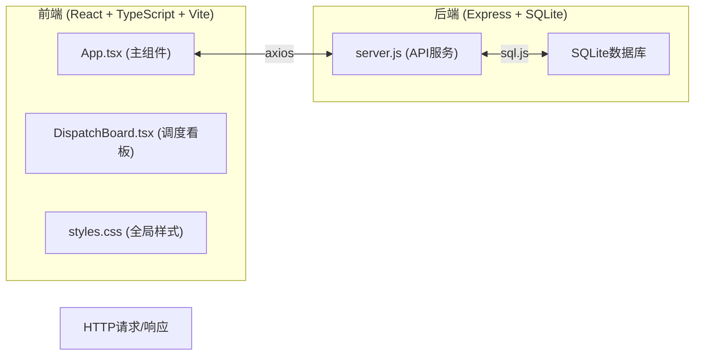
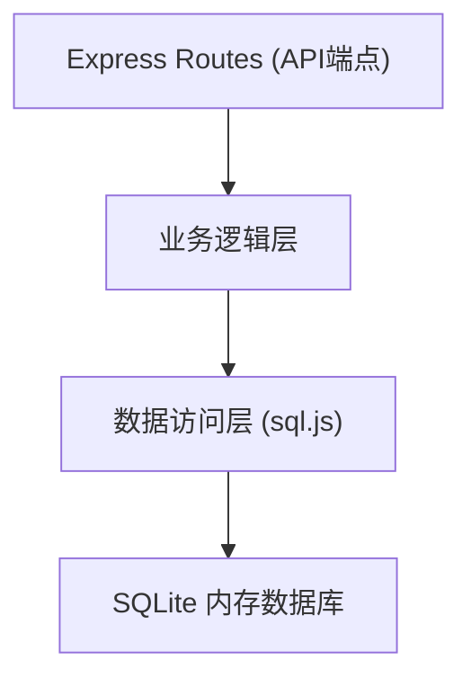
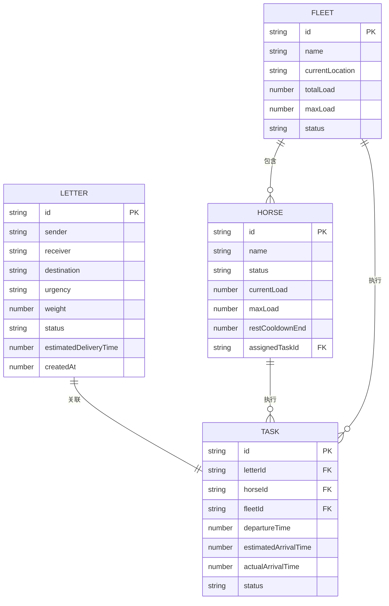

## 1. 架构设计



**数据流向说明：**
- 前端挂载时调用 `fetchBusy()` 和 `fetchHorses()` 加载数据
- 用户操作后调用 `submitTask()` 提交调度
- 后端接收HTTP请求 → 操作SQLite数据库 → 返回JSON响应
- 拖拽事件触发 `onAssignMule` 回调 → App调用API更新后端

## 2. 技术描述

- **前端**：React@18 + ReactDOM@18 + TypeScript@5 + Vite@5
- **构建工具**：Vite@5 + @vitejs/plugin-react@4
- **后端**：Express@4 + sql.js@1 + uuid@9
- **HTTP客户端**：axios@1
- **数据库**：SQLite (sql.js内存数据库)
- **启动脚本**：
  - 前端：`npm run dev` (Vite开发服务器，端口5173)
  - 后端：`node server.js` (Express服务，端口3001)
- **代理配置**：Vite代理 `/api` 到 `http://localhost:3001`

## 3. 路由定义

| 前端页面 | 路由 | 组件 | 功能 |
|---------|------|------|------|
| 管理主面板 | `/` | App.tsx | 主管理界面，包含所有模块 |

**后端API路由：**

| Method | Route | 用途 |
|--------|-------|------|
| GET | `/api/letters` | 获取所有信件列表 |
| POST | `/api/letters` | 新增信件 |
| PUT | `/api/letters/:id` | 更新信件信息 |
| DELETE | `/api/letters/:id` | 删除信件 |
| GET | `/api/horses` | 获取所有马匹状态 |
| PUT | `/api/horses/:id` | 更新马匹状态 |
| POST | `/api/horses/:id/rest` | 马匹休息 |
| GET | `/api/tasks` | 获取运输任务列表 |
| POST | `/api/tasks` | 创建运输任务 |
| PUT | `/api/tasks/:id` | 更新任务状态 |
| GET | `/api/tasks/history` | 获取任务历史（支持分页） |
| GET | `/api/statistics` | 获取统计数据 |
| GET | `/api/fleets` | 获取车队状态 |

## 4. API 定义

### 4.1 数据类型定义

```typescript
// 信件类型
interface Letter {
  id: string;
  sender: string;
  receiver: string;
  destination: string;
  urgency: 'urgent' | 'normal' | 'regular'; // 红色紧急/黄色普通/绿色平邮
  weight: number;
  status: 'pending' | 'assigned' | 'delivered';
  estimatedDeliveryTime: number; // 分钟
  createdAt: number;
}

// 马匹类型
interface Horse {
  id: string;
  name: string;
  status: 'idle' | 'transit' | 'resting'; // 空闲/途中/休息
  currentLoad: number;
  maxLoad: number; // 50kg
  restCooldownEnd: number | null; // 休息冷却结束时间戳
  assignedTaskId: string | null;
}

// 车队类型
interface Fleet {
  id: string;
  name: string;
  horseIds: string[]; // 最多3匹马
  currentLocation: string;
  totalLoad: number;
  maxLoad: number; // 150kg
  status: 'idle' | 'transit';
}

// 运输任务类型
interface Task {
  id: string;
  letterId: string;
  horseId: string;
  fleetId: string | null;
  departureTime: number;
  estimatedArrivalTime: number;
  actualArrivalTime: number | null;
  status: 'in_progress' | 'completed' | 'delayed';
}

// 统计数据类型
interface Statistics {
  todayDeliveries: number;
  averageDeliveryTime: number; // 分钟
  overtimeRate: number; // 百分比
}
```

### 4.2 请求/响应示例

**新增信件 POST /api/letters**
```json
// Request
{
  "sender": "张三",
  "receiver": "李四",
  "destination": "长安",
  "urgency": "urgent",
  "weight": 10
}

// Response
{
  "success": true,
  "data": {
    "id": "uuid-xxx",
    "sender": "张三",
    "receiver": "李四",
    "destination": "长安",
    "urgency": "urgent",
    "weight": 10,
    "status": "pending",
    "estimatedDeliveryTime": 120,
    "createdAt": 1234567890
  }
}
```

**创建任务 POST /api/tasks**
```json
// Request
{
  "letterId": "letter-uuid",
  "horseId": "horse-uuid"
}

// Response
{
  "success": true,
  "data": {
    "id": "task-uuid",
    "letterId": "letter-uuid",
    "horseId": "horse-uuid",
    "departureTime": 1234567890,
    "estimatedArrivalTime": 1234575090,
    "status": "in_progress"
  }
}
```

**分页获取历史任务 GET /api/tasks/history?page=1&limit=20**
```json
// Response
{
  "success": true,
  "data": {
    "tasks": [...],
    "total": 65,
    "page": 1,
    "limit": 20,
    "hasMore": true
  }
}
```

## 5. 服务器架构图



**模块职责：**
- `server.js`: 集成所有模块，启动Express服务，定义路由
- 路由处理器：参数校验、调用业务逻辑
- 业务逻辑：调度算法、载重校验、时间计算
- 数据访问层：SQL操作封装

## 6. 数据模型

### 6.1 ER图



### 6.2 初始化数据

**马匹初始化数据（6匹）：**
```sql
INSERT INTO horses (id, name, status, currentLoad, maxLoad) VALUES
('horse-1', '赤兔', 'idle', 0, 50),
('horse-2', '的卢', 'idle', 0, 50),
('horse-3', '绝影', 'idle', 0, 50),
('horse-4', '爪黄飞电', 'idle', 0, 50),
('horse-5', '乌云踏雪', 'idle', 0, 50),
('horse-6', '照夜玉狮子', 'idle', 0, 50);
```

**车队初始化数据（2队）：**
```sql
INSERT INTO fleets (id, name, horseIds, currentLocation, totalLoad, maxLoad, status) VALUES
('fleet-1', '龙队', '[]', '驿站', 0, 150, 'idle'),
('fleet-2', '虎队', '[]', '驿站', 0, 150, 'idle');
```

## 7. 文件结构与调用关系

```
项目根目录/
├── package.json                 # 项目依赖与脚本
├── vite.config.js              # Vite配置（代理到3001，base: ./）
├── tsconfig.json               # TypeScript配置（严格模式，ES2020）
├── index.html                  # 入口HTML（背景#f5e6c8，ZCOOL XiaoWei字体）
├── server.js                   # Express后端（API服务，SQLite操作）
└── src/
    ├── App.tsx                 # 主组件（状态管理，API调用）
    ├── components/
    │   └── DispatchBoard.tsx   # 调度看板（任务卡片，拖拽交互）
    └── styles.css              # 全局样式（复古色调，响应式布局）
```

**调用关系：**
1. `App.tsx` 导入并渲染 `DispatchBoard.tsx`
2. `App.tsx` 通过 axios 调用 `server.js` 的 API
3. `DispatchBoard.tsx` 通过 props 接收数据，通过回调通知 `App.tsx`
4. `server.js` 使用 sql.js 操作 SQLite 数据库
5. 所有组件使用 `styles.css` 中的样式类名

## 8. 关键业务逻辑

### 8.1 预计派送时间计算

根据紧急程度计算预计派送时间（分钟）：
- 紧急（红色）：`基础时间 * 0.5`（加急）
- 普通（黄色）：`基础时间 * 1.0`（正常）
- 平邮（绿色）：`基础时间 * 2.0`（延迟）

基础时间根据目的地距离预设（例如：长安=120分钟，洛阳=90分钟）。

### 8.2 载重校验逻辑

拖拽信件到马匹时校验：
- 马匹必须是 `idle` 状态
- `horse.currentLoad + letter.weight <= horse.maxLoad(50kg)`
- 校验失败：马匹图标闪烁红色警告0.5秒，弹出提示
- 校验成功：马匹头像泛起金色光芒0.3秒

### 8.3 分页加载策略

- 任务历史列表超过50条时启用分页
- 每页加载20条，避免一次性渲染过多DOM
- 使用虚拟滚动优化长列表性能

### 8.4 响应式交互策略

- 桌面端（>=768px）：拖拽操作
- 移动端（<768px）：点击信件 → 点击马匹 → 确认分配
