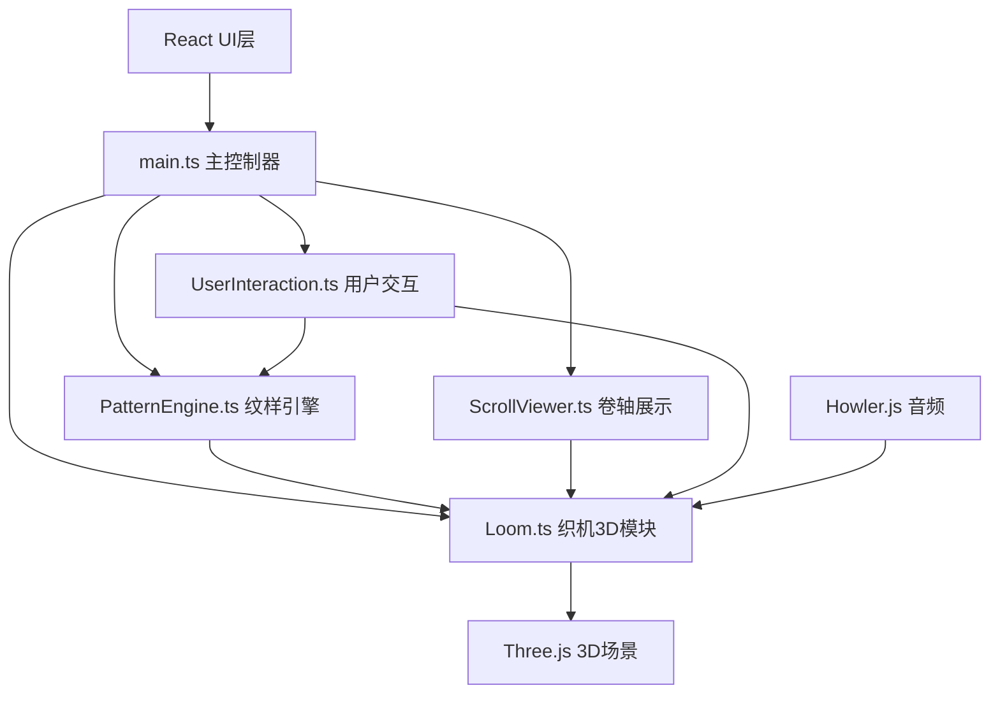
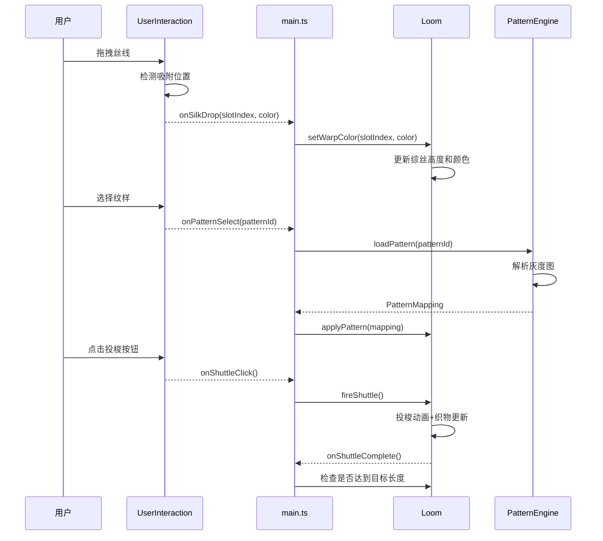

# 云锦织机3D交互模拟器 技术架构文档

## 1. 系统架构

### 1.1 整体架构图



### 1.2 模块职责划分

| 模块 | 职责 | 依赖 |
|-----|------|------|
| main.ts | 初始化场景、相机、渲染器，主循环控制，事件代理 | Loom, PatternEngine, ScrollViewer, UserInteraction |
| Loom.ts | 织机3D模型、综丝、梭子、织物的创建与动画 | Three.js |
| PatternEngine.ts | 纹样解析、灰度映射、综丝位置计算 | - |
| ScrollViewer.ts | 卷轴生成、展开/收卷动画、背景切换 | Three.js |
| UserInteraction.ts | 鼠标拖拽、点击、吸附检测、粒子效果 | Three.js |

---

## 2. 核心数据结构

### 2.1 织机状态接口

```typescript
interface LoomState {
  warpThreads: WarpThread[];      // 108根经线
  weftThreads: WeftThread[];      // 纬线数组
  heddlePositions: number[];      // 综丝位置(0或1)
  fabricLength: number;           // 当前织物长度(厘米)
  targetLength: number;           // 目标织物长度
  isShuttling: boolean;           // 是否正在投梭
  shuttlePosition: number;        // 梭子位置(-1到1)
  currentPattern: Pattern | null; // 当前纹样
  viewMode: 'orbit' | 'firstPerson'; // 视角模式
}

interface WarpThread {
  id: number;
  color: string;
  heddleHeight: number;           // 综丝高度
  slotIndex: number;              // 卡位索引
}

interface WeftThread {
  id: number;
  color: string;
  yPosition: number;              // Y轴位置
}

interface Pattern {
  id: string;
  name: string;
  pixelData: Uint8ClampedArray;   // 64x64灰度图
  width: number;
  height: number;
}
```

### 2.2 纹样映射规则

```typescript
// 灰度值映射到织造状态
enum WeaveType {
  WARP_UP = 'warp_up',     // 经线提起(灰度>180)
  WEFT_VISIBLE = 'weft_visible', // 纬线露出(灰度<80)
  MIXED = 'mixed'          // 混织效果(80<=灰度<=180)
}

interface PatternMapping {
  weaveTypes: WeaveType[][];      // 64x64织造类型矩阵
  colorScheme: string[];          // 配色方案
  heddleSequence: number[][];     // 综丝提起序列
}
```

---

## 3. 关键算法设计

### 3.1 纹样灰度映射算法

```typescript
// 输入: 64x64灰度图像素数据
// 输出: 织造类型矩阵 + 综丝提起序列
function mapPatternToWeave(patternData: Uint8ClampedArray): PatternMapping {
  const weaveMatrix: WeaveType[][] = [];
  const heddleSequence: number[][] = [];
  
  for (let y = 0; y < 64; y++) {
    const row: WeaveType[] = [];
    const heddleRow: number[] = [];
    for (let x = 0; x < 64; x++) {
      const gray = patternData[y * 64 + x];
      let type: WeaveType;
      let heddleUp: number;
      
      if (gray > 180) {
        type = WeaveType.WARP_UP;
        heddleUp = 1;
      } else if (gray < 80) {
        type = WeaveType.WEFT_VISIBLE;
        heddleUp = 0;
      } else {
        type = WeaveType.MIXED;
        heddleUp = (x + y) % 2; // 交替混织
      }
      
      row.push(type);
      heddleRow.push(heddleUp);
    }
    weaveMatrix.push(row);
    heddleSequence.push(heddleRow);
  }
  
  return {
    weaveTypes: weaveMatrix,
    colorScheme: generateColorScheme(weaveMatrix),
    heddleSequence
  };
}
```

### 3.2 投梭动画插值算法

```typescript
// 梭子运动轨迹: 余弦缓动
function shuttlePosition(time: number, duration: number): number {
  const t = Math.min(time / duration, 1);
  return Math.cos(t * Math.PI) * -1; // -1到1
}

// 综丝提升动画: 弹性缓动
function heddleElevation(t: number): number {
  const p = 0.3;
  return Math.pow(2, -10 * t) * Math.sin((t - p / 4) * (2 * Math.PI) / p) + 1;
}
```

### 3.3 拖拽吸附算法

```typescript
const SNAP_DISTANCE = 0.3; // 吸附距离

function findNearestSlot(
  dragPosition: THREE.Vector3,
  slots: THREE.Vector3[]
): { slotIndex: number; distance: number } | null {
  let nearest = null;
  let minDist = Infinity;
  
  slots.forEach((slot, index) => {
    const dist = dragPosition.distanceTo(slot);
    if (dist < minDist && dist < SNAP_DISTANCE) {
      minDist = dist;
      nearest = { slotIndex: index, distance: dist };
    }
  });
  
  return nearest;
}
```

---

## 4. 渲染与性能优化

### 4.1 性能优化策略

| 优化项 | 策略 | 预期效果 |
|-------|------|---------|
| 几何体复用 | 使用InstancedMesh渲染108根综丝 | 减少Draw Call |
| 织物LOD | 根据距离切换织物渲染精度 | 远处降低顶点数 |
| 动画帧率控制 | 使用requestAnimationFrame + 固定时间步长 | 稳定50fps+ |
| 纹理压缩 | 使用KTX2压缩纹理 | 减少显存占用 |
| 遮挡剔除 | 启用FrustumCulling | 减少可见物体数 |

### 4.2 关键渲染参数

```typescript
// 渲染器配置
const rendererConfig = {
  antialias: true,
  powerPreference: 'high-performance',
  alpha: false,
  precision: 'highp'
};

// 相机配置
const cameraConfig = {
  fov: 45,
  near: 0.1,
  far: 100,
  orbitDistance: 5,
  firstPersonPosition: new THREE.Vector3(0, 1.2, 1.8)
};

// 光照配置
const lightingConfig = {
  ambientIntensity: 0.6,
  directionalIntensity: 1.0,
  pointLightIntensity: 0.3,
  haloIntensity: 0.3
};
```

---

## 5. 事件系统

### 5.1 交互事件流



### 5.2 事件类型定义

```typescript
type InteractionEvent = 
  | { type: 'silk_drag_start'; color: string; position: Vector2 }
  | { type: 'silk_drag_move'; position: Vector2 }
  | { type: 'silk_drop'; slotIndex: number; color: string }
  | { type: 'pattern_select'; patternId: string }
  | { type: 'shuttle_click' }
  | { type: 'scroll_click' }
  | { type: 'camera_orbit'; deltaX: number; deltaY: number }
  | { type: 'loom_double_click' };
```

---

## 6. 音频系统

### 6.1 音效配置

```typescript
interface SoundConfig {
  shuttleClick: {
    frequency: number;     // 120Hz
    duration: number;      // 0.3s
    type: 'square' | 'sawtooth' | 'sine';
    volume: number;
  };
  silkDrop: {
    frequency: number;
    duration: number;
  };
}

const SOUND_CONFIG: SoundConfig = {
  shuttleClick: {
    frequency: 120,
    duration: 0.3,
    type: 'sawtooth',
    volume: 0.3
  },
  silkDrop: {
    frequency: 440,
    duration: 0.1
  }
};
```

---

## 7. 构建与部署

### 7.1 构建配置

```javascript
// vite.config.js
export default {
  base: './',
  build: {
    target: 'es2020',
    minify: 'terser',
    sourcemap: false
  },
  optimizeDeps: {
    include: ['three', 'howler', 'uuid']
  }
};
```

### 7.2 依赖版本

```json
{
  "dependencies": {
    "three": "^0.160.0",
    "@types/three": "^0.160.0",
    "howler": "^2.2.4",
    "react": "^18.2.0",
    "react-dom": "^18.2.0",
    "uuid": "^9.0.0"
  },
  "devDependencies": {
    "typescript": "^5.3.0",
    "vite": "^5.0.0",
    "@vitejs/plugin-react": "^4.2.0"
  }
}
```
