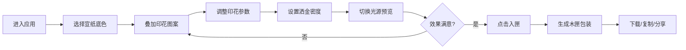

## 1. 产品概述

古风笺纸工坊是一款基于浏览器的互动应用，让用户体验古代笺纸制作工艺。用户可挑选宣纸底色、叠加印花与洒金工艺，实时预览笺纸在日光与烛光下的不同视觉效果，最终生成可保存的笺纸样图并装入木匣分享。

- 核心价值：为传统文化爱好者提供沉浸式的笺纸定制体验，还原古代文人书房的雅致氛围
- 目标用户：书法爱好者、传统文化爱好者、设计从业者

## 2. 核心功能

### 2.1 功能模块
1. **配置面板**：宣纸底色选择、印花图案叠加、洒金工艺定制
2. **预览面板**：日光/烛光双模式预览、缩放旋转、卷轴展开动画
3. **导出分享**：入匣功能生成高清PNG、木匣边框、一键下载与分享文案

### 2.2 页面详情

| 页面名称 | 模块名称 | 功能描述 |
|-----------|-------------|---------------------|
| 主页面 | 配置面板 | 6种宣纸底色选择（云白/鹅黄/松花绿/胭脂红/石青/藤紫），带金线选中框 |
| 主页面 | 印花控制 | 8种古风印花（梅兰竹菊/祥云水纹/回纹冰裂纹），支持大小/位置/旋转调整 |
| 主页面 | 洒金控制 | 三档密度（稀疏20/适中50/密集100片），不规则金箔多边形 |
| 主页面 | 预览切换 | 日光(6500K)/烛光(2700K)滑动开关，0.8s平滑过渡动画 |
| 主页面 | 导出功能 | 入匣生成600x800px高清图，木匣边框装饰，下载/复制/分享文案 |

## 3. 核心流程

用户进入应用 → 选择宣纸底色 → 叠加印花（调整大小/位置/旋转）→ 选择洒金密度 → 切换日光/烛光预览 → 调整至满意效果 → 点击"入匣"生成木匣包装图 → 下载或复制分享

## 4. 用户界面设计

### 4.1 设计风格
- **主色调**：浅米色 #f5e6d3（背景）、深褐色 #5c3a21（木匣）、金色 #d4af37（装饰线）
- **字体**：Ma Shan Zheng（古风书法字体），配合衬线字体
- **按钮风格**：手工木纹质感（CSS渐变模拟），圆角4px，金线描边选中状态
- **布局风格**：古雅书斋风格，左配置右预览，卷轴展开动画
- **动效**：墨滴涟漪点击反馈、按钮上浮阴影、颜色平滑过渡

### 4.2 页面设计概述

| 页面名称 | 模块名称 | UI元素 |
|-----------|-------------|-------------|
| 主页面 | 配置面板 | 300px宽，半透明白底毛玻璃效果，左侧固定 |
| 主页面 | 预览区 | 右侧自适应，卷轴展开动画（1s中心向两侧），缩放旋转控制 |
| 主页面 | 交互元素 | 色块选择器、印花拖拽区、滑杆开关、木纹按钮 |
| 主页面 | 动效层 | 墨滴涟漪动画容器、过渡动画容器 |

### 4.3 响应式设计
- **桌面端**（≥768px）：左配置面板（300px）+ 右预览区布局
- **移动端**（<768px）：配置面板折叠为顶部抽屉，汉堡菜单展开/收起，预览区全宽显示
- **触摸优化**：增加触控区域，支持手势缩放旋转

### 4.4 视觉细节
- 宣纸纹理：细密纤维纹路，透明度10%-20%
- 印花效果：半透明SVG矢量（30%-60%透明度）
- 洒金效果：不规则多边形，#ffd700带光泽渐变
- 木匣边框：深褐色 #5c3a21，四角铜扣装饰
