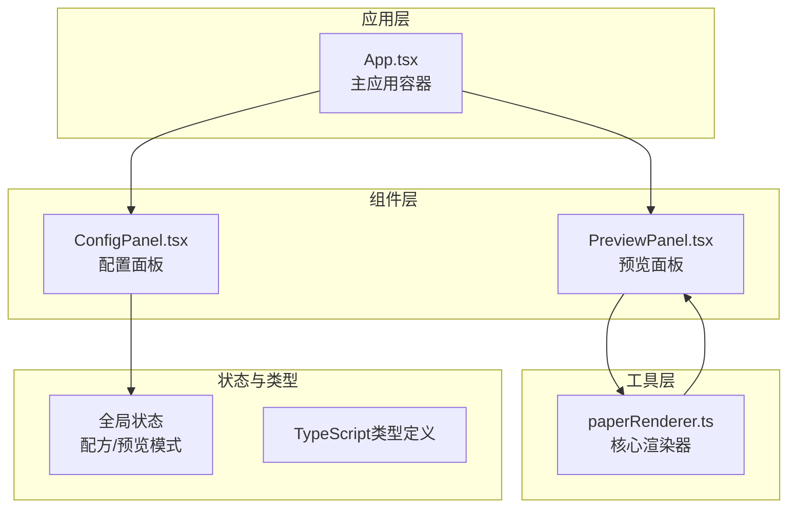

## 1. 架构设计



## 2. 技术描述

- **前端框架**：React 18 + TypeScript 5
- **构建工具**：Vite 5 + @vitejs/plugin-react 4
- **状态管理**：React useState/useReducer（轻量级场景，无需zustand）
- **图形渲染**：HTML5 Canvas API
- **导出依赖**：jspdf（PDF导出）、canvg（SVG转Canvas）
- **样式方案**：CSS Modules + CSS Variables

## 3. 项目结构与数据流向

### 3.1 文件结构

```
src/
├── App.tsx                    # 主应用容器，管理全局状态
│   ├── 状态：paperRecipe, previewMode
│   └── 调用：ConfigPanel, PreviewPanel
├── ConfigPanel.tsx            # 配置面板组件
│   ├── 接收：onRecipeChange 回调
│   └── 输出：更新后的配方对象
├── PreviewPanel.tsx           # 预览面板组件
│   ├── 接收：recipe, previewMode
│   └── 调用：renderPaper 渲染函数
└── utils/
    └── paperRenderer.ts       # 核心渲染工具
        └── 导出：renderPaper(canvas, recipe, lightMode)
```

### 3.2 数据流向

```
用户交互 → ConfigPanel → 更新配方对象 → App.tsx → 传递给 PreviewPanel → 调用 paperRenderer → Canvas 渲染
```

## 4. 核心数据模型

### 4.1 类型定义

```typescript
interface PaperColor {
  name: string;
  hex: string;
}

interface Pattern {
  name: string;
  svgPath: string;
}

interface PaperRecipe {
  baseColor: string;           // 宣纸底色HEX
  pattern: {
    type: string | null;       // 印花类型
    scale: number;             // 缩放 0.5-3
    position: { x: number; y: number }; // 相对位置 0-100
    rotation: number;          // 旋转角度 0-360
    opacity: number;           // 透明度 0.3-0.6
  };
  goldFoil: {
    density: 'sparse' | 'medium' | 'dense'; // 稀疏/适中/密集
    particles: GoldFoilParticle[];
  };
}

interface GoldFoilParticle {
  x: number;
  y: number;
  size: number;
  rotation: number;
  points: { x: number; y: number }[];
}

type LightMode = 'daylight' | 'candlelight'; // 日光/烛光
```

## 5. 性能优化

### 5.1 渲染性能
- Canvas 分层渲染：底色层 → 印花层 → 洒金层，局部脏区重绘
- 洒金粒子预计算：密度变化时一次性生成粒子数据，渲染时仅绘制
- requestAnimationFrame 节流：控制30fps更新频率
- 密集模式优化：100个多边形控制在50ms内渲染完成

### 5.2 加载性能
- 字体预加载：preconnect Google Fonts
- SVG图案内联：避免网络请求
- 按需渲染：非活动状态暂停Canvas更新
- 目标：首屏加载 < 2s

## 6. 功能实现要点

### 6.1 宣纸纹理
- 使用 Canvas 噪声算法生成纤维纹路
- 叠加多层半透明纹理模拟手工纸质感
- 纹理透明度控制在10%-20%

### 6.2 印花叠加
- SVG 图案通过 canvg 转换为 Canvas 绘制
- 支持鼠标拖拽移动位置
- 缩放和旋转通过 Canvas transform 实现

### 6.3 洒金效果
- 不规则多边形生成：随机3-7个顶点
- 光泽渐变：径向渐变从 #fff8dc 到 #ffd700
- 非重叠检测：简单距离检测避免重叠
- 密度对应：稀疏20片 / 适中50片 / 密集100片

### 6.4 光源模拟
- 色温转换算法：6500K → 偏白暖黄，2700K → 偏红暖橙
- 色彩矩阵变换实现整体色调调整
- CSS transition 实现 0.8s 平滑过渡

### 6.5 导出功能
- 离屏 Canvas 渲染 600x800px 高清图
- 木匣边框绘制：深褐色背景 + 四角铜扣装饰
- 下载：toBlob 生成 PNG，a 标签触发下载
- 剪贴板：Clipboard API 写入图片
