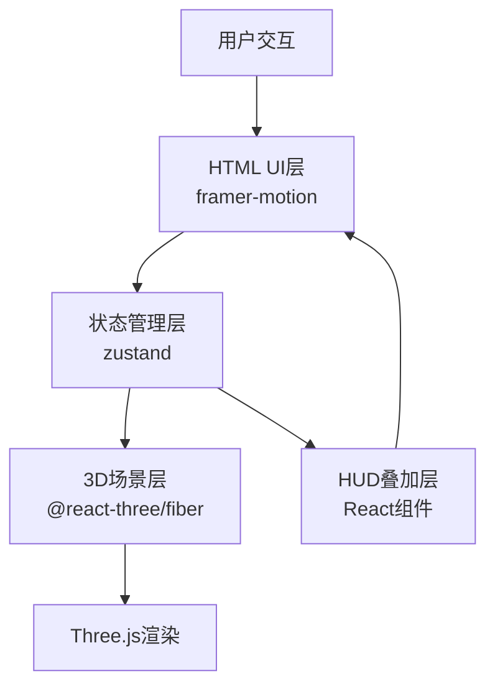
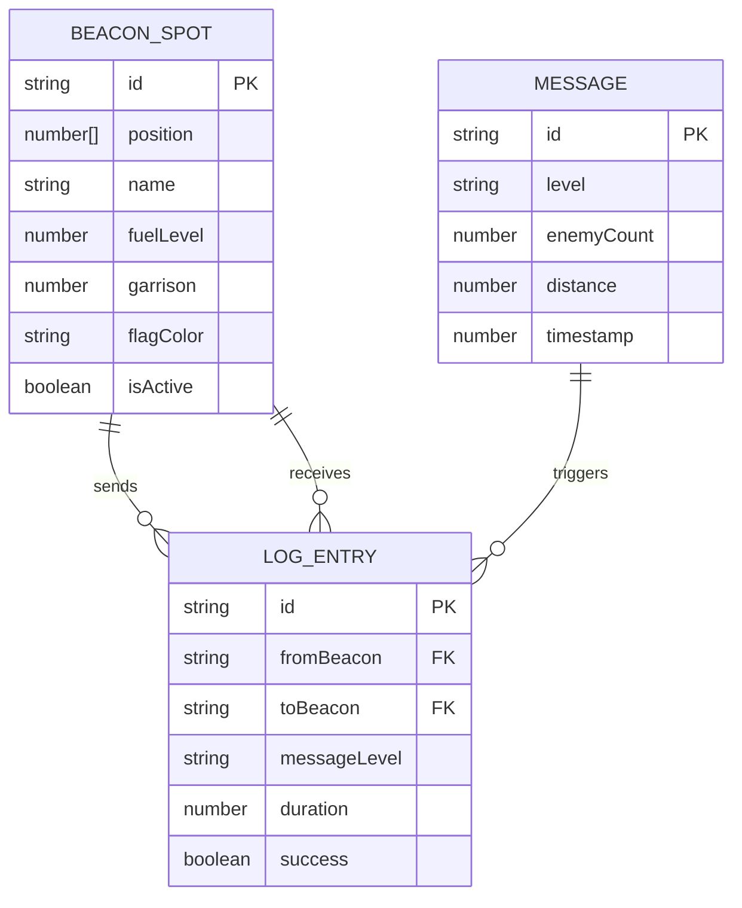

## 1. 架构设计



## 2. 技术描述

* **前端框架**：React 18 + TypeScript 5

* **构建工具**：Vite 5

* **3D引擎**：Three.js + @react-three/fiber + @react-three/drei

* **状态管理**：zustand

* **动画库**：framer-motion

* **开发规范**：ESLint + @typescript-eslint

* **无后端**：纯前端应用，数据使用mock

## 3. 目录结构

```
src/
├── components/
│   ├── Scene.tsx          # 3D场景主组件
│   ├── HUD.tsx            # HTML UI叠加层
│   ├── BeaconMesh.tsx     # 烽燧3D模型组件
│   ├── FlameParticles.tsx # 火焰粒子系统
│   ├── MessagePanel.tsx   # 左侧消息栏
│   ├── LogPanel.tsx       # 右侧竹简日志
│   ├── BeaconDetail.tsx   # 烽燧详情面板
│   └── SupplySystem.tsx   # 燃料补给系统
├── types.ts               # TypeScript类型定义
├── store.ts               # zustand全局状态
├── App.tsx                # 主应用组件
└── main.tsx               # 应用入口
```

## 4. 数据模型

### 4.1 数据模型定义



### 4.2 类型定义

```typescript
// 烽燧站点
interface BeaconSpot {
  id: string;
  position: [number, number, number];
  name: string;
  fuelLevel: number;
  garrison: number;
  flagColor: 'white' | 'red' | 'black';
  isActive: boolean;
}

// 军情消息
interface Message {
  id: string;
  level: 'normal' | 'urgent' | 'emergency';
  enemyCount: number;
  distance: number;
  timestamp: number;
}

// 传讯日志
interface LogEntry {
  id: string;
  fromBeacon: string;
  toBeacon: string;
  messageLevel: 'normal' | 'urgent' | 'emergency';
  duration: number;
  success: boolean;
}
```

## 5. 核心状态管理（zustand）

```typescript
interface BeaconStore {
  beaconSpots: BeaconSpot[];
  messages: Message[];
  logs: LogEntry[];
  currentSelectedBeaconId: string | null;
  signalRelayActive: boolean;
  activeSignals: Map<string, { targetId: string; startTime: number }>;
  
  selectBeacon: (id: string | null) => void;
  addLog: (log: Omit<LogEntry, 'id'>) => void;
  updateFuel: (beaconId: string, amount: number) => void;
  startSignalRelay: (sourceId: string, messageId: string) => void;
  stopSignalRelay: (beaconId: string) => void;
  processSignalQueue: () => void;
}
```

## 6. 性能优化策略

1. **粒子系统优化**：

   * 粒子数限制在200-500之间

   * 使用@react-three/drei的Points材质

   * 传讯链空闲时停止粒子更新

   * 火焰粒子3秒后自动销毁

2. **渲染优化**：

   * 使用useMemo缓存计算结果

   * 使用React.memo避免不必要重渲染

   * useFrame中只更新必要状态

3. **交互冻结**：

   * 镜头飞入动画期间（0.5秒）冻结其他交互

   * 使用全局标志位控制交互可用性

4. **内存管理**：

   * 粒子系统生命周期管理

   * 组件卸载时清理计时器和动画

   * 及时销毁不再使用的Three.js对象

