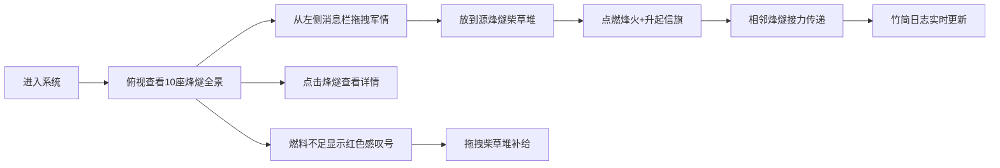

## 1. 产品概述

本项目是一个虚拟古代西域烽燧传讯与边防调度的3D交互可视化系统，用户扮演汉代敦煌都尉，在河西走廊的烽燧线上管理守军、燃料和信旗，通过燃放烽火传递军情，调动戍卒加固防御。

- 主要目的：让用户沉浸式体验古代边防传讯系统，理解烽燧接力传递军情的运作机制
- 目标用户：历史爱好者、游戏玩家、教育领域学习者
- 产品价值：寓教于乐，以互动可视化方式展现汉代边防智慧

## 2. 核心功能

### 2.1 用户角色

| 角色 | 注册方式 | 核心权限 |
|------|---------|----------|
| 都尉（用户） | 无需注册，直接进入 | 管理所有烽燧、发布军情、调度补给、查看日志 |

### 2.2 功能模块

1. **3D烽燧场景**：10座烽燧由西向东排列，支持视角旋转、缩放、平移，点击烽燧查看详情
2. **军情传讯系统**：拖拽消息到烽燧点燃烽火，接力传递至目标烽燧
3. **竹简日志面板**：实时记录所有传讯信息，展示发送/接收燧、等级、耗时、状态
4. **燃料补给系统**：柴草余量低于20%时显示警告，拖拽补给柴草堆补充燃料
5. **响应式布局**：三栏布局/底部抽屉/全屏轮播三种布局自适应

### 2.3 页面详情

| 页面名称 | 模块名称 | 功能描述 |
|----------|----------|----------|
| 主界面 | 3D场景模块 | 10座烽燧模型、传讯链路虚线、火焰粒子、烟柱动画、相机控制 |
| 主界面 | 左侧消息栏 | 滚动军情列表，支持拖拽到烽燧触发传讯 |
| 主界面 | 右侧竹简日志 | 纵向滚动传讯记录，竹简风格展示 |
| 主界面 | 烽燧详情面板 | 点击烽燧后显示，半透明羊皮纸风格，展示守军、燃料、信旗状态 |
| 主界面 | 补给系统 | 低燃料警告、拖拽柴草堆补给、抛物线飞入动画 |

## 3. 核心流程

用户进入系统后，俯视视角查看10座烽燧全景。从左侧消息栏拖拽军情消息到某座烽燧的柴草堆，触发烽火点燃和信旗升起，目标烽燧接力传递。用户可点击烽燧查看详情，当燃料不足时拖拽补给柴草堆补充。所有传讯记录实时显示在右侧竹简日志中。

## 4. 界面设计

### 4.1 设计风格

- 主色调：浅旧纸色 #f5e6c8，夯土色 #b5835a，暗红色 #8b2500
- 辅助色：羊皮纸色 #f0e0c8，竹简色 #d4a76a，枯草色 #c4a882
- 按钮风格：暗红色边框，悬停背景加深（#6b1a00），按下阴影加深
- 字体：思源宋体（标题）、隶书风格（日志文字）
- 布局：桌面端三栏布局，移动端自适应切换
- 装饰元素：仿竹编边框、毛边装饰、绳眼装饰
- 图标风格：汉代简牍风格，古朴典雅

### 4.2 页面设计概览

| 页面名称 | 模块名称 | UI元素 |
|----------|----------|--------|
| 主界面 | 3D场景 | 10座夯土色烽燧、半透明传讯虚线、橙红火焰粒子、白色/红色/黑色信旗 |
| 主界面 | 左侧消息栏 | 羊皮纸色背景、毛边装饰、消息卡片（急报等级标签、敌军数量、距燧里程） |
| 主界面 | 右侧竹简日志 | 竹简堆叠效果、绳眼装饰、黑色隶书文字、纵向滚动 |
| 主界面 | 详情面板 | 半透明羊皮纸色、毛边装饰、竹编边框、守军/燃料/信旗信息 |
| 主界面 | 补给系统 | 红色感叹号脉冲动画、柴草堆立方体、抛物线飞入动画 |

### 4.3 响应式设计

- **>1200px**：三栏布局（左消息栏、中3D场景、右日志面板）
- **800-1200px**：两栏布局，右侧日志折叠为底部抽屉（高度200px，可上拉展开）
- **<800px**：全屏轮播式切换，左上角Tab栏切换消息/场景/日志

### 4.4 3D场景设计

- **环境**：河西走廊戈壁沙漠地貌，远处祁连山轮廓，天空使用渐变背景
- **光照**：方向光模拟日光，柔和环境光补光，营造古代边关氛围
- **相机**：默认俯视角度，支持鼠标拖动360°旋转、滚轮缩放、右键平移
- **动画效果**：
  - 点击烽燧：0.5秒镜头飞入至燧顶上方5单位处，燧顶放大1.5倍
  - 火焰粒子：200-500粒子，橙#ff6600渐变至红#cc0000，持续3秒
  - 烟柱：上升至15单位高度后水平飘散，方向指向目标烽燧
  - 信旗：三角布条，0.3秒上升动画，颜色对应消息等级
  - 接力传递：目标燧1.5秒后点燃柴草堆，形成连锁反应
- **性能**：60fps运行，粒子数≤500，镜头动画时冻结其他交互
