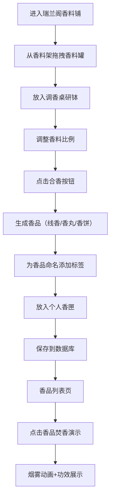

## 1. 产品概述

瑞兰阁虚拟香市是一款沉浸式调香体验Web应用，让用户化身古代香道师，在虚拟的"瑞兰阁"香料铺中挑选香料、调配香方、制作线香/香丸/香饼，并体验焚香演示。通过精美的3D场景与流畅的交互动画，传承中华香道文化。

- **核心价值**：提供沉浸式调香乐趣，传播传统香道文化
- **目标用户**：对香道文化、手工DIY、国风文化感兴趣的用户
- **产品定位**：文化传承与休闲娱乐结合的Web应用

## 2. 核心功能

### 2.1 用户角色

| 角色 | 注册方式 | 核心权限 |
|------|----------|----------|
| 普通用户 | 无需注册，本地存储 | 浏览香料、调配香方、制作香品、保存香匣、焚香演示 |

### 2.2 功能模块

1. **香市街铺场景**：3D场景渲染，明式家具风格香料铺
2. **香料架交互**：拖拽香料罐到研钵
3. **调香桌系统**：香料比例调整、合香计算、香品生成
4. **个人香匣**：香品存储、命名标签、数据持久化
5. **焚香演示**：烟雾粒子动画、功效展示
6. **香品列表**：栅格布局展示已保存香品

### 2.3 页面详情

| 页面名称 | 模块名称 | 功能描述 |
|---------|----------|----------|
| 香市街铺主页面 | 3D场景渲染 | 明式家具风格店铺，深色木架陈列青花瓷香料罐，竹制柜台与算盘，宽大调香桌 |
| 香市街铺主页面 | 香料架交互 | 拖拽香料罐到研钵，最多5种香料，拖拽倾斜动画，淡青色烟缕特效 |
| 香市街铺主页面 | 调香桌系统 | 自动计算重量比例，金色滑块微调，合香按钮生成香品 |
| 香市街铺主页面 | 香品展示 | 线香/香丸/香饼三种形态，各具纹理细节 |
| 香市街铺主页面 | 个人香匣 | 黑漆木匣，翻盖动画，丝绸衬里，最多存放12支香品 |
| 香市街铺主页面 | 焚香演示 | 三足铜香炉，白色烟雾粒子，功效文字浮动显示 |
| 香品列表页 | 栅格展示 | 每行3个响应式布局，香品卡片包含缩略图、名称、功效、制作时间 |
| 香品列表页 | 卡片交互 | 悬停上浮投影加深效果 |

## 3. 核心流程

## 4. 用户界面设计

### 4.1 设计风格

- **主色调**：深木色 #4a2c1a、暖米色 #f5ead6
- **点缀色**：暗金色 #c9a94e、褐色 #5c3a21、淡青色烟缕 #a8d5ba、青绿色铜锈 #5d825a、金色文字 #f7e7b4
- **按钮风格**：暗金色与褐色渐变，悬停时纹理微微发光，0.2s ease过渡
- **字体**：Google Fonts Noto Serif SC（宋体风格）
- **整体氛围**：古雅、精致、沉浸式国风美学

### 4.2 页面设计概览

| 页面名称 | 模块名称 | UI元素 |
|---------|----------|--------|
| 香市街铺主页面 | 3D场景 | 明式家具、青花瓷罐、竹制柜台、调香桌、研钵 |
| 香市街铺主页面 | 拖拽交互 | 香料罐跟随鼠标倾斜、淡青色烟缕特效0.8s |
| 香市街铺主页面 | 调香控件 | 金色#c9a94e滑块带纹理槽，0.2s过渡动画 |
| 香市街铺主页面 | 香匣组件 | 黑漆木匣翻盖动画0.3s，丝绸衬里#d4af37 |
| 香市街铺主页面 | 焚香组件 | 三足铜香炉饕餮纹样，烟雾粒子40-60个，升腾5单位，4s消散 |
| 香品列表页 | 卡片布局 | 栅格3列，响应式适配，卡片悬停上浮投影 |

### 4.3 响应式设计

- **桌面端**：优先设计，香品列表3列布局
- **平板端**：香品列表2列布局
- **移动端**：香品列表1列布局
- **触摸优化**：拖拽操作适配触摸手势

### 4.4 3D场景指引

- **环境氛围**：温暖柔和的古代店铺光线，暖色调
- **光照设置**：主光暖黄色，辅光柔和阴影
- **镜头设置**：固定视角俯瞰调香桌，可轻微旋转查看细节
- **构图重点**：香料架、调香桌、香炉为视觉焦点
- **交互动画**：烟雾粒子、翻盖动画、拖拽倾斜
- **后处理**：轻微泛光，增强古雅氛围
- **性能预算**：烟雾动画45FPS以上，首屏加载1.5s内

## 5. 非功能需求

- **性能要求**：焚香烟雾粒子动画保持45FPS以上
- **加载要求**：列表页首次加载时间不超过1.5s
- **技术栈**：TypeScript、React、Express、SQLite
