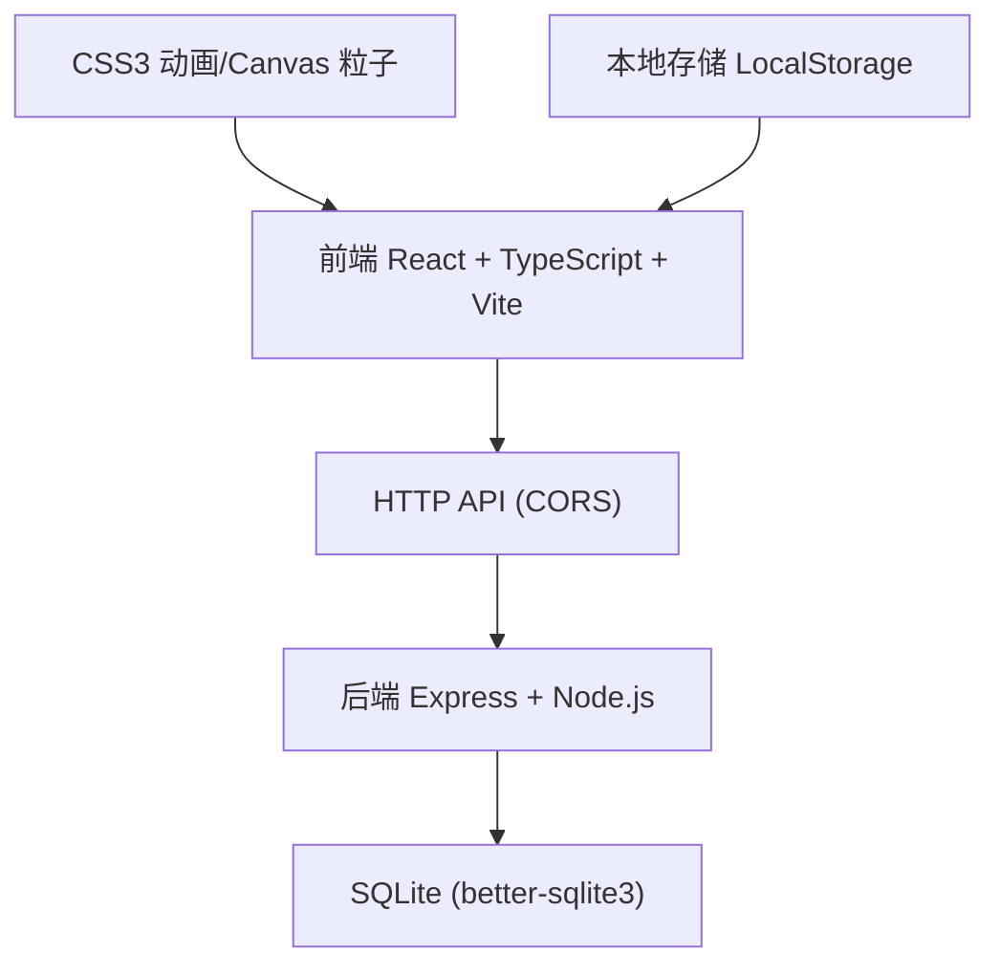
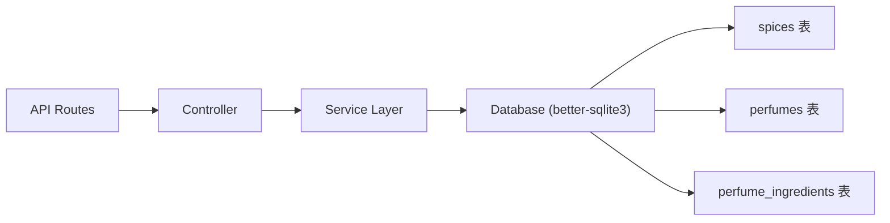
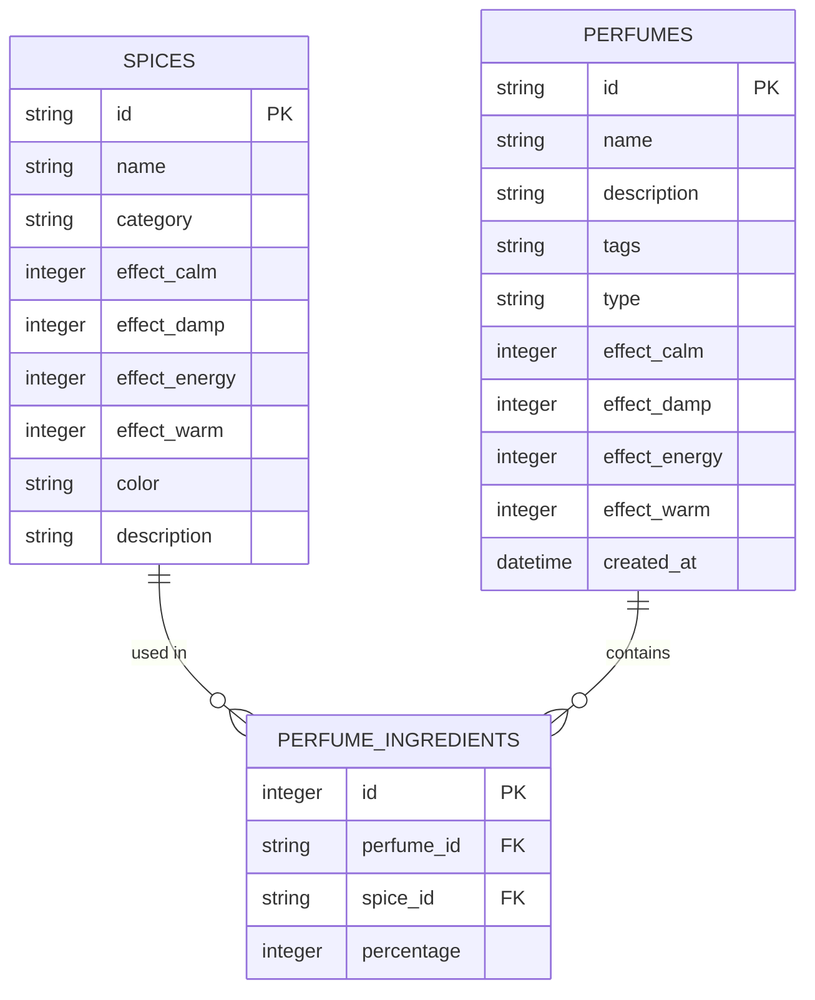

## 1. 架构设计



## 2. 技术描述

- **前端**：React@18 + TypeScript + Vite@5，CSS3 动画 + Canvas 粒子效果
- **初始化工具**：vite-init react-express-ts 模板
- **后端**：Express@4 + Node.js
- **数据库**：SQLite (better-sqlite3@11)
- **状态管理**：Zustand
- **路由**：React Router DOM@6
- **HTTP客户端**：Fetch API
- **图标**：lucide-react

## 3. 路由定义

| 路由 | 页面/组件 | 功能 |
|------|----------|------|
| `/` | 香市街铺主页面 | 3D场景、香料架、调香桌、香匣、焚香演示 |
| `/list` | 香品列表页 | 栅格展示已保存香品，支持删除和焚香 |

## 4. API 定义

### 4.1 类型定义

```typescript
interface Spice {
  id: string;
  name: string;
  category: '沉檀' | '花香' | '果香' | '辛香' | '草本';
  effects: {
    安神: number;
    祛湿: number;
    提神: number;
    暖身: number;
  };
  color: string;
  description: string;
}

interface PerfumeIngredient {
  spiceId: string;
  percentage: number;
}

interface Perfume {
  id: string;
  name: string;
  description: string;
  tags: string[];
  type: '线香' | '香丸' | '香饼';
  ingredients: PerfumeIngredient[];
  effects: {
    安神: number;
    祛湿: number;
    提神: number;
    暖身: number;
  };
  createdAt: string;
}
```

### 4.2 API 端点

| 方法 | 路径 | 请求 | 响应 |
|------|------|------|------|
| GET | `/api/spices` | 无 | `Spice[]` 香料列表 |
| GET | `/api/perfumes` | 无 | `Perfume[]` 香品列表 |
| POST | `/api/perfumes` | `{ name, description, tags, type, ingredients, effects }` | `{ id, ...Perfume }` 创建的香品 |
| DELETE | `/api/perfumes/:id` | 无 | `{ success: boolean }` 删除结果 |

### 4.3 响应格式

```typescript
// 成功响应
{
  success: true;
  data: Spice[] | Perfume[] | Perfume;
}

// 错误响应
{
  success: false;
  error: string;
}
```

## 5. 服务器架构



## 6. 数据模型

### 6.1 ER 图



### 6.2 DDL 语句

```sql
-- 香料表
CREATE TABLE IF NOT EXISTS spices (
  id TEXT PRIMARY KEY,
  name TEXT NOT NULL,
  category TEXT NOT NULL CHECK(category IN ('沉檀', '花香', '果香', '辛香', '草本')),
  effect_calm INTEGER NOT NULL DEFAULT 0,
  effect_damp INTEGER NOT NULL DEFAULT 0,
  effect_energy INTEGER NOT NULL DEFAULT 0,
  effect_warm INTEGER NOT NULL DEFAULT 0,
  color TEXT NOT NULL,
  description TEXT
);

-- 香品表
CREATE TABLE IF NOT EXISTS perfumes (
  id TEXT PRIMARY KEY,
  name TEXT NOT NULL,
  description TEXT,
  tags TEXT,
  type TEXT NOT NULL CHECK(type IN ('线香', '香丸', '香饼')),
  effect_calm INTEGER NOT NULL DEFAULT 0,
  effect_damp INTEGER NOT NULL DEFAULT 0,
  effect_energy INTEGER NOT NULL DEFAULT 0,
  effect_warm INTEGER NOT NULL DEFAULT 0,
  created_at DATETIME DEFAULT CURRENT_TIMESTAMP
);

-- 香品成分关联表
CREATE TABLE IF NOT EXISTS perfume_ingredients (
  id INTEGER PRIMARY KEY AUTOINCREMENT,
  perfume_id TEXT NOT NULL,
  spice_id TEXT NOT NULL,
  percentage INTEGER NOT NULL,
  FOREIGN KEY (perfume_id) REFERENCES perfumes(id) ON DELETE CASCADE,
  FOREIGN KEY (spice_id) REFERENCES spices(id)
);

-- 初始香料数据
INSERT OR IGNORE INTO spices (id, name, category, effect_calm, effect_damp, effect_energy, effect_warm, color, description) VALUES
('spice_001', '沉香', '沉檀', 85, 20, 10, 30, '#3d2817', '沉水奇楠，香气醇厚绵长'),
('spice_002', '檀香', '沉檀', 60, 15, 25, 45, '#8b6914', '老山檀香，温润如玉'),
('spice_003', '玫瑰', '花香', 40, 5, 15, 20, '#c94c4c', '保加利亚玫瑰，甜香馥郁'),
('spice_004', '茉莉', '花香', 50, 10, 30, 15, '#f5f5dc', '双瓣茉莉，清雅脱俗'),
('spice_005', '桂花', '花香', 35, 25, 20, 55, '#daa520', '金桂飘香，甜而不腻'),
('spice_006', '柑橘', '果香', 20, 30, 60, 10, '#ffa500', '新会陈皮，理气健脾'),
('spice_007', '丁香', '辛香', 25, 55, 35, 70, '#8b4513', '公丁香，温中散寒'),
('spice_008', '艾草', '草本', 15, 80, 20, 40, '#556b2f', '陈艾绒，祛湿除瘴');

-- 示例香品
INSERT OR IGNORE INTO perfumes (id, name, description, tags, type, effect_calm, effect_damp, effect_energy, effect_warm) VALUES
('perfume_001', '安神助眠香', '夜深人静时焚一炷，助你安然入梦', '安神,助眠,夜晚', '线香', 80, 15, 5, 25),
('perfume_002', '祛湿除瘴香', '梅雨季节常备，驱散湿邪', '祛湿,养生,居家', '香饼', 10, 75, 15, 50);

-- 示例香品成分
INSERT OR IGNORE INTO perfume_ingredients (perfume_id, spice_id, percentage) VALUES
('perfume_001', 'spice_001', 50),
('perfume_001', 'spice_002', 30),
('perfume_001', 'spice_004', 20),
('perfume_002', 'spice_008', 60),
('perfume_002', 'spice_007', 25),
('perfume_002', 'spice_006', 15);
```

## 7. 项目结构

```
├── .trae/documents/
│   ├── PRD_瑞兰阁虚拟香市.md
│   └── TechArch_瑞兰阁虚拟香市.md
├── src/
│   ├── components/
│   │   ├── SpiceJar.tsx          # 香料罐组件
│   │   ├── Mortar.tsx            # 研钵组件
│   │   ├── IncenseProduct.tsx    # 香品展示组件
│   │   ├── IncenseBox.tsx        # 香匣组件
│   │   ├── Censer.tsx            # 香炉组件
│   │   ├── SmokeParticles.tsx    # 烟雾粒子组件
│   │   └── PerfumeCard.tsx       # 香品卡片组件
│   ├── pages/
│   │   ├── ShopScene.tsx         # 香市街铺主页面
│   │   └── PerfumeList.tsx       # 香品列表页
│   ├── hooks/
│   │   ├── useDragAndDrop.ts     # 拖拽钩子
│   │   └── usePerfumeStore.ts    # 香品状态管理
│   ├── utils/
│   │   ├── incenseCalculator.ts  # 香品计算工具
│   │   └── api.ts                # API请求封装
│   ├── types/
│   │   └── index.ts              # 类型定义
│   ├── App.tsx
│   ├── main.tsx
│   └── index.css
├── api/
│   ├── server.js                 # Express服务器
│   └── database.js               # SQLite数据库初始化
├── index.html
├── vite.config.js
├── tsconfig.json
├── package.json
└── README.md
```

## 8. 性能优化策略

- **烟雾粒子**：使用 Canvas 2D 而非 DOM 元素，requestAnimationFrame 驱动，粒子池复用
- **首屏加载**：Vite 代码分割，关键资源预加载，图片懒加载
- **动画性能**：使用 CSS transform 和 opacity 动画，避免 layout thrashing
- **状态管理**：Zustand 轻量级状态，避免不必要重渲染
- **数据缓存**：香料数据首次加载后缓存，列表页使用 React.memo 优化
