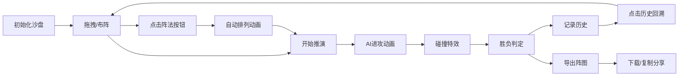

## 1. 产品概述
古代阵法推演互动应用，让用户化身军中幕僚，在毛毡质感的沙盘上拖拽兵种棋子、排布阵法、触发实时攻防推演，体验古代军事指挥的乐趣。

- 核心价值：通过可视化交互还原古代阵法推演场景，提供沉浸式军事策略体验
- 目标用户：对古代军事、策略游戏感兴趣的玩家
- 市场价值：结合传统文化与互动游戏，打造独特的策略推演体验

## 2. 核心 Features

### 2.1 用户角色
| 角色 | 注册方式 | 核心权限 |
|------|----------|----------|
| 玩家 | 无需注册 | 拖拽棋子、排列阵法、发起推演、导出阵图、查看历史 |

### 2.2 功能模块
1. **沙盘主界面**：16x16网格棋盘，毛毡质感背景，兵种棋子渲染
2. **拖拽交互系统**：棋子拖拽、吸附、碰撞检测、光晕特效
3. **阵法系统**：鱼鳞阵、方圆阵、鹤翼阵自动排列与动画
4. **攻防推演系统**：AI进攻、碰撞特效、胜负判定
5. **兵力面板**：兵种统计、士气条、实时数值展示
6. **历史记录系统**：推演结果记录、状态回溯
7. **阵图导出系统**：JSON压缩、下载、复制分享

### 2.3 页面详情
| 页面名称 | 模块名称 | 功能描述 |
|----------|----------|----------|
| 主推演页面 | 沙盘棋盘 | 16x16网格，暗金色网格线，Canvas噪点毛毡背景，SVG+Canvas混合渲染 |
| 主推演页面 | 左侧兵力面板 | 军旗图案、三兵种图标与数字、悬停放大效果 |
| 主推演页面 | 右侧控制面板 | 阵法按钮、开始推演、历史记录列表 |
| 主推演页面 | 推演动画层 | 棋子移动、碰撞粒子、阵型名称浮现、胜负横幅 |
| 主推演页面 | 阵图导出区 | 下载按钮、复制分享链接功能 |

## 3. 核心流程
用户进入应用后，沙盘自动初始化双方15个棋子。用户可拖拽己方棋子调整位置，或点击阵法按钮快速排兵。点击"开始推演"后AI发起进攻，双方棋子逐格靠近碰撞，最终展示胜负结果。推演历史自动保存，可点击回溯。阵图可导出分享。

## 4. 用户界面设计

### 4.1 设计风格
- **主色调**：羊皮纸色#f5e6c8、暗红#8b0000、深褐#2b1a0e、古金#b8860b
- **按钮风格**：矩形80x30px，深红底色#8b0000，悬停#cc0000，点击下沉2px动效
- **字体**：Google Fonts - Ma Shan Zheng（毛笔书法风格）
- **布局风格**：竹简卷轴风格，三栏布局（兵力面板-沙盘-控制面板）
- **视觉元素**：军旗图标、毛笔字体、墨点粒子、光晕特效、毛毡纹理

### 4.2 页面设计概述
| 页面名称 | 模块名称 | UI 元素 |
|----------|----------|---------|
| 主推演页面 | 沙盘棋盘 | 16x16网格（60px/格），暗金色#b8860b细线，Canvas噪点背景，圆形棋子（直径30px）带兵种图标 |
| 主推演页面 | 拖拽交互 | 半透明跟随（透明度0.5），网格吸附（<20px），深蓝色光晕#000066（半径40px，0.3s），红色叉号占位提示 |
| 主推演页面 | 阵法动画 | 平滑移动0.5s ease-out，阵型名称毛笔大字浮现（持续2s渐隐） |
| 主推演页面 | 推演动画 | 逐格靠近，墨点粒子爆炸（15个，#000000，0.8s），顶部胜负横幅 |
| 主推演页面 | 兵力面板 | 军旗图案背景，三兵种图标+数字，悬停放大动效，士气条渐变动画 |
| 主推演页面 | 历史记录 | 至多20条，"鱼鳞阵vs方圆阵，胜，剩余9兵"格式，点击回溯复原 |
| 主推演页面 | 导出功能 | JSON压缩（pako），下载文件，复制Base64分享链接 |

### 4.3 响应式
- **设计原则**：桌面优先，自适应缩放
- **沙盘缩放**：随窗口等比缩放，最小宽度600px时转为滚动视图
- **性能约束**：拖拽响应<50ms，帧率≥45fps，初始加载≤2s
- **渲染优化**：Canvas替代DOM进行棋子渲染与动画

### 4.4 视觉细节指引
- **竹简卷轴边框**：左右两侧使用深褐渐变模拟竹简边缘，顶部底部添加卷轴装饰
- **毛毡质感**：Canvas生成多层噪点叠加，模拟真实毛毡纹理
- **棋子设计**：圆形底座，中心兵种图标（步兵⚔、弓兵🏹、骑兵🐎），玩家方蓝色描边，AI方红色描边
- **士气条**：渐变从红色到绿色，动画过渡流畅
- **粒子系统**：墨点粒子具有初速度、重力、衰减，模拟墨水在纸上晕染效果
