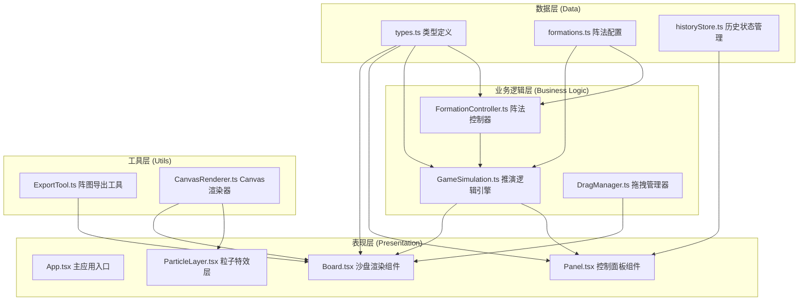

## 1. 架构设计



## 2. 技术描述

- **前端框架**：React@18 + TypeScript@5
- **构建工具**：Vite@5 + @vitejs/plugin-react@4
- **状态管理**：React useState/useReducer (轻量级场景)
- **渲染方案**：SVG + Canvas 混合渲染
  - 网格与地形：SVG 矢量渲染
  - 棋子与动画：Canvas 高性能渲染
  - 粒子特效：独立 Canvas 层
- **第三方依赖**：
  - uuid@9：唯一标识符生成
  - pako@2：JSON数据压缩

## 3. 文件结构与调用关系

```
src/
├── types.ts              # 类型定义（被所有模块引用）
│   ├── Piece 接口
│   ├── Formation 接口
│   ├── GameState 枚举
│   └── SimulationResult 接口
│
├── formations.ts         # 阵法配置数据
│   ├── 鱼鳞阵坐标配置
│   ├── 方圆阵坐标配置
│   └── 鹤翼阵坐标配置
│
├── Board.tsx             # 沙盘核心组件
│   ├── 依赖: types.ts, CanvasRenderer.ts, DragManager.ts
│   ├── 渲染: SVG网格 + Canvas棋子
│   └── 输出: onPieceMove, onDrop 事件
│
├── Panel.tsx             # 控制面板组件
│   ├── 依赖: types.ts, formations.ts
│   ├── 调用: GameSimulation.rearrange(), startSimulation()
│   └── 展示: 兵力数值、士气条、历史记录
│
├── GameSimulation.ts     # 推演逻辑引擎（纯函数）
│   ├── 依赖: types.ts, formations.ts
│   ├── rearrange()       # 阵法排列计算
│   ├── movePiece()       # 棋子移动验证
│   ├── checkCollision()  # 碰撞检测
│   └── runSimulation()   # 推演执行
│
├── CanvasRenderer.ts     # Canvas渲染工具
│   ├── drawFeltBackground()  # 毛毡背景
│   ├── drawPiece()           # 绘制棋子
│   ├── drawHalo()            # 光晕特效
│   └── animateMovement()     # 移动动画
│
├── ParticleLayer.tsx     # 粒子特效层
│   ├── 墨点粒子系统
│   └── 爆炸动画
│
├── DragManager.ts        # 拖拽管理
│   ├── handleDragStart()
│   ├── handleDragMove()
│   └── handleDragEnd()
│
├── ExportTool.ts         # 导出工具
│   ├── compressState()   # pako压缩
│   ├── downloadJSON()    # 下载文件
│   └── copyShareLink()   # 复制分享链接
│
├── historyStore.ts       # 历史记录管理
│   ├── addHistory()
│   ├── getHistoryList()
│   └── restoreState()
│
├── App.tsx               # 主应用组件
│   ├── 组合: Board + Panel + ParticleLayer
│   └── 状态: 集中管理gameState
│
└── main.tsx              # 应用入口
```

### 数据流向
```
用户操作 → Panel/Board → GameSimulation → 更新状态 → Board重渲染
                         ↓
                    historyStore → Panel历史列表
                         ↓
                    ExportTool → 下载/分享
```

## 4. 核心数据模型

### 4.1 类型定义 (types.ts)

```typescript
// 兵种类型
export type PieceType = 'infantry' | 'archer' | 'cavalry';

// 阵营
export type Side = 'player' | 'ai';

// 棋子状态
export type PieceStatus = 'alive' | 'dead' | 'moving';

// 棋子接口
export interface Piece {
  id: string;
  type: PieceType;
  side: Side;
  x: number;
  y: number;
  status: PieceStatus;
  attack: number;
  defense: number;
}

// 阵法类型
export type FormationType = 'yulin' | 'fangyuan' | 'heyi';

// 阵法配置
export interface Formation {
  name: string;
  nameCN: string;
  description: string;
  attackBonus: number;
  defenseBonus: number;
  // 相对坐标（以阵型中心为原点）
  positions: Array<{ dx: number; dy: number; type: PieceType }>;
}

// 游戏状态枚举
export enum GamePhase {
  IDLE = 'idle',
  DRAGGING = 'dragging',
  FORMING = 'forming',
  SIMULATING = 'simulating',
  FINISHED = 'finished',
}

// 推演结果
export interface SimulationResult {
  winner: Side | 'draw';
  playerRemaining: number;
  aiRemaining: number;
  playerFormation: FormationType;
  aiFormation: FormationType;
  timestamp: number;
  snapshot: Piece[];
}

// 拖拽状态
export interface DragState {
  isDragging: boolean;
  pieceId: string | null;
  startX: number;
  startY: number;
  currentX: number;
  currentY: number;
}

// 粒子数据
export interface Particle {
  id: string;
  x: number;
  y: number;
  vx: number;
  vy: number;
  life: number;
  maxLife: number;
  size: number;
  color: string;
}

// 历史记录项
export interface HistoryItem {
  id: string;
  playerFormation: string;
  aiFormation: string;
  result: 'win' | 'lose' | 'draw';
  remaining: number;
  timestamp: number;
  snapshot: Piece[];
}

// 游戏状态
export interface GameState {
  pieces: Piece[];
  phase: GamePhase;
  playerFormation: FormationType | null;
  aiFormation: FormationType | null;
  playerMorale: number;
  aiMorale: number;
  result: SimulationResult | null;
  history: HistoryItem[];
}
```

### 4.2 常量配置

```typescript
// 棋盘配置
export const BOARD_SIZE = 16;
export const CELL_SIZE = 60;
export const PIECE_RADIUS = 15;
export const SNAP_DISTANCE = 20;

// 颜色配置
export const COLORS = {
  parchment: '#f5e6c8',
  darkBrown: '#2b1a0e',
  gold: '#b8860b',
  darkRed: '#8b0000',
  lightRed: '#cc0000',
  deepBlue: '#000066',
  player: '#1e3a8a',
  ai: '#991b1b',
  grid: '#b8860b',
};

// 兵种属性
export const PIECE_STATS = {
  infantry: { attack: 3, defense: 4 },
  archer: { attack: 4, defense: 2 },
  cavalry: { attack: 5, defense: 3 },
};
```

## 5. 核心算法

### 5.1 网格吸附算法
```
输入：鼠标坐标(mouseX, mouseY)
输出：吸附后格坐标(gridX, gridY)
1. 计算网格坐标：gridX = round(mouseX / CELL_SIZE), gridY = round(mouseY / CELL_SIZE)
2. 计算实际中心坐标：centerX = gridX * CELL_SIZE, centerY = gridY * CELL_SIZE
3. 计算距离：distance = sqrt((mouseX-centerX)² + (mouseY-centerY)²)
4. 若 distance < SNAP_DISTANCE 则吸附，否则返回原始坐标
```

### 5.2 阵法排列算法
```
输入：棋子列表pieces, 阵型类型formationType, 中心坐标(centerX, centerY)
输出：移动目标映射Map<pieceId, targetPos>
1. 按类型筛选己方棋子：infantry[], archer[], cavalry[]
2. 获取阵型配置positions[]
3. 按顺序为每个阵型位置分配对应类型棋子
4. 计算绝对坐标：absX = centerX + dx, absY = centerY + dy
5. 返回映射关系
```

### 5.3 碰撞检测与胜负判定
```
输入：所有棋子位置
1. 逐帧更新棋子位置（向敌方移动）
2. 检测任意两棋子距离 < PIECE_RADIUS * 2
3. 若碰撞：
   - 比较攻击力vs防御力
   - 防御力低者死亡
   - 触发墨点粒子爆炸
4. 当一方棋子全灭或双方接触完成：
   - 统计剩余兵力
   - 判定胜负（剩余多者胜）
```

## 6. 性能优化方案

1. **Canvas分层渲染**
   - 背景层：静态毛毡纹理，一次性渲染缓存
   - 静态层：网格线、地形色块
   - 动态层：棋子、动画、粒子

2. **requestAnimationFrame 动画**
   - 所有动画统一调度
   - 脏矩形渲染：只重绘变化区域

3. **对象池优化**
   - 粒子对象复用，避免频繁GC
   - 棋子对象预先创建

4. **防抖节流**
   - 拖拽事件节流（16ms）
   - 窗口resize防抖
