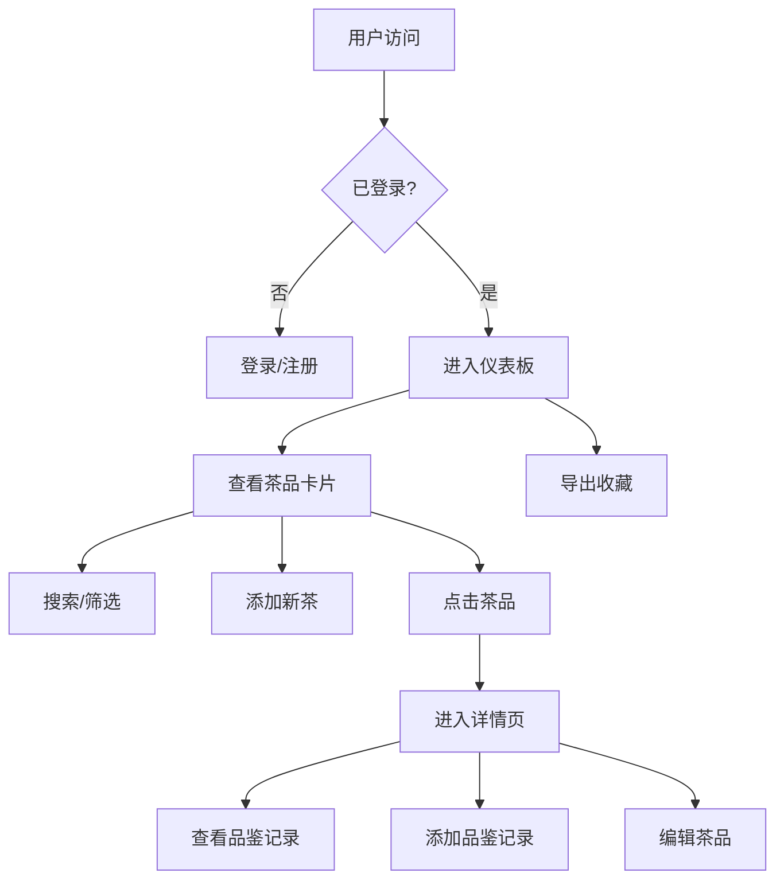

## 1. 产品概述

茶品收藏与品鉴笔记是一个为茶友设计的全栈Web应用，帮助用户系统化记录茶品信息、冲泡参数和口感变化，解决品茶过程中难以留存和分享品鉴体验的痛点。

- 核心目标用户：茶叶爱好者、收藏家和品鉴师
- 核心价值：提供古风茶室美学的沉浸式体验，让茶品记录成为一种雅致的生活方式
- 市场定位：面向小众但高粘性的茶文化爱好者群体

## 2. 核心功能

### 2.1 用户角色

| 角色 | 注册方式 | 核心权限 |
|------|----------|----------|
| 普通用户 | 用户名密码注册 | 茶品CRUD、品鉴记录CRUD、数据导出、个人收藏管理 |

### 2.2 功能模块

1. **登录/注册页**：用户身份认证，表单验证
2. **仪表板**：茶品卡片网格展示、搜索筛选、添加新茶、导出收藏
3. **茶品详情页**：茶品信息展示、品鉴记录时间线、添加品鉴记录、编辑茶品

### 2.3 页面详情

| 页面名称 | 模块名称 | 功能描述 |
|----------|----------|----------|
| 登录页 | 登录表单 | 用户名密码登录、错误提示、跳转注册 |
| 注册页 | 注册表单 | 用户名密码注册、密码确认、跳转登录 |
| 仪表板 | 顶部装饰 | 竹帘装饰、左右纸窗、古风茶室背景 |
| 仪表板 | 搜索筛选栏 | 茶类筛选、评分范围、年份范围、产地关键词搜索 |
| 仪表板 | 茶品卡片网格 | 卡片悬停效果、点击跳转、分页加载 |
| 仪表板 | 添加新茶表单 | 四步表单向导、茶类选择、基本信息、照片上传、冲泡参数 |
| 仪表板 | 导出功能 | JSON格式导出、自动命名下载 |
| 茶品详情页 | 照片展示 | pinch-zoom缩放、光晕效果 |
| 茶品详情页 | 基本信息 | 竖排毛笔字风格展示 |
| 茶品详情页 | 品鉴记录时间线 | 评分颜色渐变、时间线样式 |
| 茶品详情页 | 添加品鉴记录 | 表单提交、滑入动画 |
| 茶品详情页 | 编辑茶品 | 预填表单、照片替换、闪烁提示 |

## 3. 核心流程

用户核心流程：注册登录 → 浏览茶品收藏 → 添加新茶/品鉴记录 → 搜索筛选 → 查看详情 → 编辑或导出数据

## 4. 用户界面设计

### 4.1 设计风格

- **主色调**：淡米色 #f5f0e8（宣纸色），深褐色 #4a2c1a（文字边框）
- **点缀色**：茶绿色 #6b8e23，茶红色 #c0392b，淡金色 #d4a373
- **按钮风格**：圆角 6px，背景色渐变 #d4a373 → #c19a6b，悬停亮度提升 10%
- **字体**：标题使用 Ma Shan Zheng（毛笔书法字体），正文使用 Noto Serif SC
- **布局风格**：卡片式布局，古风茶室氛围，竹帘装饰，半透明纸窗
- **阴影效果**：轻微模糊阴影 box-shadow: 0 4px 12px rgba(0,0,0,0.08)

### 4.2 页面设计概述

| 页面名称 | 模块名称 | UI 元素 |
|----------|----------|----------|
| 仪表板 | 茶室背景 | 背景色 #e8dcc8，顶部竹帘装饰，左右半透明白色纸窗 |
| 仪表板 | 茶品卡片 | 200x260px，宣纸色背景，磨损纹理，悬停上抬 8px + 淡金色阴影 |
| 仪表板 | 四步表单 | 茶类图标渐变，拖拽上传虚线框，滑块数值弹跳动画 |
| 茶品详情页 | 照片展示 | pinch-zoom 缩放，半透明光晕 #d4a373，0.3s 过渡 |
| 茶品详情页 | 基本信息 | 竖排毛笔字风格，Ma Shan Zheng 字体 |
| 茶品详情页 | 品鉴时间线 | 茶色圆点标记，评分颜色渐变 #c0392b → #27ae60，淡茶色连线 |
| 全站 | 动画效果 | 竹帘展开动画 1.0s，卡片淡入上移 0.4s，FLIP 网格重排 0.5s |

### 4.3 响应式设计

- **桌面端（≥1024px）**：三列卡片网格，标准字体和边距
- **平板端（768-1023px）**：两列卡片网格，适当缩小字体和边距
- **移动端（<768px）**：单列卡片网格，触控优化，简化布局
- **滚动加载**：默认显示最近 10 条，每次追加 10 条

### 4.4 性能要求

- 交互响应时间 ≤ 50ms
- 页面初始加载时间 ≤ 1.5s（除去网络延迟）
- 动画帧率 ≥ 50fps
- 动画持续时间控制在 0.3s-0.5s，使用 ease-out 缓动函数
