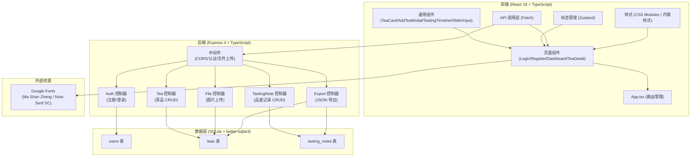
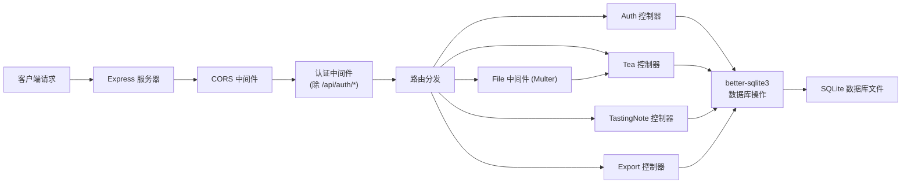

## 1. 架构设计



## 2. 技术描述

- **前端**：React 18.2.0 + TypeScript 5.3.3 + Vite 5.0.8 + React Router v6 + Zustand
- **后端**：Express 4.18.2 + TypeScript 5.3.3 + better-sqlite3 9.4.3
- **数据库**：SQLite（本地文件存储）
- **文件上传**：Multer 1.4.5-lts.1（存储于 public/uploads 目录）
- **其他依赖**：uuid 9.0.0、cors 2.8.5
- **构建工具**：Vite 5.0.8（前端）、ts-node（后端开发）

## 3. 路由定义

| 路由 | 页面 | 说明 |
|------|------|------|
| /login | 登录页 | 用户登录表单 |
| /register | 注册页 | 用户注册表单 |
| /dashboard | 仪表板 | 茶品卡片网格、搜索筛选、添加新茶 |
| /tea/:id | 茶品详情页 | 茶品信息、品鉴记录时间线、编辑功能 |
| * | 重定向 | 未登录重定向到 /login，已登录重定向到 /dashboard |

## 4. API 定义

### 4.1 类型定义

```typescript
interface User {
  id: string;
  username: string;
  password_hash: string;
}

interface Tea {
  id: string;
  user_id: string;
  name: string;
  category: string;
  origin: string;
  year: number;
  photo_path: string;
  created_at: string;
}

interface TastingNote {
  id: string;
  tea_id: string;
  date: string;
  water_temp: number;
  tea_amount: number;
  brew_time: number;
  aroma: string;
  score: number;
  description: string;
  created_at: string;
}

interface AuthRequest {
  username: string;
  password: string;
}

interface TeaWithNotes extends Tea {
  tasting_notes: TastingNote[];
}
```

### 4.2 认证接口

| 方法 | 路径 | 请求 | 响应 | 说明 |
|------|------|------|------|------|
| POST | /api/auth/register | `{ username, password }` | `{ success, user: { id, username } }` | 用户注册 |
| POST | /api/auth/login | `{ username, password }` | `{ success, user: { id, username } }` | 用户登录 |
| POST | /api/auth/logout | - | `{ success }` | 用户登出 |

### 4.3 茶品接口

| 方法 | 路径 | 请求 | 响应 | 说明 |
|------|------|------|------|------|
| GET | /api/teas | `?page=1&limit=10&category=&minScore=&maxScore=&minYear=&maxYear=&origin=` | `{ teas: Tea[], total: number }` | 获取茶品列表（支持筛选和分页） |
| GET | /api/teas/:id | - | `{ tea: TeaWithNotes }` | 获取茶品详情（含品鉴记录） |
| POST | /api/teas | `FormData: { name, category, origin, year, photo }` | `{ success, tea: Tea }` | 创建茶品（含图片上传） |
| PUT | /api/teas/:id | `FormData: { name, category, origin, year, photo? }` | `{ success, tea: Tea }` | 更新茶品（可选更新图片） |
| DELETE | /api/teas/:id | - | `{ success }` | 删除茶品 |

### 4.4 品鉴记录接口

| 方法 | 路径 | 请求 | 响应 | 说明 |
|------|------|------|------|------|
| POST | /api/teas/:teaId/notes | `{ date, water_temp, tea_amount, brew_time, aroma, score, description }` | `{ success, note: TastingNote }` | 添加品鉴记录 |
| PUT | /api/notes/:id | `{ date, water_temp, tea_amount, brew_time, aroma, score, description }` | `{ success, note: TastingNote }` | 更新品鉴记录 |
| DELETE | /api/notes/:id | - | `{ success }` | 删除品鉴记录 |

### 4.5 导出接口

| 方法 | 路径 | 请求 | 响应 | 说明 |
|------|------|------|------|------|
| GET | /api/export | - | JSON 文件下载 | 导出所有茶品和品鉴记录 |

## 5. 服务器架构图



## 6. 数据模型

### 6.1 数据模型定义

```mermaid
erDiagram
    users ||--o{ teas : "拥有"
    teas ||--o{ tasting_notes : "包含"
    
    users {
        string id PK
        string username UNIQUE
        string password_hash
    }
    
    teas {
        string id PK
        string user_id FK
        string name
        string category
        string origin
        int year
        string photo_path
        string created_at
    }
    
    tasting_notes {
        string id PK
        string tea_id FK
        string date
        int water_temp
        int tea_amount
        int brew_time
        string aroma
        int score
        string description
        string created_at
    }
```

### 6.2 数据定义语言

```sql
-- 创建 users 表
CREATE TABLE IF NOT EXISTS users (
  id TEXT PRIMARY KEY,
  username TEXT UNIQUE NOT NULL,
  password_hash TEXT NOT NULL
);

-- 创建 teas 表
CREATE TABLE IF NOT EXISTS teas (
  id TEXT PRIMARY KEY,
  user_id TEXT NOT NULL,
  name TEXT NOT NULL,
  category TEXT NOT NULL,
  origin TEXT NOT NULL,
  year INTEGER NOT NULL,
  photo_path TEXT,
  created_at TEXT DEFAULT CURRENT_TIMESTAMP,
  FOREIGN KEY (user_id) REFERENCES users(id) ON DELETE CASCADE
);

-- 创建 tasting_notes 表
CREATE TABLE IF NOT EXISTS tasting_notes (
  id TEXT PRIMARY KEY,
  tea_id TEXT NOT NULL,
  date TEXT NOT NULL,
  water_temp INTEGER NOT NULL,
  tea_amount INTEGER NOT NULL,
  brew_time INTEGER NOT NULL,
  aroma TEXT,
  score INTEGER NOT NULL CHECK (score >= 1 AND score <= 10),
  description TEXT,
  created_at TEXT DEFAULT CURRENT_TIMESTAMP,
  FOREIGN KEY (tea_id) REFERENCES teas(id) ON DELETE CASCADE
);

-- 创建索引
CREATE INDEX IF NOT EXISTS idx_teas_user_id ON teas(user_id);
CREATE INDEX IF NOT EXISTS idx_teas_category ON teas(category);
CREATE INDEX IF NOT EXISTS idx_teas_year ON teas(year);
CREATE INDEX IF NOT EXISTS idx_tasting_notes_tea_id ON tasting_notes(tea_id);
CREATE INDEX IF NOT EXISTS idx_tasting_notes_score ON tasting_notes(score);
```
