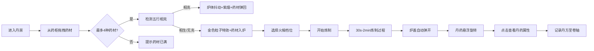

## 1. 产品概述

本项目是一款在浏览器中运行的古代炼丹模拟器游戏，用户扮演深居山林的炼丹术士，通过选择药材、控制炉火温度与时辰炼制丹药，观察丹药品质变化并记录丹方。

- **核心价值**：以沉浸式的3D交互体验还原中国古代炼丹文化，让用户体验药材配伍、火候控制的乐趣
- **目标用户**：对中国传统文化、仙侠题材、模拟经营类游戏感兴趣的玩家
- **市场定位**：文化科普类休闲游戏，融合教育与娱乐

## 2. 核心功能

### 2.1 用户角色
| 角色 | 注册方式 | 核心权限 |
|------|----------|----------|
| 炼丹术士 | 无需注册，直接进入 | 完整游戏体验，药材拖拽、火候控制、丹药炼制、丹方查看 |

### 2.2 功能模块
1. **丹房主场景**：3D八卦炉、药柜、温度计、青烟粒子效果
2. **药材拖拽系统**：从药柜拖拽药材至丹炉，支持五行相克检测
3. **炉火控制系统**：五档火候调节（文火→武火），实时温度曲线
4. **炼制过程系统**：30秒-2分钟真实时间炼制，音效与震动反馈
5. **丹药产出系统**：根据药材配比与温度生成不同品质丹药
6. **丹方卷轴系统**：可展开的仿古卷轴记录成功丹方
7. **响应式适配**：桌面/平板/移动端三种布局模式

### 2.3 页面详情
| 页面名称 | 模块名称 | 功能描述 |
|----------|----------|----------|
| 丹房主界面 | 八卦炉组件 | 3D渲染炉体，支持开盖动画，火焰颜色随温度变化 |
| 丹房主界面 | 药柜组件 | 三层六格药柜，药材3D模型悬浮展示，悬停显示药性 |
| 丹房主界面 | 火候控制区 | 五档火候按钮，温度实时显示，温度计可视化 |
| 丹房主界面 | 炼制信息区 | 已投入药材列表、炼制进度、时辰显示 |
| 丹药详情面板 | 属性展示 | 仿古宣纸底纹，毛笔字体显示丹药名称、药性、品级等 |
| 丹方卷轴 | 记录展示 | 可展开卷轴动画，记录成功丹方的药材配比与火候 |

## 3. 核心流程

**核心流程描述**：用户进入丹房后，从左右两侧药柜中拖拽药材至中央八卦炉，系统自动检测药材五行关系。若五行相克则药材被弹回；若成功投入，则触发金色粒子特效。用户选择火候档位后开始炼制，期间可观察温度变化与青烟效果。炼制完成后炉盖弹开，丹药悬浮于炉口，点击可查看详细属性并自动记录至丹方卷轴。

## 4. 用户界面设计

### 4.1 设计风格
- **整体风格**：中国水墨风格，米白底色搭配古铜色与紫檀色
- **主色调**：米白 `#f5f0e8`、青铜色 `#5c3a21`、紫檀色 `#4a2c1a`、青砖色 `#8b7d6b`、松木色 `#6b4423`
- **点缀色**：火焰红 `#ff4500`、炫白 `#ffffff`、金色 `#ffd700`、紫烟 `#8b00ff`
- **字体**：标题使用 Ma Shan Zheng（毛笔书法字体），正文使用 ZCOOL QingKe HuangYou
- **按钮风格**：圆角设计，细微阴影，点击时墨水晕开扩散效果（CSS filter blur，0.3s）
- **特殊元素**：仿古宣纸底纹、八卦纹样、卷轴展开动画

###