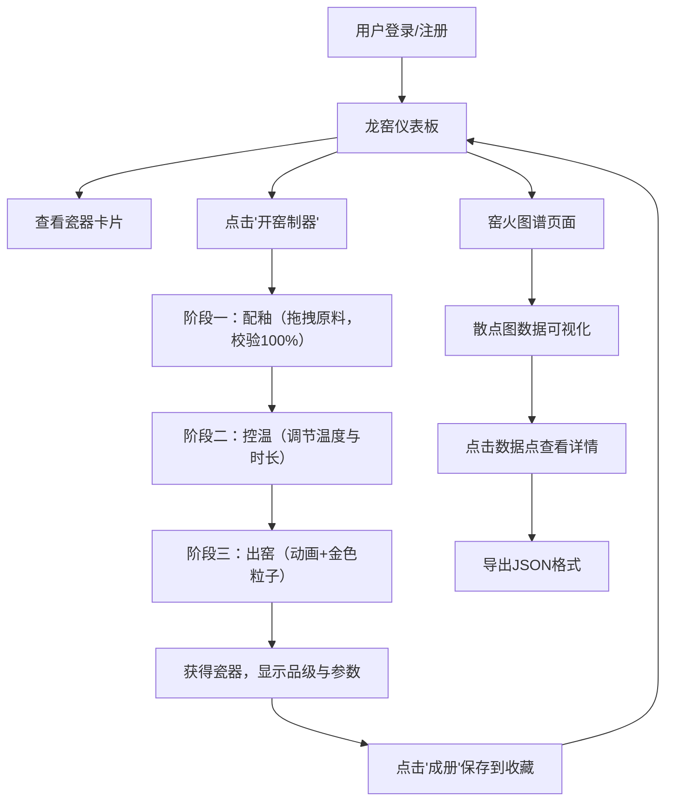

## 1. 产品概述

本产品是一款模拟宋代官窑瓷器烧制工艺的全栈Web应用，用户可通过调配釉料、控制窑温与烧制时长，体验传统制瓷工艺的精髓，并将作品数字化留存。

- 解决传统制瓷工艺缺乏系统化交互模拟与作品数字化留存的问题
- 面向瓷器爱好者、文化传承者与游戏玩家，提供沉浸式的数字制瓷体验
- 实现传统工艺的数字化传承与创新，具有文化传播与教育价值

## 2. 核心特性

### 2.1 用户角色

| 角色 | 注册方式 | 核心权限 |
|------|----------|----------|
| 普通用户 | 用户名密码注册 | 制瓷操作、作品收藏、窑火图谱查看、数据导出 |

### 2.2 功能模块

1. **用户认证模块**：注册、登录、状态管理
2. **龙窑作坊仪表板**：瓷器卡片网格展示、实时统计卡片、开窑制器入口
3. **开窑制器三阶段交互**：配釉（拖拽调配）、控温（实时火焰动画）、出窑（动画效果展示）
4. **官窑瓷册**：作品册页生成、卷轴浏览、品级评定
5. **窑火图谱**：散点图数据可视化、详情查看、JSON导出

### 2.3 页面详情

| 页面名称 | 模块名称 | 功能描述 |
|---------|----------|----------|
| 登录页 | 用户认证 | 用户名密码登录，表单验证 |
| 注册页 | 用户认证 | 新用户注册，密码加密存储 |
| 仪表板页 | 龙窑作坊 | 瓷器卡片网格（220x300px）、统计卡片、开窑制器按钮、宋代美学风格 |
| 开窑制器页 | 三阶段交互 | 配釉（6种原料拖拽调配，总和100%校验）、控温（双滑块+火焰动画）、出窑（1.5s动画+金色粒子） |
| 窑火图谱页 | 数据可视化 | 散点图展示（X轴温度、Y轴时长）、详情弹层、JSON导出 |

## 3. 核心流程

用户登录后进入龙窑仪表板，查看已烧制的瓷器作品。点击"开窑制器"进入三阶段交互：首先拖拽原料到釉料碗中调配釉料（最多3种，百分比总和100%）；然后拖动滑块调节窑温和烧制时长，观察火焰实时变化；最后点击出窑，观看窑门打开动画与金色粒子特效，获得烧制完成的瓷器。系统根据配方参数自动评定品级，用户可选择"成册"保存作品。在窑火图谱页面可查看所有作品的数据分布，点击数据点查看详情并导出JSON。

## 4. 界面设计

### 4.1 设计风格

- **主色调**：汝窑天青釉 #9dc3c3，辅以深褐 #5c3a21（木架与边框）、宣纸白 #f5f0e8（背景）、赤金 #d4af37（强调色）
- **整体风格**：宋代极简美学，宣纸质感背景，竹帘装饰元素
- **按钮样式**：圆角8px，平滑过渡动画0.3s，点击弹性缩放（0.98→1.02）
- **字体**：Noto Serif SC 衬线字体，古风统一
- **卡片效果**：宣纸色背景，边缘烧焦纹理，悬停上抬10px+淡青色阴影 #8baa9a
- **侧边栏**：240px宽度，半透明磨砂玻璃效果（背景色#ffffff 0.1透明度，模糊12px）

### 4.2 页面设计概览

| 页面名称 | 模块名称 | UI元素 |
|---------|----------|--------|
| 登录页 | 表单区域 | 宣纸质感背景，居中表单，汝窑青按钮，输入框深褐边框 |
| 仪表板页 | 瓷器卡片网格 | 220x300px卡片，边缘烧焦纹理，悬停上抬动画，淡青阴影 |
| 仪表板页 | 统计卡片 | 右上角实时数据，总烧制次数、最高品级、最近烧制时间（甲辰年格式） |
| 开窑制器页 | 配釉阶段 | 左侧原料架6种原料，右侧釉料碗，拖拽半透明百分比显示 |
| 开窑制器页 | 控温阶段 | 渐变滑块（暗红#8b0000→炫白#fff5e6），实时火焰动画，时长调节 |
| 开窑制器页 | 出窑阶段 | 1.5s窑门打开动画，灰色烟雾粒子，金色粒子