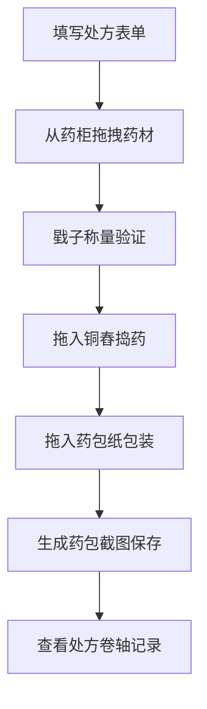

## 1. 产品概述

本项目是一款基于浏览器的古风药铺药材配制互动应用，让用户体验古代药童抓药、配药、捣药、包药的完整流程。通过沉浸式的交互体验，让用户感受传统中医药文化的魅力。

### 核心价值
- 传承中医药文化，让用户在互动中学习药材知识
- 提供沉浸式的古风体验，还原古代药铺抓药场景
- 通过游戏化的操作流程，增加趣味性与教育性

## 2. 核心功能

### 2.1 用户角色

| 角色 | 注册方式 | 核心权限 |
|------|----------|----------|
| 药童（用户） | 无需注册 | 完整的药材抓取、配比、捣药、包药操作 |

### 2.2 功能模块

1. **药柜组件**：5x5格药材架，展示各类中药材，支持拖拽选择
2. **配药台组件**：包含戥子秤盘、铜舂（木槌+石臼）、药包纸三个区域
3. **处方表单组件**：方剂名称、患者姓名、服用说明输入
4. **处方卷轴组件**：纵向展开的古风卷轴，记录药方与功效

### 2.3 页面详情

| 页面名称 | 模块名称 | 功能描述 |
|---------|----------|----------|
| 主页面 | 药柜模块 | 5x5格药材架，每格展示药材3D缩略图，鼠标悬停放大显示药性 |
| 主页面 | 配药台模块 | 戥子称量、铜舂捣药、药包封装的完整流程 |
| 主页面 | 处方表单模块 | 输入方剂信息，与配药台联动验证配比 |
| 主页面 | 处方卷轴模块 | 右侧纵向展开卷轴，记录药方、功效、手写备注 |

## 3. 核心流程

用户操作流程：

1. 用户在处方表单中输入方剂信息（方剂名称、患者姓名、服用说明、君臣佐使药量）
2. 用户从药柜拖拽药材到戥子秤盘进行称量
3. 系统实时显示累计重量，验证是否与处方匹配
4. 将称好的药材拖入铜舂，选择捣药档位（轻/中/重），触发捣药动画
5. 捣药完成后，将药材粉末拖入药包纸区域，触发折叠包装动画
6. 点击"生成药包"按钮，截图保存药包为PNG
7. 展开右侧处方卷轴，查看药方记录，可手写备注

## 4. 用户界面设计

### 4.1 设计风格
- **主色调**：木色系（深褐#4e342e、浅木#d2b48c、宣纸白#f5f0e8）
- **点缀色**：暗金色#b8860b、淡金色#ffd700
- **字体**：Google Fonts - Ma Shan Zheng（毛笔书法风格）
- **按钮风格**：古风木质按钮，圆角2px，悬停放大1.05倍，点击下沉2px
- **布局风格**：左右分栏，左侧60%药柜，右侧40%配药台
- **图标风格**：古风手绘风格，使用CSS绘制或SVG

### 4.2 页面设计概述

| 页面名称 | 模块名称 | UI元素 |
|---------|----------|--------|
| 主页面 | 药柜模块 | 5x5木质格子、药材3D缩略图、悬停放大动画、药性提示 |
| 主页面 | 配药台模块 | 戥子秤盘（50x50px网格）、铜舂（木槌+石臼）、药包纸（折叠动画） |
| 主页面 | 处方表单模块 | 古风输入框、木质按钮、配药进度条 |
| 主页面 | 处方卷轴模块 | 纵向卷轴、竖排文字（从右向左）、手写canvas区域 |

### 4.3 响应式设计

- **宽屏(>=1200px)**：药柜格子和配药台区域放大1.2倍
- **笔记本(>=1024px)**：标准尺寸显示
- **设计原则**：Desktop-first，保持核心交互完整性

### 4.4 视觉动效

- 拖拽动画：duration 0.3s，ease-out
- 捣药动画：木槌每击间隔0.4s，振幅60px
- 折叠动画：持续1s，分4步（左右对折→上下对折→封口→贴签）
- 涟漪动画：点击时半径60px金色扩散，持续0.4s，ease-out
- 悬停效果：放大1.05倍+0.3px淡金色描边#ffd700
