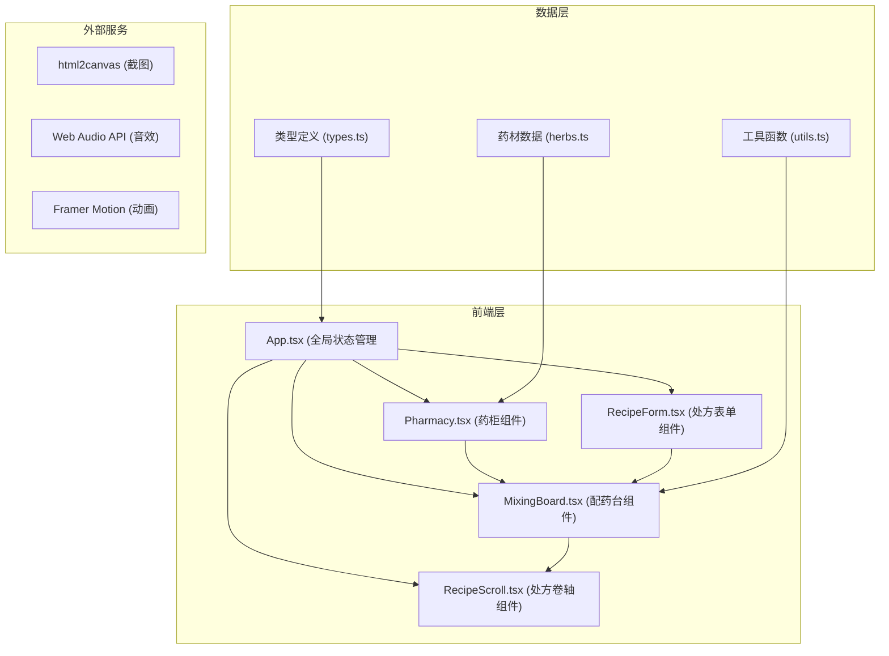

## 1. 架构设计



**数据流向**：
1. 用户操作 → App.tsx (状态分发) → 子组件
2. Pharmacy.tsx → 拖拽药材 → MixingBoard.tsx
3. RecipeForm.tsx → 处方数据 → MixingBoard.tsx (验证配比)
4. MixingBoard.tsx → 药包数据 → RecipeScroll.tsx (记录)

**调用关系**：
- [App.tsx](file:///d:/Solocoder/VersionFast/tasks/auto269/src/App.tsx) 调用 [Pharmacy.tsx](file:///d:/Solocoder/VersionFast/tasks/auto269/src/components/Pharmacy.tsx)、[MixingBoard.tsx](file:///d:/Solocoder/VersionFast/tasks/auto269/src/components/MixingBoard.tsx)、[RecipeForm.tsx](file:///d:/Solocoder/VersionFast/tasks/auto269/src/components/RecipeForm.tsx)、[RecipeScroll.tsx](file:///d:/Solocoder/VersionFast/tasks/auto269/src/components/RecipeScroll.tsx)
- [MixingBoard.tsx](file:///d:/Solocoder/VersionFast/tasks/auto269/src/components/MixingBoard.tsx) 调用 [utils.ts](file:///d:/Solocoder/VersionFast/tasks/auto269/src/utils/utils.ts) 中的音频、动画工具
- 所有组件引用 [types.ts](file:///d:/Solocoder/VersionFast/tasks/auto269/src/types/types.ts) 中的类型定义
- [Pharmacy.tsx](file:///d:/Solocoder/VersionFast/tasks/auto269/src/components/Pharmacy.tsx) 引用 [herbs.ts](file:///d:/Solocoder/VersionFast/tasks/auto269/src/data/herbs.ts) 中的药材数据

## 2. 技术描述

- **前端框架**：React@18 + TypeScript@5 + Vite@5
- **构建工具**：Vite@5 + @vitejs/plugin-react@4
- **动画库**：framer-motion@11
- **状态管理**：React useState/useReducer
- **截图功能**：html2canvas@1
- **唯一ID**：uuid@9
- **样式方案**：CSS Modules + CSS Variables
- **3D渲染**：CSS 3D transforms（无需three.js，使用CSS绘制药材形状）

## 3. 目录结构

```
src/
├── App.tsx              # 主应用组件，全局状态管理
├── main.tsx             # 应用入口
├── index.css            # 全局样式与CSS变量
├── types/
│   └── types.ts       # TypeScript类型定义
├── data/
│   └── herbs.ts        # 药材数据
├── utils/
│   └── utils.ts        # 工具函数（音频、动画、拖拽处理）
├── components/
│   ├── Pharmacy.tsx      # 药柜组件
│   ├── MixingBoard.tsx # 配药台组件
│   ├── RecipeForm.tsx  # 处方表单组件
│   └── RecipeScroll.tsx # 处方卷轴组件
│   └── Herb3D.tsx    # 药材3D缩略图组件
│   └── Scale.tsx      # 戥子秤盘组件
│   └── Mortar.tsx     # 铜舂组件
│   └── Paper.tsx        # 药包纸组件
```

## 4. 数据模型

### 4.1 类型定义

```typescript
// 药材类型
interface Herb {
  id: string;
  name: string;
  pinyin: string;
  color: string;
  shape: 'ellipse' | 'slice' | 'root' | 'powder';
  weightPerUnit: number; // 单份重量（钱）
  property: string; // 药性说明
  effect: string; // 功效
}

// 处方类型
interface Recipe {
  id: string;
  name: string;
  patientName: string;
  dosage: string;
  herbs: { herbId: string; weight: number }[];
  instructions: string;
  createdAt: Date;
}

// 称量中的药材
interface WeighedHerb {
  id: string;
  herb: Herb;
  weight: number;
  position: { x: number; y: number };
}

// 药包数据
interface MedicinePackage {
  id: string;
  recipe: Recipe;
  herbs: WeighedHerb[];
  fineness: number; // 细腻度百分比
  packageDate: Date;
}
```

## 5. 性能优化

- **动画性能**：使用Framer Motion的layout动画，确保拖拽保持60FPS
- **拖拽优化**：使用transform和opacity属性做动画，避免重排重绘
- **资源优化**：药材使用CSS绘制，不使用外部图片资源
- **加载性能**：按需加载，代码分割，首屏加载<2s
- **响应式**：使用CSS变量和calc实现响应式布局
