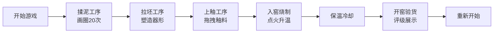

## 1. 产品概述

本产品是一款基于浏览器的宋代钧窑烧制陶器互动游戏应用，让用户以第一人称视角体验古代窑工的制瓷全流程，从揉泥、拉坯、修坯、上釉到入窑烧制，最终开窑检视成品品相。

- **主要目的**：通过沉浸式交互体验传播中国传统陶瓷文化，让用户了解钧窑烧制工艺
- **目标用户**：对中国传统文化、手工艺、瓷器艺术感兴趣的互联网用户
- **市场价值**：填补传统文化互动体验类Web应用的空白，兼具教育性与娱乐性

## 2. 核心功能

### 2.1 用户角色
| 角色 | 注册方式 | 核心权限 |
|------|----------|----------|
| 体验用户 | 无需注册 | 完整体验制瓷全流程，查看成品评级 |

### 2.2 功能模块
1. **揉泥工序**：鼠标螺旋画圈揉捏陶土，20圈完成，颜色渐变
2. **拉坯工序**：陶轮旋转，四种手势塑造器形
3. **上釉工序**：三种釉料拖拽覆盖，釉层厚度可控
4. **烧制工序**：窑炉升温动画，火焰粒子效果，温度曲线
5. **开窑验货**：成品展示，四维指标评级，瑕疵检测

### 2.3 页面详情
| 页面名称 | 模块名称 | 功能描述 |
|----------|----------|----------|
| 窑场主界面 | 全局状态管理 | 管理工序切换、进度保存、数据共享 |
| 揉泥面板 | 揉泥交互 | 检测鼠标螺旋轨迹，计数揉捏次数，颜色渐变动画 |
| 拉坯面板 | 拉坯交互 | 陶轮旋转动画，四种手势（挤压/拉伸/挖空/修口），器形实时变形 |
| 上釉面板 | 上釉交互 | 釉料拖拽，波纹覆盖动画，厚度计算 |
| 窑炉面板 | 烧制动画 | 火焰粒子效果（≤60个），温度计，陶坯变色收缩，保温冷却 |
| 结果面板 | 成品展示 | 品相评级（甲/乙/丙/残次），四维柱状图，瑕疵检测结果 |

## 3. 核心流程

用户进入窑场 → 开始揉泥（画圈20次）→ 进入拉坯（四种手势塑造器形）→ 进入上釉（选择釉料拖拽覆盖）→ 点击点火入窑烧制（升温→保温→冷却）→ 开窑验货查看成品 → 可重新开始

## 4. 用户界面设计

### 4.1 设计风格
- **主色调**：土黄色系（#d6c8a8背景、#c49a6c木纹、#8a7a6a窑砖）
- **辅助色**：赭石色、灰蓝色、三种釉色（天青#51a8d8、玫瑰紫#8a3b6c、月白#f5f0e8）
- **按钮风格**：圆角矩形（border-radius: 6px），悬停背景加深
- **字体**：思源宋体（Source Han Serif），体现宋代文化气质
- **布局风格**：左右分栏（桌面），上下布局（移动端），宋式馒头窑主视觉
- **动效风格**：淡入淡出（0.3s），进度条脉冲动画，微震动反馈

### 4.2 页面设计概述
| 页面名称 | 模块名称 | UI元素 |
|----------|----------|----------|
| 窑场主界面 | 全局布局 | 宋式馒头窑场景、左侧工匠操作台、进度条、工序切换按钮 |
| 揉泥面板 | 揉泥区 | 陶土团（颜色渐变）、螺旋轨迹提示、进度条、操作反馈tooltip |
| 拉坯面板 | 拉坯区 | 旋转陶轮、可变形陶坯、四种手势工具按钮、高度指示器（25-45px） |
| 上釉面板 | 上釉区 | 左侧三种釉料选项、陶坯放置区、波纹动画、厚度指示 |
| 窑炉面板 | 窑炉区 | 灰色砖窑体、穹窿顶、火焰粒子、温度计、陶坯观察窗 |
| 结果面板 | 成品区 | 中央成品陶器、顶部评级标签、四维半透明柱状图、瑕疵列表 |

### 4.3 响应式
- **桌面端**（≥1024px）：左右分栏布局，左侧操作区，右侧窑炉展示区
- **移动端**（<1024px）：上下布局，上部窑炉展示，下部操作面板
- **触摸优化**：支持触控拖拽事件，增大触摸热区

### 4.4 性能指标
- 火焰粒子数量 ≤ 60个
- 温度更新频率：3次/秒
- CSS动画帧率 ≥ 55fps
- 交互延迟 ≤ 50ms
