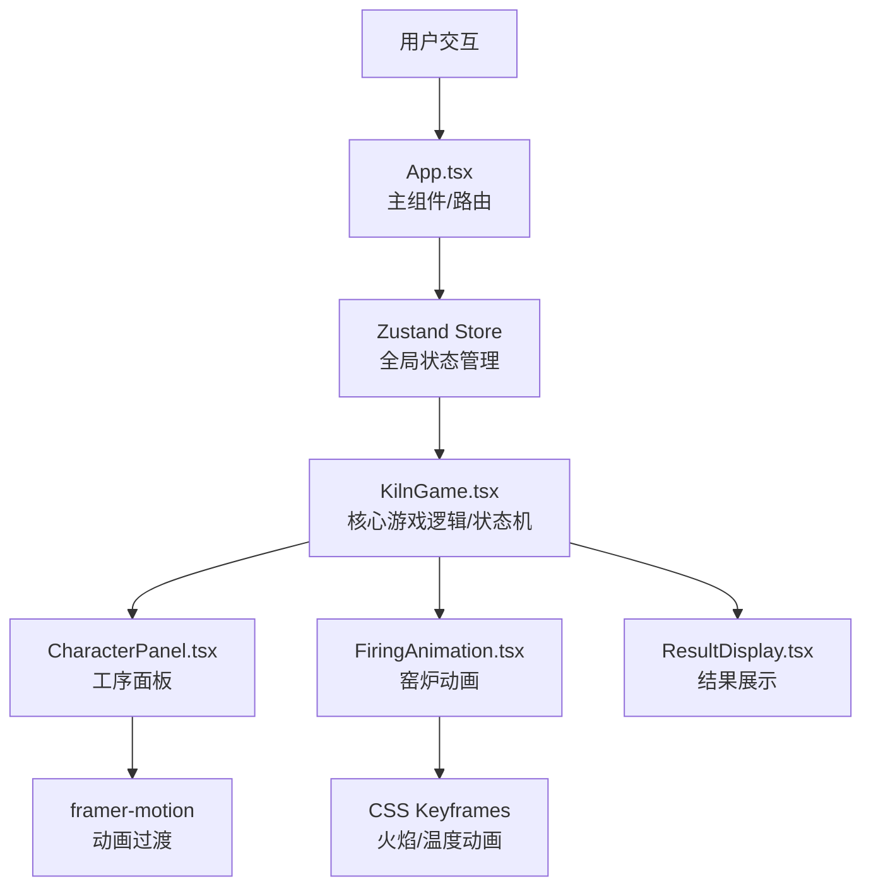

## 1. 架构设计



## 2. 技术描述

* **前端框架**：React 18 + TypeScript

* **构建工具**：Vite 5

* **状态管理**：Zustand 4

* **动画库**：framer-motion 11

* **样式方案**：CSS Modules + 内联样式

* **字体**：思源宋体（Google Fonts）

* **初始化方式**：Vite + react-ts 模板

## 3. 目录结构

```
├── package.json
├── vite.config.js
├── tsconfig.json
├── index.html
├── src/
│   ├── App.tsx                 # 主组件，全局状态与路由
│   ├── store/
│   │   └── useKilnStore.ts     # Zustand全局状态管理
│   ├── KilnGame.tsx            # 核心游戏逻辑，状态机
│   ├── CharacterPanel.tsx      # 工序面板组件
│   ├── FiringAnimation.tsx     # 窑炉烧制动画组件
│   ├── ResultDisplay.tsx       # 开窑结果面板
│   ├── components/
│   │   ├── KneadingStage.tsx   # 揉泥工序
│   │   ├── ThrowingStage.tsx   # 拉坯工序
│   │   └── GlazingStage.tsx    # 上釉工序
│   ├── types/
│   │   └── index.ts            # 类型定义
│   └── utils/
│       └── potteryUtils.ts     # 工具函数
```

## 4. 状态管理设计

### 4.1 Zustand Store 状态定义

```typescript
interface KilnState {
  // 工序状态
  currentStage: 'kneading' | 'throwing' | 'glazing' | 'firing' | 'result';
  stageProgress: number;
  
  // 揉泥数据
  kneadingCount: number;
  kneadingUniformity: number; // 0-100
  clayColor: string;
  
  // 拉坯数据
  potteryShape: {
    height: number; // 25-45px
    width: number;
    curvature: number;
    symmetry: number; // 0-100
  };
  selectedTool: 'press' | 'stretch' | 'hollow' | 'smooth';
  
  // 上釉数据
  selectedGlaze: 'sky' | 'rose' | 'moon' | null;
  glazeThickness: 'thick' | 'medium' | 'thin';
  glazeUniformity: number; // 0-100
  
  // 烧制数据
  temperature: number;
  firingPhase: 'idle' | 'heating' | 'holding' | 'cooling' | 'complete';
  temperatureCurve: number[];
  
  // 结果数据
  finalGrade: 'A' | 'B' | 'C' | 'D' | null;
  defects: string[];
  finalColor: string;
}
```

## 5. 核心算法

### 5.1 螺旋轨迹检测算法

```typescript
function detectSpiral(points: {x: number, y: number}[], centerX: number, centerY: number): number {
  let rotations = 0;
  let lastAngle = Math.atan2(points[0].y - centerY, points[0].x - centerX);
  
  for (let i = 1; i < points.length; i++) {
    const angle = Math.atan2(points[i].y - centerY, points[i].x - centerX);
    const delta = angle - lastAngle;
    if (delta > Math.PI) rotations--;
    else if (delta < -Math.PI) rotations++;
    else rotations += delta > 0 ? delta / (2 * Math.PI) : delta / (2 * Math.PI);
    lastAngle = angle;
  }
  
  return Math.abs(rotations);
}
```

### 5.2 品相评级算法

```typescript
function calculateGrade(
  kneading: number,    // 揉泥均匀度 0-100
  symmetry: number,    // 拉坯对称度 0-100
  glaze: number,       // 釉料均匀度 0-100
  tempScore: number    // 温度曲线得分 0-100
): 'A' | 'B' | 'C' | 'D' {
  const total = (kneading * 0.25) + (symmetry * 0.3) + (glaze * 0.25) + (tempScore * 0.2);
  if (total >= 85) return 'A';
  if (total >= 70) return 'B';
  if (total >= 55) return 'C';
  return 'D';
}
```

### 5.3 温度曲线评分

```typescript
function evaluateTemperatureCurve(readings: number[]): number {
  let score = 100;
  const idealRate = 10; // 理想升温速率 10°C/s
  
  for (let i = 1; i < readings.length; i++) {
    const actualRate = readings[i] - readings[i-1];
    const deviation = Math.abs(actualRate - idealRate);
    score -= deviation * 2;
  }
  
  return Math.max(0, Math.min(100, score));
}
```

## 6. 性能优化

### 6.1 动画性能

* 使用 `transform` 和 `opacity` 属性触发 GPU 加速

* 火焰粒子使用 CSS 动画而非 JS 循环

* 使用 `will-change` 提示浏览器优化

* 粒子数量上限 60 个，超出复用旧粒子

### 6.2 交互性能

* 鼠标事件使用节流（throttle），频率 ≤ 60fps

* 状态更新批量处理，避免频繁 re-render

* 使用 React.memo 优化组件渲染

### 6.3 响应式适配

* 媒体查询断点：1024px

* 触摸事件支持：`touchstart` / `touchmove` / `touchend`

* 使用相对单位（%、vw、vh）保证缩放适配

## 7. 动画定义

### 7.1 火焰动画

```css
@keyframes flicker {
  0%, 100% { transform: translateY(0) scale(1); opacity: 0.8; }
  50% { transform: translateY(-10px) scale(1.1); opacity: 1; }
}

@keyframes rise {
  0% { transform: translateY(100%) scale(0.5); opacity: 0; }
  20% { opacity: 1; }
  100% { transform: translateY(-100%) scale(1.2); opacity: 0; }
}
```

### 7.2 进度条脉冲

```css
@keyframes pulse {
  0%, 100% { transform: scale(1); }
  50% { transform: scale(1.02); }
}
```

### 7.3 釉面波纹

```css
@keyframes glazeWave {
  0% { clip-path: inset(100% 0 0 0); }
  100% { clip-path: inset(0 0 0 0); }
}
```

